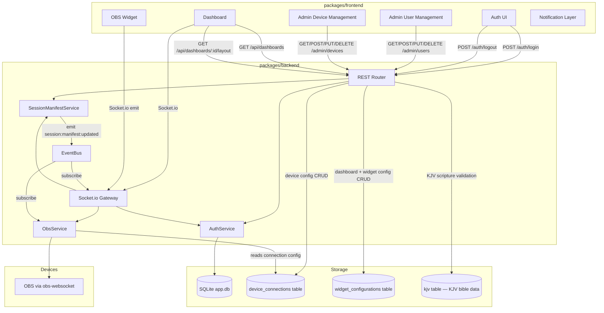

# Design Document — Invisible A/V Booth

## Overview

Invisible A/V Booth is a touch-first, volunteer-safe web application for managing church livestream operations. The backend is the single authority for all device state, commands, and session metadata. The frontend renders a responsive widget grid that communicates exclusively through the backend's REST and WebSocket interfaces.

This initial release delivers:

- Authentication and RBAC (ADMIN / AvPowerUser / AvVolunteer)
- Responsive dashboard grid with database-driven layout (GridManifest served from backend)
- Active session metadata management (SessionManifest)
- Real-time state synchronization via Socket.io
- OBS widget: stream/recording control and metadata preview
- Tiered error notification system (Toast / Banner / Modal) with severity levels
- Touch-first UI built on Ionic React, themed with the project color tokens
- Platform-level `WidgetContainer` with title bar and connection status indicators
- Reusable `ConfirmationModal` platform component
- Shared `packages/shared` module containing the `BIBLE_BOOKS` constant (used by both frontend and backend for `bookId` → display name resolution)

Camera PTZ, audio mixer, and text overlay widgets are out of scope for this release.

---

## Architecture

### High-Level Topology



### Communication Boundaries

| Boundary                            | Protocol                  | Notes                             |
| ----------------------------------- | ------------------------- | --------------------------------- |
| Frontend ↔ Backend (commands/state) | Socket.io                 | Real-time bidirectional           |
| Frontend ↔ Backend (auth/config)    | REST (HTTPS)              | Stateless, JWT-authenticated      |
| Backend ↔ OBS                       | obs-websocket (WebSocket) | Managed exclusively by ObsService |

### Key Architectural Decisions

**Backend as authority**: No widget communicates with a device directly. All commands flow through the backend, which authenticates, authorizes, and routes them to the appropriate HAL service. This prevents conflicting commands and ensures state consistency across all connected clients.

**EventBus decoupling**: Services subscribe to events independently. `SessionManifestService` emits `session:manifest:updated`; `ObsService` and `SocketGateway` subscribe. Adding a new subscriber (e.g., a future overlay service) requires zero changes to existing services.

**commandedState for event-driven devices**: obs-websocket is event-driven — OBS pushes state changes to the backend in real time rather than requiring periodic polling. The backend maintains `commandedState` as the authoritative record of what was last commanded, reconciled against obs-websocket event callbacks. This allows the backend to detect divergence between what was commanded and what OBS actually reports (e.g., a stream that failed to start, or stopped unexpectedly).

**Multiple connected clients**: When multiple clients are connected (e.g., two tablets), all receive the same state broadcasts via Socket.io. A command issued from one client is reflected on all connected clients within the 500ms broadcast window. This is a natural consequence of the SocketGateway broadcast model — no additional design is required.

**WidgetContainer as the platform connection visibility layer**: Every widget renders a `WidgetContainer` as its outermost element, passing its own title and connection state as props. This keeps the container pattern consistent across all widgets while allowing each widget to own and update its connection data — the widget knows which connections it depends on, so it is the right place to source that information. The `WidgetContainer` itself is purely presentational; it renders whatever connection state it receives. This is enforced by convention: no widget may render its content outside a `WidgetContainer`.

**ConfirmationModal as a reusable platform component**: Destructive operations (e.g., stopping a live stream) require a confirmation step. Rather than each widget implementing its own confirmation dialog, a shared `ConfirmationModal` component is used. This ensures consistent wording patterns, button placement, and behavior across all future destructive actions in the system.

**One widgetId per dashboard layout**: The `GridManifest` enforces uniqueness of `widgetId` across all cells at the database layer (unique constraint on `dashboardId + widgetId`). Placing the same widget twice would result in two views of the same backend service instance — identical state, duplicate commands to the same device, and a confusing UI. This is prevented at creation time via the database constraint. Multiple physical devices of the same type (e.g., OBS Primary and OBS Backup) are supported by creating separate `device_connections` entries with distinct IDs, each backed by its own `ObsService` instance.

**Duplicate widgetId in a loaded manifest is rendered, not rejected**: If a `GridManifest` somehow contains duplicate `widgetId` values (e.g., a manually crafted seed script or a future data migration error), the frontend renders it as-is rather than rejecting it. The database constraint is the enforcement point — the frontend is not a second line of defense. Rejecting a manifest at load time would leave the volunteer with no dashboard during a live service, which is worse than rendering duplicate widgets. This is an accepted tradeoff; the known risk is documented here rather than enforced in the frontend.

**Widget configuration is database-driven, not hardcoded**: Widget titles and dashboard layout are stored in the database rather than hardcoded in the frontend. This allows the layout to be modified without a code deployment. Dashboards are created and managed via a seed script (`scripts/seed-dashboard.ts`) before a dashboard builder UI is available. The frontend `DEFAULT_GRID_MANIFEST` constant is a last-resort fallback only — it is never the primary source of layout data.

**Dashboard selection with localStorage caching**: The frontend caches the selected dashboard ID and its layout in localStorage. This allows instant rendering on return visits (Flow 6) while still fetching fresh data in the background. The cache is keyed by dashboard ID so multiple dashboards can be cached independently. The cache is cleared on logout.

**Socket.io connection persists across dashboard navigation**: The Socket.io connection is established once after authentication and is not torn down when navigating between the dashboard and the selection screen. Widget event listeners are managed by React component lifecycle (mount/unmount). This avoids reconnection latency and simplifies the connection model — the backend has no concept of which dashboard a client is viewing.

**Multiple OBS instances and misconfiguration risk**: obs-websocket allows multiple simultaneous client connections, so two `device_connections` entries pointing at the same OBS machine will both connect successfully and both appear healthy. Commands from either widget will affect the same OBS instance, and state events will be duplicated. This is an admin misconfiguration, not a system failure — the system cannot distinguish intent. Admins are expected to configure distinct host/port combinations for distinct devices. This risk is documented here rather than enforced by the system, as the people performing device setup are not the same non-technical volunteers operating the dashboard.

**Concurrent conflicting commands are non-deterministic by design**: When two clients issue conflicting OBS commands simultaneously (e.g., one starts the stream while another stops it), the backend processes them in the order they are received. The outcome depends on network arrival order, which is non-deterministic. The second command will likely fail or produce an unexpected state; both clients receive the reconciled state via the normal broadcast. This is an accepted tradeoff — the system is designed for a single operator per session, and the complexity of distributed command locking is not justified for this use case.

**Admin pages are accessible by direct URL only**: The admin pages (`/admin/users`, `/admin/devices`) are not linked from the main dashboard UI. ADMIN users navigate to them directly by URL. This is an accepted usability tradeoff for the initial release — the admin workflow is infrequent and the complexity of an in-app admin nav is deferred. All admin routes are documented in `docs/setup.md`.

**Pending state for all backend-bound saves**: Any action that emits a command or save to the backend and awaits an ack or response SHALL disable the triggering control and show a spinner in place of the action label for the duration of the wait. This applies to all forms and buttons that communicate with the backend — not just OBS commands. The volunteer must never be left wondering whether a tap registered. This is a platform-wide convention, not a per-widget decision.

---

## Components and Interfaces

### Backend Services

#### AuthService

Responsible for user authentication, JWT issuance, and RBAC enforcement. Authentication is credential-based: the backend stores a local user record with a bcrypt-hashed password. On login, `bcrypt.compare()` validates the submitted password against the stored hash. If it passes, a signed JWT is issued containing the user's role. Roles are static — assigned at user creation time by an ADMIN and stored in the user record.

```typescript
interface AuthService {
  login(username: string, password: string, rememberMe?: boolean): Promise<Result<AuthResult, AuthError>>;
  logout(): Promise<Result<void, AuthError>>;
  verifyToken(token: string): Result<JwtPayload, AuthError>;
  requireRole(payload: JwtPayload, minimum: Role): Result<void, AuthError>;
  createUser(data: CreateUserRequest, actor: JwtPayload): Promise<Result<User, AuthError>>;
  updateUser(id: string, data: UpdateUserRequest, actor: JwtPayload): Promise<Result<User, AuthError>>;
  deleteUser(id: string, actor: JwtPayload): Promise<Result<void, AuthError>>;
  listUsers(actor: JwtPayload): Promise<Result<User[], AuthError>>;
  changePassword(id: string, newPassword: string, actor: JwtPayload): Promise<Result<void, AuthError>>;
}

interface User {
  id: string;
  username: string;
  role: Role;
  createdAt: string;
}

interface CreateUserRequest {
  username: string;
  password: string; // plaintext — hashed before storage
  role: Role;
}

interface UpdateUserRequest {
  username?: string;
  password?: string; // plaintext — hashed before storage
  role?: Role;
}

interface AuthResult {
  user: Omit<User, "createdAt">;
  requiresPasswordChange?: boolean; // frontend uses this to redirect to /change-password
}

type Role = "ADMIN" | "AvPowerUser" | "AvVolunteer";

interface JwtPayload {
  sub: string; // user id
  username: string;
  role: Role;
  iat: number;
  exp: number;
  requiresPasswordChange?: boolean; // set to true on first login after bootstrap; cleared after password change
}
```

Role hierarchy for `requireRole`: `ADMIN > AvPowerUser > AvVolunteer`. All user management endpoints require `ADMIN` role. Users are persisted in the SQLite database (`data/app.db`) so they survive backend restarts.

**Password strength**: No minimum length or complexity requirements are enforced. This is an accepted risk — the system is deployed in a controlled, trusted environment (church internal network) and the operational overhead of password policy enforcement is not justified. Admins are expected to set reasonable passwords. This decision should be revisited if the system is ever exposed to a public network.

**JWT as HttpOnly Cookie**: On successful login, the JWT is issued as an `HttpOnly`, `Secure`, `SameSite=Lax` cookie — never stored in localStorage or sessionStorage. `SameSite=Lax` is used rather than `Strict` so that bookmarked URLs and links from other origins navigate correctly without forcing re-login. `Lax` still blocks cross-site POST requests, so CSRF protection is intact — the only thing `Strict` adds over `Lax` is blocking top-level GET navigations from external origins, which is the exact scenario volunteers are likely to encounter (bookmarks, links in a church communication). The browser sends the cookie automatically on every request; no manual `Authorization` header management is needed in the frontend. Default expiry is 8 hours (covers a full service day). A "Remember me" option on the login form sets expiry to 30 days.

On first login after bootstrap, the JWT contains `requiresPasswordChange: true`. The frontend intercepts this flag and redirects to `/change-password` before allowing dashboard access. After the password is changed, a new JWT is issued without the flag.

#### SessionManifestService

Maintains the in-memory SessionManifest and coordinates updates.

```typescript
interface SessionManifestService {
  get(): SessionManifest;
  update(patch: Partial<SessionManifest>, actor: JwtPayload): Promise<Result<SessionManifest, ValidationError>>;
  clear(actor: JwtPayload): Promise<Result<void, ValidationError>>;
  // Emits session:manifest:updated on EventBus after successful update or clear
}
```

The manifest persists in memory as long as the backend is running. While streaming OR recording is active, `clear()` returns an error — the manifest cannot be cleared during a live session. After both have stopped, the manifest remains available until the backend restarts or the operator explicitly clears it via the "Clear All" button in `SessionManifestModal`. On frontend reconnect, the current manifest is fetched from the backend — the frontend does NOT clear the manifest on page refresh.

`SessionManifestService` does not directly depend on `ObsService`. Instead, it subscribes to `obs:state:changed` on the EventBus and maintains a local cache of the current `{ streaming, recording }` state. The `clear()` method checks this cached state before allowing a clear. This is the only reason `SessionManifestService` listens to OBS events — it needs to know whether a live session is active so it can reject a clear. There is no other coupling between the two services; `ObsService` has no knowledge of `SessionManifestService`.

**`ObsService` EventBus emissions**: `ObsService` emits `obs:state:changed` on the EventBus whenever OBS state changes — on every obs-websocket state event, on reconnect, and after each command completes. This is the internal broadcast that `SessionManifestService` and any future backend subscribers consume. It is distinct from the `obs:state` Socket.io event that `SocketGateway` broadcasts to frontend clients; both are triggered by the same state change but serve different consumers.

#### ObsService

HAL service for all OBS communication. Reads its connection configuration from the `device_connections` table in SQLite on startup and on each reconnect attempt. Subscribes to `session:manifest:updated` on the EventBus to keep its internal metadata cache current for use during the safe-start sequence.

```typescript
interface ObsService {
  connect(): Promise<Result<void, ObsError>>;
  disconnect(): Promise<Result<void, ObsError>>;
  getState(): ObsState;
  startStream(): Promise<Result<ObsState, ObsError>>; // safe-start: update metadata → confirm → start stream
  stopStream(): Promise<Result<ObsState, ObsError>>;
  startRecording(): Promise<Result<ObsState, ObsError>>;
  stopRecording(): Promise<Result<ObsState, ObsError>>;
  updateStreamMetadata(title: string): Promise<Result<void, ObsError>>;
}

// Discriminated union result type — callers always handle both cases explicitly
type Result<T, E> = { success: true; value: T } | { success: false; error: E };
```

Returning `Result<T, ObsError>` instead of `Promise<void>` ensures callers receive typed success data or a typed error. Unexpected/unrecoverable errors (e.g., programming bugs, out-of-memory) may still throw as untyped exceptions. Callers must handle this with `unknown` narrowing:

```typescript
try {
  const result = await obsService.startStream();
  if (!result.success) {
    // result.error is ObsError — typed, expected failure
  }
} catch (err: unknown) {
  // err is NOT ObsError — this is an unexpected/unrecoverable error
  // Narrow before use:
  const message = err instanceof Error ? err.message : String(err);
  // Surface as a generic error notification — do not assume ObsError shape
}
```

The `SocketGateway` wraps all `ObsService` calls in this pattern and maps unexpected throws to a generic `UNEXPECTED_ERROR` notification rather than letting them propagate unhandled.

#### EventBus

Thin typed wrapper around Node.js `EventEmitter` with explicit subscribe/unsubscribe semantics.

```typescript
interface EventBus {
  emit<K extends keyof EventMap>(event: K, payload: EventMap[K]): void;
  subscribe<K extends keyof EventMap>(event: K, handler: (payload: EventMap[K]) => void): void;
  unsubscribe<K extends keyof EventMap>(event: K, handler: (payload: EventMap[K]) => void): void;
}

interface EventMap {
  "session:manifest:updated": { manifest: SessionManifest; interpolatedStreamTitle: string };
  "obs:state:changed": { state: ObsState };
  "obs:error": ObsErrorEvent;
  "obs:error:resolved": { errorCode: string };
  "device:capabilities:updated": { deviceId: string; capabilities: CapabilitiesObject };
}

// Discriminated union ensures context is always present for OBS_UNREACHABLE,
// so the SocketGateway can always produce the correct disconnect message.
// OBS_NOT_CONFIGURED falls into the second branch — it is a startup config error,
// not a connection failure, so retryExhausted and context are never present.
// The SocketGateway MUST NOT show a "Retry Connection" button for OBS_NOT_CONFIGURED;
// the WidgetErrorOverlay action navigates to /admin/devices instead.
type ObsErrorEvent =
  | { error: ObsError & { code: "OBS_UNREACHABLE" }; retryExhausted: boolean; context: { streaming: boolean; recording: boolean } }
  | { error: ObsError & { code: Exclude<ObsErrorCode, "OBS_UNREACHABLE"> }; retryExhausted?: never; context?: never };
```

Note: `interpolatedStreamTitle` is the single source of truth for the pre-computed OBS stream title string (e.g., `"April 8 – John Smith – Grace"`). The `SessionManifestService` computes it once on update using the configured template and includes it in the event payload. All subscribers — `SocketGateway` (to broadcast to clients for the preview field) and `ObsService` (to use when starting the stream) — read from this field rather than re-interpolating independently.

**`{Scripture}` interpolation format**: When the `{Scripture}` token appears in the template, it is replaced with the display book name (resolved from `bookId` via `BIBLE_BOOKS`) followed by chapter and verse in the format `<Book> <Chapter>:<Verse>` for single verses (e.g., `"John 3:16"`) and `<Book> <Chapter>:<Verse>-<EndVerse>` for ranges (e.g., `"John 3:16-17"`). If the `scripture` field is absent from the SessionManifest, the token is replaced with `[No Scripture]`.

#### SocketGateway

Manages all Socket.io connections. Validates JWT on connection handshake, subscribes to EventBus events, and broadcasts to connected clients.

**JWT validation on reconnect**: Socket.io auto-reconnects silently after network drops. On each reconnect, the SocketGateway re-validates the JWT cookie. If the token has expired during the session, the reconnect handshake is rejected and the SocketGateway emits a `notification` event of level `modal` / severity `error` with a message prompting re-login. This prevents the frontend from silently operating with stale state after a token expiry — the volunteer sees a clear re-login prompt rather than a frozen UI.

**`obs:reconnect` authorization**: The `obs:reconnect` command is available to all authenticated roles (ADMIN, AvPowerUser, AvVolunteer). Any operator present at the dashboard should be able to trigger a reconnect attempt — restricting it to ADMIN would block a volunteer from recovering a dropped OBS connection during a live service, which is the exact scenario where fast recovery matters most.

```typescript
// Socket.io event names (server → client)
type ServerToClientEvents = {
  "session:manifest:updated": (payload: { manifest: SessionManifest; interpolatedStreamTitle: string }) => void;
  "obs:state": (state: ObsState) => void;
  "obs:error": (error: ObsErrorEvent) => void;
  "obs:error:resolved": (payload: { errorCode: string }) => void;
  "device:capabilities": (payload: { deviceId: string; capabilities: CapabilitiesObject }) => void;
  notification: (notification: Notification) => void;
};

// Socket.io event names (client → server)
type ClientToServerEvents = {
  "obs:command": (command: ObsCommand, ack: (result: CommandResult) => void) => void;
  "session:manifest:update": (patch: Partial<SessionManifest>, ack: (result: CommandResult) => void) => void;
  "obs:reconnect": (ack: (result: CommandResult) => void) => void; // available to all authenticated roles
};
```

### Frontend Components

#### WidgetContainer

Every widget renders a `WidgetContainer` as its outermost element. The widget is responsible for passing its own title and connection state — the widget knows which connections it depends on and maintains that state internally. `WidgetContainer` is purely presentational.

The container has two regions:

1. A **title bar** at the top: widget title on the left, connection status indicators on the right.
2. A **content area** below: the widget's own UI (`children`).

**Connection status indicators** reflect the health of one or more named connections associated with the widget (e.g., OBS). Each indicator is a colored dot:

- Green solid dot (`color-success`, no animation) — healthy connection. Solid and static so a full dashboard of healthy widgets is calm and non-distracting.
- Red blinking dot (`color-danger`, CSS animation `pulse`) — unhealthy connection. The blink draws attention to the problem that needs action, and provides a motion cue that aids red/green colorblind users.

**Responsive label behavior**: The title bar switches between two display modes based on available width, measured via a `ResizeObserver` on the title bar element. `ResizeObserver` is used rather than CSS container queries because it integrates cleanly with React state and fires automatically on orientation changes, window resizes, and any layout shift — no media query breakpoints needed.

- **Expanded** (enough space for all labels + dots + `--space-control-gap` between each): each indicator shows its label and dot inline — e.g., `OBS ●`
- **Collapsed** (insufficient space): the indicators section shows the text `Status` followed by a row of dots only.

Tapping the indicators section always opens an Ionic popover listing each connection by name with its dot and the word `Healthy` or `Unhealthy` — in both expanded and collapsed modes. This ensures full label visibility is always one tap away regardless of display mode.

```
┌─────────────────────────────────────────┐
│ OBS                            OBS ●    │  ← title bar (expanded), height: 2.5rem
├─────────────────────────────────────────┤
│                                         │
│         [widget content here]           │
│                                         │
└─────────────────────────────────────────┘

┌──────────────────────┐
│ OBS          Status ●│  ← title bar (collapsed), height: 2.5rem
├──────────────────────┤
│  [widget content]    │
└──────────────────────┘
```

```typescript
interface ConnectionStatus {
  label: string; // e.g., "OBS"
  healthy: boolean;
}

interface WidgetContainerProps {
  title: string; // widget's display name, e.g., "OBS"
  connections: ConnectionStatus[]; // sourced and maintained by the widget itself
  children: React.ReactNode;
}
```

**Spacing**: `WidgetContainer` enforces `--space-widget-inner` (0.75rem) padding on all four sides of both the title bar and the content area. This is applied uniformly — the container has no knowledge of what the widget renders inside it. Widgets lay out their own internal rows and controls; the container only guarantees the outer breathing room.

**Title bar height**: `2.5rem`. This is below the WCAG 2.5.5 recommended 2.75rem for interactive elements, but is a deliberate tradeoff — the title bar is a secondary affordance (opens a popover) not expected to be used frequently during live operation. Keeping it compact preserves vertical space for primary controls. See the OBS widget rem layout specification for the full height budget.

`data-testid="widget-container"`, `data-testid="widget-title-bar"`, `data-testid="connection-indicators"`, `data-testid="connection-popover"`.

---

#### ConfirmationModal

A reusable platform modal for destructive or irreversible actions, and for any operation that benefits from an explicit confirmation step before proceeding (e.g., starting a live stream). Used wherever the system needs explicit user confirmation — currently for Start Stream and Stop Stream, but designed for any future use.

The modal supports an optional title, an optional body (either a text string or a React slot for richer content), and fully configurable button labels. This flexibility allows the same component to serve both simple confirmations ("Are you sure?") and richer pre-flight checks ("Here's what you're about to do — confirm?"). The confirm button uses `color-danger` for destructive actions; for non-destructive confirmations (e.g., Start Stream), the confirm button uses `color-primary`.

```
┌─────────────────────────────────┐
│  Begin Stream                   │  ← optional title (bold)
│                                 │
│  Stream title                   │  ← muted label (color-text-muted, small)
│  ┌─────────────────────────┐    │
│  │ Apr 8 – J. Smith – Grace│    │  ← title block: bold, color-text, color-surface-raised bg, rounded, padded
│  └─────────────────────────┘    │
│                                 │
│  ┌──────────────┐  ┌──────────┐ │
│  │ Start Stream │  │  Cancel  │ │  ← confirmLabel / cancelLabel
│  └──────────────┘  └──────────┘ │
└─────────────────────────────────┘
```

```typescript
interface ConfirmationModalProps {
  isOpen: boolean;
  title?: string; // optional heading, e.g., "Begin Stream"
  body?: string | React.ReactNode; // optional body — text string or JSX slot
  confirmLabel: string; // e.g., "Start Stream" or "Stop Streaming"
  cancelLabel: string; // e.g., "Cancel" or "Continue Streaming"
  confirmVariant?: "danger" | "primary"; // default: "danger"
  onConfirm: () => void;
  onCancel: () => void;
}
```

Usage for Start Stream (non-destructive confirmation with styled title slot):

```tsx
<ConfirmationModal
  isOpen={showStartConfirm}
  title="Begin Stream"
  body={
    <div>
      <p style={{ color: "var(--color-text-muted)", fontSize: "0.875rem", marginBottom: "0.375rem" }}>Stream title</p>
      <div
        style={{
          background: "var(--color-surface-raised)",
          borderRadius: "0.375rem",
          padding: "0.625rem 0.75rem",
          fontWeight: "bold",
          color: "var(--color-text)",
        }}
      >
        {interpolatedStreamTitle}
      </div>
    </div>
  }
  confirmLabel="Start Stream"
  cancelLabel="Cancel"
  confirmVariant="primary"
  onConfirm={handleStartStream}
  onCancel={() => setShowStartConfirm(false)}
/>
```

The title string is the focal point — displayed in a visually distinct block with a `color-surface-raised` background and bold text so the volunteer's eye lands on it immediately. The muted "Stream title" label above it provides context without competing. This is the only use of the JSX slot in the current system; all other `ConfirmationModal` usages pass a plain string or no body.

Usage for Stop Stream (destructive confirmation, no body):

```tsx
<ConfirmationModal
  isOpen={showStopConfirm}
  title="Are you sure you want to stop the stream?"
  confirmLabel="Stop Streaming"
  cancelLabel="Continue Streaming"
  confirmVariant="danger"
  onConfirm={handleStopStream}
  onCancel={() => setShowStopConfirm(false)}
/>
```

`data-testid="confirmation-modal"`, `data-testid="confirmation-title"`, `data-testid="confirmation-body"`, `data-testid="confirmation-confirm-btn"`, `data-testid="confirmation-cancel-btn"`.

---

#### GlobalTitleBar

A persistent bar rendered at the top of all fully-authenticated screens. It is not shown on `/login`.

```
┌──────────────────────────────────────────────────────────┐
│  John Smith  Main Dashboard      AvVolunteer  [Logout]   │
└──────────────────────────────────────────────────────────┘
```

On `/change-password`: shows only username and Logout (role and dashboard navigation label omitted — the user has not completed setup).

On all other authenticated routes: shows username, role, a dashboard navigation label, and Logout button.

**Dashboard navigation label**: When a dashboard is currently loaded, the label shows the active dashboard's name (e.g., "Main Dashboard"). When no dashboard is loaded — including on the Dashboard Selection Screen itself, admin pages, or any other authenticated route without an active dashboard — the label shows "Choose Dashboard". In both cases the label is tappable.

**Tapping the dashboard navigation label**: Always navigates to the Dashboard Selection Screen — regardless of any cached dashboard ID or how many dashboards the user has access to. This gives the operator a reliable way to switch dashboards at any time. All widget components unmount on navigation, automatically removing their Socket.io event listeners. The Socket.io connection itself remains open.

The Logout button calls `POST /auth/logout`, clears the JWT cookie, clears `localStorage` keys `dashboardId` and `dashboardLayout:{id}`, and redirects to `/login`.

`data-testid="global-title-bar"`, `data-testid="title-bar-username"`, `data-testid="title-bar-role"`, `data-testid="title-bar-dashboard-nav"`, `data-testid="title-bar-logout-btn"`.

---

#### DashboardSelectionScreen

Shown after login (or when no valid cached dashboard ID exists), and always when the user taps the dashboard navigation label in the `GlobalTitleBar`. Displays a list of all accessible dashboards with name and description. On initial login, if exactly one dashboard is accessible, this screen is skipped and the dashboard loads automatically — but tapping the `GlobalTitleBar` label always shows this screen regardless.

```
┌──────────────────────────────────┐
│         Select Dashboard         │
│                                  │
│  ┌────────────────────────────┐  │
│  │ Main Dashboard             │  │
│  │ Standard volunteer view    │  │
│  └────────────────────────────┘  │
│  ┌────────────────────────────┐  │
│  │ Tech Dashboard             │  │
│  │ Advanced controls          │  │
│  └────────────────────────────┘  │
└──────────────────────────────────┘
```

If no dashboards are accessible:

```
┌──────────────────────────────────┐
│           No Dashboards          │
│  Please contact the              │
│  administrator                   │
└──────────────────────────────────┘
```

`data-testid="dashboard-selection-screen"`, `data-testid="dashboard-option"`, `data-testid="no-dashboards-screen"`.

---

#### Dashboard Selection State Machine

The following flows define all paths from authentication to a loaded dashboard. localStorage keys: `dashboardId` (string), `dashboardLayout:{id}` (serialized GridManifest).

**Flow 1 — First login, multiple dashboards accessible:**

1. Login → `/dashboards` selection screen
2. User selects a dashboard → store `dashboardId` in localStorage → show "Loading Dashboard" spinner
3. Fetch `GET /api/dashboards/:id/layout` → cache result as `dashboardLayout:{id}` → render dashboard

**Flow 2 — Login, no accessible dashboards:**

1. Login → `/dashboards` → "No Dashboards" screen

**Flow 3 — Already authenticated, no cached dashboard ID:**

1. Resume at Flow 1 step 1 (show selection screen)

**Flow 4 — Already authenticated, cached ID exists but no cached layout (or cached layout is unparseable):**

1. Show "Loading Dashboard" spinner → fetch fresh layout → cache and render
2. If fetch fails → show selection screen with Toast "Could not load dashboard"

**Flow 5 — Already authenticated, cached ID is invalid (dashboard deleted or access revoked):**

1. API returns 404 or 403 for the cached ID → clear `dashboardId` from localStorage → show Toast "Invalid Dashboard" → show selection screen

**Flow 6 — Already authenticated, valid cached ID and valid cached layout:**

1. Render immediately from cached layout
2. Fetch fresh layout in background
3. If structural change detected (widget positions changed) → show "Refreshing Dashboard" spinner → apply new layout → update cache
4. If only non-structural changes (title, roleMinimum) → apply silently, no spinner

**Flow 7 — Already authenticated, no cached ID, exactly one accessible dashboard:**

1. Fetch `GET /api/dashboards` → exactly one result → auto-select → store `dashboardId` → continue as Flow 4
2. Note: this auto-select only applies on initial authentication. Tapping the `GlobalTitleBar` label always shows the selection screen (Flow 8).

**Flow 8 — User taps dashboard navigation label in GlobalTitleBar (from any screen):**

1. Always navigate to the Dashboard Selection Screen
2. Show all accessible dashboards — even if only one exists
3. User selects a dashboard → store `dashboardId` in localStorage → continue as Flow 4

**Structural change definition**: A structural change is any difference in `widgetId`, `col`, `row`, `colSpan`, or `rowSpan` for any cell between the cached and fresh manifests. Title and `roleMinimum` changes are non-structural.

---

#### Dashboard

Renders the responsive grid for the active dashboard. Fetches `GridManifest` from `GET /api/dashboards/:id/layout` on mount. Implements the Flow 4/6 loading and refresh logic described in the state machine above. Each widget is responsible for rendering its own `WidgetContainer` with its own title and connection state.

#### ObsWidget

The OBS control widget. Default footprint: **2×2** (2 columns × 2 rows). This fits comfortably in both the 5×3 landscape and 3×5 portrait grids while leaving room for future widgets.

The widget is always rendered inside a `WidgetContainer` that the widget itself creates, passing `title="OBS"` and its own connection state. The OBS widget maintains one connection entry: `{ label: "OBS", healthy: obsState.connected }`. The container's title bar handles connection status display. The widget itself owns only its content area.

Visual layout (content area, inside WidgetContainer):

```
┌────────────────────────────┐
│ ● LIVE  00:14:32  ⏺ REC ✏ │  ← ObsStatusBar: stream status dot, timecode, rec indicator, Edit Details icon
├────────────────────────────┤
│ Apr 8 – J. Smith – Gr…     │  ← ObsMetadataPreview: interpolated title or "No session details set"
├──────────────┬─────────────┤
│ ▶ Stream     │ ⏺ Record   │  ← ObsControls: two large touch targets, pending spinner on tap
└──────────────┴─────────────┘
```

The metadata preview row (`ObsMetadataPreview`) shows the `interpolatedStreamTitle` from the backend. The row uses CSS `text-overflow: ellipsis` with `overflow: hidden` and `white-space: nowrap` to truncate naturally at the available row width — no character counting or JavaScript truncation needed. Tapping the preview row opens an Ionic popover showing the full title. The preview communicates metadata completeness through its content rather than a separate indicator:

- All fields absent: displays `"No session details set"` in `color-text-muted`
- Some required fields missing: displays the interpolated title with visible placeholders (e.g., `"Apr 8 – [No Speaker] – Grace"`) — the placeholder text makes it immediately obvious what is missing
- All required fields present: displays the clean interpolated title (e.g., `"Apr 8 – J. Smith – Grace"`)

This approach removes the need for a separate amber warning dot in `ObsStatusBar`. The metadata row itself is the status indicator — the volunteer sees exactly what the stream title will be, including any gaps, without needing to interpret a separate symbol. `ObsStatusBar` contains only stream/recording state dots and the Edit Details button; it has no metadata completeness indicator.

When OBS is disconnected (`!obsState.connected`), a `WidgetErrorOverlay` covers the entire `ObsControls` section (both streaming and recording controls). Partial capability detection is deferred to a future release.

If no enabled OBS device connection exists in the `device_connections` table when the backend starts, `ObsService` emits an `obs:error` with code `OBS_NOT_CONFIGURED`. The OBS widget renders a `WidgetErrorOverlay` with message `'OBS Not Configured'` and `actionLabel` `'Go to Settings → Devices'` — `onAction` navigates to `/admin/devices` if the current user has ADMIN role, otherwise it is a no-op with `actionLabel` `'Contact Admin'`. `isPending` is always false. The overlay is not dismissable. This gives an ADMIN who is also operating the dashboard a direct path to fix the configuration without needing to know the route.

**Disabled Start Stream behavior**: The 'Start Stream' button is disabled when the SessionManifest does not have at least one of `speaker` or `title` populated. The `date` field is always present (auto-populated by the backend). A sub-label on the disabled button reads `'Enter metadata'`. When the user taps the disabled button:

- If the _only_ reason it is disabled is missing metadata (i.e., OBS is connected and no other blocker exists), the tap opens `SessionManifestModal` directly. This removes the need to locate the pencil icon under time pressure.
- If OBS is disconnected (or any other blocker is active), the tap shows a brief Toast explaining why: e.g., `"OBS is not connected"`. This prevents a silent no-op that would leave the volunteer confused about why nothing happened.

The pencil icon remains visible in `ObsStatusBar` at all times — it is the primary affordance for editing details when the button is already enabled, and its presence reinforces that the modal is where metadata lives.

**Start Stream confirmation**: Starting a live stream is a significant, visible action — the wrong stream title will be broadcast to all viewers. When the user taps 'Start Stream' and the button is enabled, the widget opens a `ConfirmationModal` using the JSX body slot to display the stream title prominently:

- `title`: `"Begin Stream"`
- `body`: JSX slot — a muted `"Stream title"` label above a bold, `color-surface-raised` block containing `interpolatedStreamTitle`
- `confirmLabel`: `"Start Stream"`
- `cancelLabel`: `"Cancel"`
- `confirmVariant`: `"primary"`

The title block is the visual focal point — the volunteer's eye lands on it immediately so they can verify the title at a glance before confirming.

**Mid-stream title updates**: OBS accepts `SetStreamServiceSettings` commands while streaming is active, so the backend can technically update the stream title mid-stream. However, most downstream platforms (YouTube Live, Facebook Live) do not propagate title changes to viewers once a broadcast has started — the title is locked at stream start on the platform side. For this reason, no mid-stream title update affordance is provided. The confirmation modal before going live is the only correction opportunity. This is a known limitation of the streaming platform ecosystem, not a system design gap.

**Stop Stream confirmation**: Stopping a live stream is destructive and irreversible. When the user taps 'Stop Stream' while `obsState.streaming === true`, the widget opens a `ConfirmationModal` with:

- `title`: `"Are you sure you want to stop the stream?"`
- `confirmLabel`: `"Stop Streaming"`
- `cancelLabel`: `"Continue Streaming"`
- `confirmVariant`: `"danger"`

The `stopStream` command is only issued if the user confirms.

**Stop Recording confirmation**: Stopping a recording creates a gap that cannot be recovered — the content recorded while the system is stopped is lost permanently. When the user taps 'Stop Recording' while `obsState.recording === true`, the widget opens a `ConfirmationModal` with:

- `title`: `"Are you sure you want to stop recording?"`
- `confirmLabel`: `"Stop Recording"`
- `cancelLabel`: `"Keep Recording"`
- `confirmVariant`: `"danger"`

The `stopRecording` command is only issued if the user confirms.

**Empty manifest state**: When the SessionManifest has no fields set (all absent), the `ObsMetadataPreview` row displays `"No session details set"` in `color-text-muted`. When partially filled, the interpolated title with placeholders (e.g., `[No Speaker]`) makes missing fields visible in context. No separate amber dot or status indicator is used in `ObsStatusBar` — the metadata preview row is the sole completeness signal.

The OBS widget shows an "Edit Details" button (pencil icon) in the `ObsStatusBar` row. Tapping it opens `SessionManifestModal` — a full-screen Ionic modal for entering session metadata:

- Speaker Name: text input with `clearInput`
- Sermon Title: text input with `clearInput`
- Scripture: book text input with `clearInput` and KJV "contains" autocomplete (see Requirement 19), Chapter (number input), Verse (number input), End Verse (optional number input, shown as "– verse" suffix)
- Live preview of `interpolatedStreamTitle` updating as fields change (including visible placeholders for missing fields)
- Save and Cancel buttons; a "Clear All" button (disabled while streaming or recording is active)

On Save, the frontend emits `session:manifest:update` via Socket.io with a 5-second ack timeout. While waiting for the ack, the Save button is replaced with a spinner and disabled — the volunteer has clear feedback that the save is in progress. If the ack does not arrive within 5 seconds (e.g., network drop mid-save), the modal displays an inline error: `'Save failed — check your connection and try again.'` The modal remains open so the volunteer can retry. The 5-second timeout matches the Toast auto-dismiss duration and gives the volunteer a fast failure signal. On a network under load this may trigger a false failure (the ack arrives after the timeout), but this is an accepted tradeoff — the volunteer can simply retry, and a fast failure is preferable to a long wait during a live service.

**Known risk — silent discard on Cancel after save failure**: If the volunteer taps Cancel after a save failure, the modal closes without saving. The widget continues to display the pre-edit metadata. The volunteer may not realize the save failed and the stream could go live with stale data. This risk is accepted — adding a "discard changes?" confirmation on Cancel would add friction to the normal (non-failure) cancel flow. The Start Stream button's metadata requirement provides a partial safety net: if the manifest is empty, the button remains disabled.

Sub-components:

```
ObsWidget (2×2)
└── WidgetContainer (title: "OBS", connections: [{ label: "OBS", healthy: obsState.connected }])
    ├── ObsStatusBar          — stream status dot, timecode, recording indicator, Edit Details (pencil) button
    ├── ObsMetadataPreview    — interpolated title with placeholders, or "No session details set"; tap-to-expand popover
    ├── ObsControls
    │   └── WidgetErrorOverlay (wraps entire ObsControls when !obsState.connected)
    │       ├── ObsStreamingControls  — Start/Stop Stream button; Start disabled without speaker or title; tapping disabled Start opens SessionManifestModal if metadata is the only blocker
    │       └── ObsRecordingControls  — Start/Stop Recording button
    ├── SessionManifestModal  — full-screen Ionic modal, opened from Edit Details button or disabled Start Stream tap
    └── ConfirmationModal     — shown on Start Stream tap (pre-flight) and Stop Stream tap (destructive confirmation)
```

**OBS Widget rem layout specification**

All sizing uses `rem` units. The pixel values shown below are illustrative only — they represent the equivalent at the base viewport (1024×768, `font-size: 16px`, 1rem = 16px). No code should use pixel values; all implementation must use the rem values in the left column.

The widget content area (inside `WidgetContainer`, after the title bar and inner padding) is laid out as a vertical flex column. Row heights are fixed except `ObsControls`, which fills remaining space with `flex: 1`.

| Row                         | Height (rem) | Illustrative px at base | Notes                                                                |
| --------------------------- | ------------ | ----------------------- | -------------------------------------------------------------------- |
| `WidgetContainer` title bar | `2.5rem`     | ≈40px                   | Includes connection indicators; enforced by `WidgetContainer`        |
| `ObsStatusBar`              | `2.25rem`    | ≈36px                   | Display only, no primary touch targets                               |
| `ObsMetadataPreview`        | `3rem`       | ≈48px                   | Accommodates `2.5rem` pencil button with `0.25rem` padding each side |
| `ObsControls`               | `flex: 1`    | fills remaining         | Buttons expand to fill available height                              |

**Landscape layout example** (1024×768px base, illustrative only):

- Widget cell height: ≈474px (2 rows × 237px)
- Minus title bar (2.5rem ≈ 40px) and top/bottom inner padding (2 × 0.75rem ≈ 24px): ≈410px content height
- Fixed rows (2.25rem + 3rem ≈ 84px): leaves ≈326px for `ObsControls`
- Each button: ≈171px wide × ≈326px tall — well above WCAG minimums

**Portrait layout example** (768×1024px base, illustrative only):

- Grid: 3 columns × 5 rows. OBS widget occupies 2 columns × 2 rows.
- Widget cell width: (768 − 2×1rem − 2×0.75rem) / 3 × 2 ≈ 474px
- Widget cell height: (1024 − 2×1rem − 4×0.75rem) / 5 × 2 ≈ 380px
- Minus title bar (≈40px) and padding (≈24px): ≈316px content height
- Fixed rows (≈84px): leaves ≈232px for `ObsControls`
- Each button: ≈228px wide × ≈232px tall — still well above WCAG minimums

These pixel values are examples only. The layout is defined entirely in rem and percentages; it scales automatically with the root font size.

`ObsControls` renders two buttons side-by-side with `--space-control-gap` (0.75rem) between them. Each button fills 50% of the available width minus half the gap.

Button text: `1.125rem` bold. Pencil icon button in `ObsMetadataPreview`: `2.5rem × 2.5rem`.

#### WidgetErrorOverlay

A reusable wrapper component that covers a DOM region with a semi-transparent dark scrim and an action card when an error condition is active. It is placed around whatever section of a widget should be blocked — the full widget, or just a sub-section (e.g., streaming controls only, leaving recording controls accessible).

```
┌ ─ ─ ─ ─ ─ ─ ─ ─ ─ ─ ─ ┐   ← wrapped region (children visible through scrim)
│  ╔═══════════════════╗  │
│  ║  ⚠  Streaming     ║  │
│  ║  Unavailable      ║  │   ← overlay card: 80% width, 80% height, centered
│  ║  Tap to Retry Connecting ║  │
│  ╚═══════════════════╝  │
└ ─ ─ ─ ─ ─ ─ ─ ─ ─ ─ ─ ┘
```

Scrim: `rgba(0, 0, 0, 0.70)` covering the wrapped region. Overlay card: 80% width × 80% height, centered, `color-surface-raised` background, `color-danger` icon and title. Tapping anywhere on the overlay (scrim or card) triggers `onAction`. While `isPending` is true, the card shows a spinner and the action label is replaced with "Reconnecting…" — the tap target is disabled.

```typescript
interface WidgetErrorOverlayProps {
  isVisible: boolean; // overlay is only shown when true
  message: string; // e.g., "Streaming Unavailable"
  actionLabel: string; // e.g., "Tap to Retry Connecting"
  onAction?: () => void; // called when the user taps the overlay; if absent, the overlay card is non-interactive (no tap target)
  isPending: boolean; // shows spinner, disables tap target
  children: React.ReactNode; // the DOM region to wrap (rendered underneath the scrim)
}
```

The overlay is only rendered when `isVisible` is true. When `isVisible` is false, children render normally with no scrim.

Example usage — OBS widget wraps the entire controls section when OBS is disconnected:

```tsx
<WidgetErrorOverlay
  isVisible={!obsState.connected}
  message="OBS Disconnected"
  actionLabel="Tap to Retry Connecting"
  onAction={handleReconnect}
  isPending={isReconnecting}
>
  <ObsStreamingControls ... />
  <ObsRecordingControls ... />
</WidgetErrorOverlay>
```

#### NotificationLayer

Renders Toast, Banner, and Modal notifications. Subscribes to a `useNotifications` hook that receives notification events from the Socket.io connection.

#### SessionManifestModal

A full-screen Ionic modal opened from the OBS widget's "Edit Details" button. Contains session metadata inputs (speaker, title, scripture) with a live preview of `interpolatedStreamTitle`. Emits `session:manifest:update` on save. The "Clear All" button is disabled while streaming or recording is active.

All text inputs use Ionic's `clearInput` property, which renders an X button on the right side of the field when the field has a non-empty value. Tapping it clears the field. This applies to all text inputs in the system (session manifest, user management, device management forms).

**Date**: The date is not a user-editable field. The backend always uses today's ISO 8601 date during template interpolation — it is set automatically and cannot be changed by the volunteer. The date is visible in the live preview of `interpolatedStreamTitle` so the volunteer can confirm it, but there is no date input in the modal. A livestream is always for today; pre-dating or post-dating the stream title is not a supported use case.

**Scripture field**: The book input performs a case-insensitive "contains" search against the 66 books of the KJV canon. Book names use Roman numeral prefixes for numbered books (e.g., "I John", "II John", "III John"). Typing "John" surfaces "John", "I John", "II John", and "III John" as candidates. The frontend displays book names to the user but sends the numeric `bookId` (1–66) in the `ScriptureReference` payload — the `BIBLE_BOOKS` constant maps between the two. Chapter, verse, and optional end verse are numeric inputs.

**Scripture validation**: Before the form can be saved, the frontend validates that the entered `bookId` + `chapter` + `verse` combination exists in the KJV database. If the combination does not exist (e.g., Jude chapter 2, which doesn't exist), the form displays an inline validation error on the verse field and the Save button is disabled until the reference is corrected. The end verse, if provided, is also validated to exist in the same book and chapter. Validation is performed client-side by querying the KJV database via a backend REST endpoint (e.g., `GET /api/kjv/validate?bookId=&chapter=&verse=`) — the frontend does not embed the full KJV dataset. Validation fires on blur of each field, not on every keystroke.

**End verse normalisation**: The frontend silently corrects invalid end verse relationships before saving — no error is shown, the field values just update so the volunteer sees the correction happen:

- If `verseEnd === verse`: `verseEnd` is cleared — the reference is treated as a single verse (e.g., John 3:16–16 → John 3:16).
- If `verseEnd < verse`: the two values are swapped (e.g., John 3:22–21 → John 3:21–22). The swap happens on blur of the end verse field so the volunteer sees the fields update immediately.

This normalisation runs before the KJV existence validation, so the corrected values are what get validated and saved.

The KJV database schema is:

```sql
CREATE TABLE IF NOT EXISTS `kjv` (
  `BOOKID`    int(11)   DEFAULT NULL,
  `CHAPTERNO` int(11)   DEFAULT NULL,
  `VERSENO`   int(11)   DEFAULT NULL,
  `VERSETEXT` longtext
)
```

The `BIBLE_BOOKS` frontend constant is a `Record<number, string>` keyed by `bookId` (1–66), mapping each numeric ID to its display name string using Roman numeral forms for numbered books. This constant is the sole source of book name display strings in the frontend — no book names are hardcoded elsewhere.

The backend requires the same lookup to resolve `bookId` to a display name during `{Scripture}` template interpolation. Rather than duplicating the constant, this lookup lives in `packages/shared/bibleBooks.ts` — a shared module imported by both `packages/frontend` and `packages/backend`. This is the only shared constant between the two packages; no other logic is shared at this layer.

**`packages/shared` configuration**: `packages/shared` is a local TypeScript workspace package with its own `package.json` (name: `@invisible-av-booth/shared`) and `tsconfig.json` (extending `tsconfig.base.json`). Both `packages/frontend` and `packages/backend` declare it as a workspace dependency and reference it via TypeScript project references. No separate build step is required — both consumers compile the shared source directly. This is the standard pattern for constants-only shared packages in TypeScript monorepos. If additional shared types are needed in the future (e.g., the Socket.io event type maps), they belong here.

Sub-components and save behavior are unchanged: Save emits `session:manifest:update` via Socket.io with a 5-second ack timeout. If the ack does not arrive, the modal displays an inline error and remains open for retry.

#### AdminUserManagement

A dedicated page (not a dashboard widget) accessible only to ADMIN users. Reached via a separate route (`/admin/users`). Provides a list of all users with their roles, and forms to create, edit (username, password, role), and delete users. Communicates exclusively via REST endpoints authenticated with the ADMIN JWT. Not part of the widget grid.

#### AdminDeviceManagement

A dedicated page accessible only to ADMIN users. Reached via route `/admin/devices`. Allows adding, editing, and deleting device connections (OBS host, port, password). Communicates via REST endpoints requiring ADMIN role. Not part of the widget grid. See "Device Connection Configuration" section for the data model.

#### useObsState (hook)

```typescript
function useObsState(): {
  state: ObsState;
  isPending: boolean;
  sendCommand: (command: ObsCommand) => Promise<CommandResult>;
};
```

Applies optimistic updates immediately on `sendCommand`, then reconciles when the backend emits `obs:state`. A thin wrapper over the Zustand `obsSlice` selectors — see Frontend State Management for the store structure. Multiple components can call `useObsState()` and each only re-renders when the specific fields they select change.

---

#### useAuth (hook)

Provides the authenticated user's identity and role to any component that needs it. This is the single, canonical way for frontend components to access auth state — no component should read the JWT cookie directly, parse localStorage, or receive role as a prop drilled from a parent.

```typescript
interface AuthUser {
  id: string;
  username: string;
  role: Role;
}

function useAuth(): {
  user: AuthUser;
  isRole: (minimum: Role) => boolean; // true if user's role satisfies the minimum in the hierarchy (ADMIN > AvPowerUser > AvVolunteer)
};
```

`useAuth` reads from the Zustand `authSlice` (see Frontend State Management). Components never need to decode the JWT themselves — the decoded user object is always available via this hook.

`isRole(minimum)` is a convenience helper for conditional rendering. Example usage in the OBS widget's `OBS_NOT_CONFIGURED` overlay:

```tsx
const { isRole } = useAuth();
// ...
<WidgetErrorOverlay
  actionLabel={isRole("ADMIN") ? "Go to Settings → Devices" : "Contact Admin"}
  onAction={isRole("ADMIN") ? () => navigate("/admin/devices") : undefined}
  // ...
/>;
```

`useAuth` must only be called inside components rendered within the authenticated route tree. Calling it outside that context (e.g., on the login page) is a programming error and will throw.

---

## Frontend State Management

The frontend uses **Zustand** with a slice pattern for all shared state. Zustand's selector-based subscriptions ensure components only re-render when the specific state they select actually changes — an OBS state update does not re-render the notification layer, and a manifest update does not re-render OBS controls. This is essential for a dashboard that may have up to 15 widget slots; React Context would cause the entire subtree to re-render on every device state change.

Auth state lives in the store alongside everything else — there is no separate `AuthContext`. One mechanism, one mental model.

### Store Structure

One Zustand store, composed from slices. Each slice owns its state and actions:

```typescript
// Root store — composed from slices
const useStore = create<AppStore>()((...args) => ({
  ...createAuthSlice(...args),
  ...createObsSlice(...args),
  ...createSessionManifestSlice(...args),
  ...createNotificationSlice(...args),
}));
```

### Slices

**`authSlice`** — set once at login, cleared on logout. Static for the session lifetime.

```typescript
interface AuthSlice {
  user: AuthUser | null;
  setUser: (user: AuthUser) => void;
  clearUser: () => void;
}
```

**`obsSlice`** — updated by the Socket.io `obs:state` event listener registered in `SocketProvider`. Optimistic updates applied immediately on `sendCommand`, reconciled on the next `obs:state` broadcast.

```typescript
interface ObsSlice {
  obsState: ObsState;
  obsPending: boolean;
  setObsState: (state: ObsState) => void;
  setObsPending: (pending: boolean) => void;
}
```

**`sessionManifestSlice`** — updated by the `session:manifest:updated` Socket.io event. Available to any widget that needs session metadata (e.g., a future lyrics widget, a lower-thirds widget).

```typescript
interface SessionManifestSlice {
  manifest: SessionManifest;
  interpolatedStreamTitle: string;
  setManifest: (manifest: SessionManifest, interpolatedStreamTitle: string) => void;
}
```

**`notificationSlice`** — append-only queue of active notifications. Updated by the `notification` Socket.io event and by resolution events.

```typescript
interface NotificationSlice {
  notifications: Notification[];
  addNotification: (n: Notification) => void;
  removeNotification: (id: string) => void;
}
```

### Hook Pattern

Each hook selects only the state it needs — no component subscribes to the whole store:

```typescript
// Only re-renders when obsState changes
const obsState = useStore((s) => s.obsState);

// Only re-renders when notifications change
const notifications = useStore((s) => s.notifications);

// All hooks are thin wrappers over useStore selectors
function useObsState() {
  const obsState = useStore((s) => s.obsState);
  const obsPending = useStore((s) => s.obsPending);
  const sendCommand = ...; // calls SocketProvider's emit + setObsPending
  return { state: obsState, isPending: obsPending, sendCommand };
}

function useAuth() {
  const user = useStore((s) => s.user);
  const isRole = (minimum: Role) => ...; // checks role hierarchy
  return { user, isRole };
}
```

**Test reset**: Between tests, call `useStore.setState(initialState)` to reset all slices to their initial values. No per-context mock setup needed.

### Socket.io Event Wiring

`SocketProvider` establishes the Socket.io connection and registers all event listeners on mount. Each listener calls the appropriate store action:

```typescript
socket.on("obs:state", (state) => useStore.getState().setObsState(state));
socket.on("session:manifest:updated", ({ manifest, interpolatedStreamTitle }) => useStore.getState().setManifest(manifest, interpolatedStreamTitle));
socket.on("notification", (n) => useStore.getState().addNotification(n));
socket.on("obs:error:resolved", ({ errorCode }) => useStore.getState().removeNotification(errorCode));
```

`SocketProvider` is the only place that touches the socket directly. All other components interact with device state through store hooks.

### Provider Tree

```
<Router>
  <ProtectedRoutes>    ← reads useStore((s) => s.user) — redirects to /login if null
    <SocketProvider>   ← Socket.io connection + event → store wiring
      <Dashboard />    ← reads from store via hooks; no prop drilling
      <AdminPages />
    </SocketProvider>
  </ProtectedRoutes>
</Router>
```

No `AuthProvider`. No context nesting. `ProtectedRoutes` reads auth state from the store like any other component.

### Adding a New Device

Adding a new HAL (e.g., audio mixer) requires:

1. A new slice (`audioSlice`) with its state shape and actions
2. Composing it into the root store
3. Registering its Socket.io event listener in `SocketProvider`
4. A `useAudioState()` hook wrapping the selector

No changes to existing slices, no changes to existing widgets.

---

## Data Models

### Shared Types

```typescript
// Returned in Socket.io acknowledgment callbacks
type CommandResult = { success: true } | { success: false; errorCode: string; message: string };

// Typed error for AuthService failures
class AuthError extends Error {
  constructor(
    public readonly code: AuthErrorCode,
    message: string,
  ) {
    super(message);
  }
}

type AuthErrorCode =
  | "INVALID_CREDENTIALS"
  | "USER_NOT_FOUND"
  | "INSUFFICIENT_ROLE"
  | "TOKEN_EXPIRED"
  | "TOKEN_INVALID"
  | "SELF_DELETE_FORBIDDEN"
  | "USERNAME_TAKEN";

// Typed error for validation failures (SessionManifestService, etc.)
class ValidationError extends Error {
  constructor(
    public readonly code: ValidationErrorCode,
    message: string,
  ) {
    super(message);
  }
}

type ValidationErrorCode = "FIELD_REQUIRED" | "INVALID_FORMAT" | "CLEAR_WHILE_LIVE";
```

### SessionManifest

```typescript
interface ScriptureReference {
  bookId: number; // 1–66, where Genesis = 1 and Revelation = 66; maps to display name via BIBLE_BOOKS constant
  chapter: number; // e.g., 3
  verse: number; // e.g., 16
  verseEnd?: number; // e.g., 17 — present for ranges like John 3:16-17
}

interface SessionManifest {
  speaker?: string; // Speaker Name
  title?: string; // Sermon Title
  scripture?: ScriptureReference; // Structured scripture reference; bookId is stored internally, display name resolved via BIBLE_BOOKS
  // Absent fields and empty strings are treated identically by the interpolation engine —
  // both trigger placeholder substitution (e.g., [No Speaker]). The manifest is initialized
  // as {} on backend startup so no empty-string placeholders leak into a fresh system.
  // date: always set by the backend to today's ISO 8601 date during interpolation;
  //   never submitted by the frontend — intentionally absent from this type.
  // updatedAt: intentionally absent — nothing in the system consumes it.
}
```

### GridManifest

The dashboard layout is stored in the backend database in a `widget_configurations` table, scoped to a `dashboardId`. Layout is served via `GET /api/dashboards/:id/layout`. The frontend caches the parsed manifest in localStorage keyed by dashboard ID.

```typescript
interface GridManifest {
  version: 1;
  cells: GridCell[];
}

interface GridCell {
  widgetId: string; // e.g., "obs", "camera-ptz", "audio-mixer"
  title: string; // display name shown in WidgetContainer title bar, e.g., "OBS"
  col: number; // 0-indexed column — CSS Grid domain term, intentional shorthand
  row: number; // 0-indexed row — CSS Grid domain term, intentional shorthand
  colSpan: number; // footprint width in grid columns — CSS Grid domain term (cf. HTML colspan)
  rowSpan: number; // footprint height in grid rows — CSS Grid domain term (cf. HTML rowspan)
  roleMinimum: Role; // minimum role required to see this cell within the dashboard
}
```

**Validation on load**: When the Dashboard receives the manifest from `GET /api/dashboards/:id/layout`, it validates:

1. The request succeeded (non-error HTTP response)
2. `manifest.version === 1` — version mismatch means the schema has changed; fall back to the cached manifest for this dashboard ID, or show the selection screen if no cache exists
3. All `widgetId` values are known to the frontend's widget registry — unknown IDs indicate a deprecated or missing widget

Duplicate `widgetId` values are not a frontend validation failure — the database constraint is the enforcement point. If duplicates exist in a loaded manifest, the dashboard renders them as-is. If any check above fails (including a network error or non-200 response), the Dashboard falls back to the cached `GridManifest` for that dashboard ID. If no cache exists, the user is returned to the Dashboard Selection Screen with a Toast.

**Structural change detection**: When a fresh layout is fetched after rendering from cache, the frontend compares the new manifest against the cached one. A structural change is any difference in `widgetId`, `col`, `row`, `colSpan`, or `rowSpan` for any cell. If a structural change is detected, a full-screen "Refreshing Dashboard" spinner is shown while the layout reflows. Non-structural changes (title, roleMinimum) are applied silently.

**Default bootstrap**: The initial dashboard is created via `scripts/seed-dashboard.ts`, a standalone backend script that inserts a dashboard record and its widget configurations into the database. This is the mechanism for bootstrapping the system before a dashboard builder UI is available. The `DEFAULT_GRID_MANIFEST` frontend constant mirrors the expected seed output and is used only as a last-resort fallback when both the API and the cache are unavailable.

### CapabilitiesObject

```typescript
interface CapabilitiesObject {
  deviceId: string;
  deviceType: "obs" | "camera-ptz" | "audio-mixer" | "text-overlay";
  features: Record<string, boolean>;
}
```

Example for OBS:

```json
{
  "deviceId": "obs-primary",
  "deviceType": "obs",
  "features": {
    "recording": true,
    "sceneSwitch": false
  }
}
```

Widgets check `features[featureName]` before rendering controls. Missing keys are treated as `false`.

**How capabilities are determined**: Each HAL service is responsible for producing its own `CapabilitiesObject`. For devices that expose a capability API (e.g., OBS via obs-websocket's `GetVersion` and available request list), the HAL queries the device on connect and transforms the response into the well-known `CapabilitiesObject` format — the `features` map in `DeviceConnectionRecord` is not used. For devices that cannot be queried, the HAL reads from the `features` map in the connection record as a fallback. This keeps the database schema generic while allowing each HAL to use the most accurate source available.

### ObsState

```typescript
interface ObsState {
  connected: boolean;
  streaming: boolean;
  recording: boolean;
  streamTimecode?: string; // "HH:MM:SS" while live, absent otherwise
  recordingTimecode?: string;
  commandedState: {
    streaming: boolean;
    recording: boolean;
  };
}
```

`commandedState` reflects the last command issued by the backend. Used to detect divergence when obs-websocket state events arrive.

When `!obsState.connected`, the `WidgetErrorOverlay` covers the entire `ObsControls` section (both streaming and recording controls). Partial capability detection (e.g., streaming unavailable while recording remains available) is deferred to a future release.

### ObsCommand

```typescript
type ObsCommandType = "startStream" | "stopStream" | "startRecording" | "stopRecording";

interface ObsCommand {
  type: ObsCommandType;
}
```

### Notification

```typescript
type NotificationLevel = "toast" | "banner" | "modal";
type NotificationSeverity = "info" | "warning" | "error";

interface Notification {
  id: string;
  level: NotificationLevel;
  severity: NotificationSeverity;
  message: string;
  errorCode?: string; // present for banner/modal — used to match resolution events
  autoResolve?: boolean; // if true, backend will emit a resolution event
}
```

`severity` drives visual treatment:

- `info` — neutral icon on toasts; blue/neutral tint on banners
- `warning` — warning icon on toasts; amber tint on banners/modals
- `error` — error icon on toasts; red tint on banners/modals (uses `color-danger`)

### Error Notification Mapping

| Condition                                                                                                             | Level  | Severity | Auto-resolves?                                                                       |
| --------------------------------------------------------------------------------------------------------------------- | ------ | -------- | ------------------------------------------------------------------------------------ |
| OBS disconnected while streaming (retrying)                                                                           | Modal  | error    | Yes — when OBS reconnects                                                            |
| OBS disconnected while recording (retrying)                                                                           | Modal  | error    | Yes — when OBS reconnects                                                            |
| OBS disconnected while streaming AND recording (retrying)                                                             | Modal  | error    | Yes — when OBS reconnects                                                            |
| OBS disconnected (idle — neither streaming nor recording, retrying)                                                   | Banner | error    | Yes — when OBS reconnects                                                            |
| OBS reconnection exhausted (any state)                                                                                | Modal  | error    | No — requires "Retry Connection" tap                                                 |
| Stream start command failed                                                                                           | Banner | error    | Yes — clears when user retries (success or failure); failure re-emits a fresh banner |
| Stream stop command failed                                                                                            | Banner | error    | Yes — clears when user retries                                                       |
| Recording start command failed                                                                                        | Banner | error    | Yes — clears when user retries                                                       |
| Recording stop command failed                                                                                         | Banner | error    | Yes — clears when user retries                                                       |
| SessionManifest update failed                                                                                         | Toast  | warning  | N/A                                                                                  |
| JWT expired / 401                                                                                                     | Modal  | error    | No — requires re-login                                                               |
| 403 Forbidden                                                                                                         | Toast  | warning  | N/A                                                                                  |
| OBS error resolved                                                                                                    | Toast  | info     | N/A                                                                                  |
| Stream did not resume after reconnect (commandedState.streaming was true, obsState.streaming is false post-reconnect) | Banner | warning  | Yes — when obsState.streaming becomes true                                           |
| Tablet network lost (Socket.io disconnect)                                                                            | Banner | warning  | Yes — when Socket.io reconnects                                                      |

**OBS disconnect message content**: The Modal message must clearly state which operations were active at the time of disconnect and communicate uncertainty about their current status — the tablet lost its connection to the backend, but OBS and the stream may still be running. The volunteer should check physical indicators (stream platform, recording light) rather than assume the worst:

- Streaming only: `"OBS disconnected — stream status unknown. Reconnecting…"`
- Recording only: `"OBS disconnected — recording status unknown. Reconnecting…"`
- Both: `"OBS disconnected — stream and recording status unknown. Reconnecting…"`
- Retry exhausted (streaming): `"OBS connection lost — stream status unknown. Tap to retry connecting."`
- Retry exhausted (recording): `"OBS connection lost — recording status unknown. Tap to retry connecting."`
- Retry exhausted (both): `"OBS connection lost — stream and recording status unknown. Tap to retry connecting."`

The `commandedState` at the time of disconnect determines which message is shown. The backend includes a `context` field in the `obs:error` payload indicating which operations were active: `{ streaming: boolean; recording: boolean }`. The message does not assert that the stream or recording has stopped — only that the connection to OBS is lost and the current state cannot be confirmed until reconnection.

---

## First Run & Bootstrap

SQLite is embedded via `better-sqlite3` — no external database service is required. On startup, the backend creates the `data/` directory and `data/app.db` if they do not exist. All application data — users, device connections, dashboard layout, and KJV bible data — lives in this single file.

### Required Setup Steps (First-Time Installation)

The following steps must be completed in order before the system is usable. Each step has a clear error message if skipped.

**Step 1 — Set `DEVICE_SECRET_KEY`**
The backend refuses to start if `DEVICE_SECRET_KEY` is not set. Error message:

```
[ERROR] DEVICE_SECRET_KEY is not set. Generate one with:
  node -e "console.log(require('crypto').randomBytes(32).toString('hex'))"
Set it as an environment variable before starting the backend.
```

**Step 2 — Start the backend (first time)**
On first startup, if the `users` table is empty, the backend:

1. Generates a cryptographically random 16-character password using Node's `crypto.randomBytes()`
2. Creates a default ADMIN account with username `admin` and the generated password (bcrypt-hashed before storage)
3. Writes the credentials to **stdout** and to `data/bootstrap.txt`
4. Sets `requiresPasswordChange: true` on the account

**Step 3 — Run the seed script**
The `dashboards` and `widget_configurations` tables are NOT auto-seeded on startup. Run:

```
npx ts-node scripts/seed-dashboard.ts
```

If this step is skipped, the backend logs a warning at startup:

```
[WARN] No dashboards found in the database. Run scripts/seed-dashboard.ts to seed the initial dashboard.
```

The system will start, but authenticated users will see the "No Dashboards" screen. The seed script is idempotent — running it multiple times will not create duplicate dashboards if the seed ID already exists.

**Step 4 — Log in and change the admin password**
Navigate to the app URL, log in with the credentials from `data/bootstrap.txt` or stdout, and complete the mandatory password change at `/change-password`. After the password is changed, `bootstrap.txt` is deleted automatically.

All steps are documented in `docs/setup.md`, which also lists all admin-accessible routes.

### Admin Routes Reference

| Route              | Access                                       | Purpose                                                         |
| ------------------ | -------------------------------------------- | --------------------------------------------------------------- |
| `/admin/users`     | ADMIN only                                   | Create, edit, delete user accounts and assign roles             |
| `/admin/devices`   | ADMIN only                                   | Add, edit, delete device connections (OBS host, port, password) |
| `/change-password` | Any user with `requiresPasswordChange: true` | Mandatory password change on first login                        |

These routes are not linked from the main dashboard UI. Navigate to them directly by URL.

### Bootstrap File Security

`data/bootstrap.txt` contains the original bootstrap password. Once the admin changes their password, the credentials in `bootstrap.txt` are invalid — they cannot be used to log in. A deletion failure is therefore a low-severity concern: the file is stale and harmless. The `WARN` log entry is sufficient to alert an operator reviewing server logs. The `data/` directory must not be web-accessible; ensure the HTTP server or reverse proxy does not serve files from `data/`.

**Accepted risk — `data/` path is relative to working directory**: The `data/bootstrap.txt` path (and `data/app.db`) is resolved relative to the backend process's working directory. If the backend is run from a different working directory (e.g., via a process manager like PM2 with a non-default `cwd`), the `data/` directory will be created in an unexpected location and `bootstrap.txt` deletion may silently fail. This is an accepted risk for the initial deployment context — the system is expected to be run directly from the project root. If process manager deployment is needed in the future, the `data/` path should be made configurable via an environment variable.

---

## Session Lifecycle

The `SessionManifest` persists in memory for the lifetime of the backend process.

| State                         | Manifest behavior                                                               |
| ----------------------------- | ------------------------------------------------------------------------------- |
| Streaming OR recording active | Manifest cannot be cleared (Clear All button disabled)                          |
| Both stopped                  | Manifest remains available; operator can edit or clear                          |
| Backend restart               | Manifest resets to empty                                                        |
| Frontend page refresh         | Frontend fetches current manifest from backend on reconnect — does NOT clear it |

The "Clear All" button in `SessionManifestModal` is disabled while `obsState.streaming || obsState.recording` is true. This prevents accidentally wiping metadata during a live session.

**Accepted risk — backend restart during a service**: If the backend process crashes and restarts mid-service, the SessionManifest is lost. The frontend will detect the Socket.io disconnect (showing the "Connection lost" Banner), reconnect, and receive the fresh (empty) state from the backend. The volunteer will see the correct end state — OBS connected, manifest empty, Start Stream button disabled with "Enter metadata". There is no explicit "session data was reset" notification beyond the disconnect/reconnect Banner that already fires. This is an accepted risk: the frontend always converges to the correct state after reconnection, and the disconnect Banner signals that something happened. A backend crash mid-service is an exceptional event; adding a dedicated notification would require the backend to distinguish a clean restart from a crash, which adds complexity not justified for this deployment context.

---

## Device Connection Configuration

Device connection parameters (host, port, password) are stored in the SQLite database in a `device_connections` table rather than in static config files. This allows an ADMIN to update connection details at runtime without redeploying.

```typescript
interface DeviceConnection {
  id: string;
  deviceType: "obs" | "camera-ptz" | "audio-mixer" | "text-overlay";
  label: string; // human-readable name, e.g., "Main OBS"
  host: string;
  port: number;
  encryptedPassword?: string; // AES-256-GCM encrypted, stored as base64
  metadata: Record<string, string>; // device-type-specific configuration (e.g., streamTitleTemplate for OBS)
  features: Record<string, boolean>; // device-type-specific feature flags; may be empty if the HAL derives capabilities dynamically
  enabled: boolean;
}
```

**`metadata` and `features` maps**: Rather than adding device-specific columns to the `device_connections` table for every HAL's needs, each record carries two generic JSON maps:

- `metadata` — arbitrary string key/value pairs for device configuration. For OBS, this includes `streamTitleTemplate`. Future devices can store whatever they need (e.g., a color-to-mic mapping for an audio mixer) without schema changes.
- `features` — arbitrary boolean key/value pairs for capability flags. For devices that can be queried for their capabilities at connect time (e.g., OBS via obs-websocket), this map may be empty — the HAL derives capabilities dynamically and transforms them to the well-known `CapabilitiesObject` format. For devices that cannot be queried, capabilities can be stored here and read by the HAL.

Both maps are stored as JSON strings in the database and decoded by the DAO layer before being passed to the HAL factory. The HAL is responsible for knowing which keys it cares about in each map.

**OBS capabilities**: `ObsService` does not rely on the `features` map for capability discovery. On connect, it queries obs-websocket directly (e.g., `GetVersion`, available request types) and derives the `CapabilitiesObject` from the response. The `features` map for an OBS connection is typically empty. This is the preferred approach for any device that exposes its own capability API.

**Encryption at rest**: Sensitive fields (passwords) are encrypted using AES-256-GCM via Node's built-in `crypto` module. The encryption key is loaded from the `DEVICE_SECRET_KEY` environment variable — it is never stored in the database or any config file. If `DEVICE_SECRET_KEY` is not set, the backend refuses to start.

**`DEVICE_SECRET_KEY` format**: The variable must be a 64-character lowercase hex string (representing 32 bytes). On startup, the backend validates the format and length before proceeding. If the value is present but invalid (wrong length, non-hex characters), the backend refuses to start with a clear error message: `DEVICE_SECRET_KEY must be a 64-character hex string (32 bytes). Generate one with: node -e "console.log(require('crypto').randomBytes(32).toString('hex'))"`. A 32-byte key is required by AES-256; accepting shorter strings and silently padding or hashing them would create a false sense of security.

`ObsService` reads its connection config from the `device_connections` table on startup and on each reconnect attempt. The `AdminDeviceManagement` page (`/admin/devices`) allows ADMIN users to add, edit, and delete device connections. Password fields are write-only in the UI — existing encrypted values are never sent to the frontend.

When editing an OBS device connection, the page exposes an additional 'Stream Title Template' text field (default: `{Date} – {Speaker} – {Title}`). Supported tokens: `{Date}`, `{Speaker}`, `{Title}`, `{Scripture}`. The field shows a live preview using the current SessionManifest values. This value is stored as `metadata.streamTitleTemplate` on the device connection record and read by `ObsService` on initialisation.

**`streamTitleTemplate` fallback**: If `metadata.streamTitleTemplate` is absent or empty, `ObsService` falls back to the hardcoded default `"{Date} – {Speaker} – {Title}"`. This fallback is applied in `ObsService` at read time, so the system always has a valid template to interpolate against regardless of what is stored.

**Key rotation**: If `DEVICE_SECRET_KEY` is changed, all existing encrypted passwords in the database become unreadable. There is no automated migration path in this release. To rotate the key, an ADMIN must re-enter all device passwords after the key change. This is a known limitation and should be documented in the operator guide.

---

## Database Schema

All application data lives in a single SQLite file (`data/app.db`). The KJV bible data is loaded from `bibledb_kjv.sql` into the same database on first startup if the `kjv` table does not exist. This keeps the deployment simple — one database file, no external services.

```typescript
// users table
interface UserRecord {
  id: string; // UUID, primary key
  username: string; // unique, not null
  passwordHash: string; // bcrypt hash, not null
  role: Role; // "ADMIN" | "AvPowerUser" | "AvVolunteer", not null
  requiresPasswordChange: number; // SQLite boolean: 0 or 1
  createdAt: string; // ISO 8601 timestamp
}

// device_connections table
interface DeviceConnectionRecord {
  id: string; // UUID, primary key
  deviceType: string; // "obs" | "camera-ptz" | "audio-mixer" | "text-overlay"
  label: string; // human-readable name, not null
  host: string; // not null
  port: number; // not null
  encryptedPassword?: string; // AES-256-GCM base64, nullable
  metadata: string; // JSON-encoded Record<string, string> — decoded by DAO before passing to HAL factory
  features: string; // JSON-encoded Record<string, boolean> — decoded by DAO before passing to HAL factory; may be "{}" if HAL derives capabilities dynamically
  enabled: number; // SQLite boolean: 0 or 1
  createdAt: string; // ISO 8601 timestamp
}

// dashboards table — each dashboard has a name, description, and allowed roles
// ADMIN always has access to all dashboards regardless of allowedRoles
interface DashboardRecord {
  id: string; // UUID, primary key
  name: string; // display name shown on the selection screen, e.g., "Volunteer View"
  description: string; // short description shown on the selection screen
  allowedRoles: string; // JSON array of Role values, e.g., '["AvVolunteer","AvPowerUser"]'
  createdAt: string; // ISO 8601 timestamp
}

// widget_configurations table — stores the layout for a specific dashboard
// widgetId is unique per dashboard (enforced by unique constraint on dashboardId + widgetId)
interface WidgetConfigurationRecord {
  id: string; // UUID, primary key
  dashboardId: string; // foreign key → dashboards.id
  widgetId: string; // e.g., "obs" — unique per dashboard
  title: string; // display name shown in WidgetContainer title bar, e.g., "OBS"
  col: number; // 0-indexed column
  row: number; // 0-indexed row
  colSpan: number; // footprint width in grid columns
  rowSpan: number; // footprint height in grid rows
  roleMinimum: string; // minimum role to see this cell: "ADMIN" | "AvPowerUser" | "AvVolunteer"
  createdAt: string; // ISO 8601 timestamp
}
```

---

## Default Dashboard Layout

The initial dashboard is created via `scripts/seed-dashboard.ts`, a standalone backend script run independently to bootstrap the database before a dashboard builder UI is available. The script inserts one `dashboards` record and its associated `widget_configurations` rows.

Example seed output (the actual values are defined in the script):

```typescript
// dashboards row
{ id: "default", name: "Main Dashboard", description: "Standard volunteer control surface", allowedRoles: '["AvVolunteer","AvPowerUser","ADMIN"]' }

// widget_configurations row
{ dashboardId: "default", widgetId: "obs", title: "OBS", col: 0, row: 0, colSpan: 2, rowSpan: 2, roleMinimum: "AvVolunteer" }
```

The `DEFAULT_GRID_MANIFEST` frontend constant mirrors the expected seed output and is used only as a last-resort fallback when both the API and the localStorage cache are unavailable:

```typescript
const DEFAULT_GRID_MANIFEST: GridManifest = {
  version: 1,
  cells: [
    {
      widgetId: "obs",
      title: "OBS",
      col: 0,
      row: 0,
      colSpan: 2,
      rowSpan: 2,
      roleMinimum: "AvVolunteer",
    },
  ],
};
```

The OBS widget occupies col 0, row 0, spanning 2 columns × 2 rows with title "OBS". Remaining cells are empty in the initial release.

---

## Navigation

| Route              | Accessible to                                    | Description                                           |
| ------------------ | ------------------------------------------------ | ----------------------------------------------------- |
| `/login`           | Unauthenticated                                  | Login page with username, password, and "Remember me" |
| `/change-password` | Authenticated (requiresPasswordChange)           | Mandatory password change on first login              |
| `/dashboards`      | All authenticated                                | Dashboard Selection Screen                            |
| `/dashboard`       | All authenticated (dashboard ID in localStorage) | Active dashboard — the widget grid                    |
| `/admin/users`     | ADMIN only                                       | User management page                                  |
| `/admin/devices`   | ADMIN only                                       | Device connection management page                     |

REST endpoints:

| Endpoint                                            | Role              | Description                                                                              |
| --------------------------------------------------- | ----------------- | ---------------------------------------------------------------------------------------- |
| `POST /auth/login`                                  | Unauthenticated   | Authenticate with username + password; sets JWT cookie                                   |
| `POST /auth/logout`                                 | All authenticated | Clears JWT cookie                                                                        |
| `GET /api/dashboards`                               | All authenticated | Returns dashboards accessible to the user's role (name, description, id)                 |
| `GET /api/dashboards/:id/layout`                    | All authenticated | Returns `GridManifest` for the specified dashboard                                       |
| `GET /api/session/manifest`                         | All authenticated | Returns the current in-memory SessionManifest                                            |
| `GET /api/kjv/validate`                             | All authenticated | Validates a scripture reference against the KJV database                                 |
| `GET/POST/PUT/DELETE /admin/users`                  | ADMIN only        | User account CRUD                                                                        |
| `GET/POST/PUT/DELETE /admin/devices`                | ADMIN only        | Device connection CRUD                                                                   |
| `GET/POST/PUT/DELETE /admin/dashboards`             | ADMIN only        | Dashboard CRUD                                                                           |
| `GET/POST/PUT/DELETE /admin/dashboards/:id/widgets` | ADMIN only        | Widget configuration CRUD for a dashboard                                                |
| `POST /api/logs`                                    | All authenticated | Accepts a batch of frontend log entries; written to `logs/app.log` by the backend logger |

### `GET /api/kjv/validate` Contract

Validates that a given book/chapter/verse combination exists in the KJV database. Used by the `SessionManifestModal` scripture field on blur to prevent invalid references from being saved.

**Query parameters:**

| Parameter  | Type          | Required | Description                                   |
| ---------- | ------------- | -------- | --------------------------------------------- |
| `bookId`   | number (1–66) | Yes      | Numeric book ID                               |
| `chapter`  | number        | Yes      | Chapter number                                |
| `verse`    | number        | Yes      | Verse number                                  |
| `verseEnd` | number        | No       | End verse for ranges; validated independently |

**Response — valid reference:**

```json
{ "valid": true }
```

**Response — invalid reference:**

```json
{ "valid": false, "reason": "VERSE_NOT_FOUND" }
```

**Reason codes:**

| Code                  | Meaning                                         |
| --------------------- | ----------------------------------------------- |
| `BOOK_NOT_FOUND`      | `bookId` is not in range 1–66                   |
| `CHAPTER_NOT_FOUND`   | Chapter does not exist for this book            |
| `VERSE_NOT_FOUND`     | Verse does not exist for this book/chapter      |
| `VERSE_END_NOT_FOUND` | `verseEnd` does not exist for this book/chapter |

The KJV database (`bibledb_kjv.sql`) is loaded into the same SQLite instance as the rest of the application data. The `RestRouter` queries it directly — no separate service layer is needed for a simple existence check.

**GlobalTitleBar** is rendered on all fully-authenticated routes. It is not shown on `/login`. On `/change-password` it shows only username and Logout. On all other authenticated routes it shows username, role, a dashboard navigation label ("Choose Dashboard" when no dashboard is loaded, or the active dashboard name when one is loaded), and Logout. Tapping the label always navigates to the Dashboard Selection Screen — regardless of any cached dashboard ID or how many dashboards are accessible.

**Socket.io connection lifecycle**: The Socket.io connection is established once after authentication and persists for the entire authenticated session. Widget event listeners are managed by React component lifecycle — added on mount, removed on unmount. When the user navigates from the dashboard to the Dashboard Selection Screen, all widget components unmount and their listeners are automatically removed. No explicit backend unsubscription is required. The backend broadcasts to all connected clients regardless of which dashboard they are viewing; the frontend simply stops listening when widgets unmount. This is intentional — the backend has no concept of "which dashboard a client is viewing."

**Dashboard selection flows**: See the Dashboard Selection and Navigation section in the design for the full state machine covering all 7 flows.

---

## Logging

The system uses a single unified log file (`logs/app.log`) that captures entries from both the backend and the frontend. This gives a complete picture of what both sides were doing at the time of any failure.

### Backend Logger

The backend uses **winston** configured with two simultaneous transports:

- **File transport** (`logs/app.log`): structured JSON, one object per line — machine-parseable for post-mortem analysis
- **Console transport**: human-readable pretty format — for live monitoring during development and operation

Log rotation is handled by `winston-daily-rotate-file`:

```typescript
// Rotation config
{
  filename: "logs/app.log",
  maxSize: "20m",   // trim oldest content when file reaches 20MB
  maxFiles: 1,      // single rolling file — no numbered archives
}
```

The `logs/` directory is created automatically on startup if it does not exist.

### Log Entry Shape

Every entry written to the file transport is a JSON object:

```typescript
interface LogEntry {
  timestamp: string; // ISO 8601, host-local timezone
  level: "debug" | "info" | "warn" | "error";
  source: "backend" | "frontend";
  message: string;
  userId?: string; // present on any entry triggered by a user action
  context?: Record<string, unknown>; // optional structured data (command type, device ID, error code, etc.)
}
```

### Frontend Logger

The frontend uses a thin logger wrapper that mirrors the same `debug / info / warn / error` interface. Call sites are identical to the backend — the wrapper handles the transport difference transparently.

```typescript
// Same interface on both sides
logger.info("Stream started", { userId, context: { deviceId: "obs-primary" } });
```

Internally, the frontend logger batches entries and forwards them to `POST /api/logs`. The backend writes them to `logs/app.log` via the same winston logger, tagged with `"source": "frontend"`. This ensures atomicity — all writes go through Node.js's single-threaded event loop and are never interleaved.

### Frontend Log Transport

`POST /api/logs` accepts a JSON array of `LogEntry` objects. The endpoint is authenticated (JWT cookie required). The backend writes each entry to the log file in the order received.

**Retry and buffering**: If the request fails (network down, 5xx), the frontend buffers the entries in memory and retries up to 3 times with a short delay. If all retries are exhausted, the entries are dropped — frontend logging is best-effort. While the Socket.io connection is down (tablet network loss), the frontend continues to buffer and flushes when the HTTP stack is available again.

### Log Levels

`DEBUG` is off by default. Set `LOG_LEVEL=debug` to enable it. The default floor is `INFO`.

| Level   | Use                                                    |
| ------- | ------------------------------------------------------ |
| `DEBUG` | Detailed internal state — development only             |
| `INFO`  | Significant events in normal operation                 |
| `WARN`  | Unexpected but recoverable — retry attempts, fallbacks |
| `ERROR` | Failures requiring attention                           |

### Atomicity

Winston's file transport serializes writes through Node.js's event loop — concurrent log calls are queued, not interleaved. Frontend entries arrive via HTTP and are written by the same backend logger, so they are subject to the same guarantee. A single `logs/app.log` file is safe; two files are not needed.

Log race conditions (entries from frontend and backend appearing slightly out of chronological order) are acceptable — the network is unpredictable. What is not acceptable is one entry writing into the middle of another.

---

## Correctness Properties

_A property is a characteristic or behavior that should hold true across all valid executions of a system — essentially, a formal statement about what the system should do. Properties serve as the bridge between human-readable specifications and machine-verifiable correctness guarantees._

### Property 1: SessionManifest update propagates to all subscribers

_For any_ valid partial update to the SessionManifest, after the update is applied, every EventBus subscriber registered for `session:manifest:updated` SHALL receive the updated manifest with all fields reflecting the patch.

**Validates: Requirements 2.2, 2.3, 9.2**

---

### Property 2: Template interpolation is complete and placeholder-safe

_For any_ SessionManifest (with any combination of populated and empty fields) and any template string containing any combination of `{Date}`, `{Speaker}`, `{Title}`, and `{Scripture}` tokens, the interpolated output SHALL contain no raw unresolved tokens — each token is replaced by the corresponding field value, or by a visible placeholder (e.g., `[No Title]`) if the field is empty.

**Validates: Requirements 9.2, 9.5**

---

### Property 3: Capabilities gate controls

_For any_ CapabilitiesObject and any widget rendering controls for that device, every control whose corresponding feature key is `false` or absent SHALL be disabled or hidden, and every control whose feature key is `true` SHALL be enabled.

**Validates: Requirements 3.3**

---

### Property 4: Optimistic update reverts on backend error

_For any_ ObsCommand issued by a widget that receives an error response from the backend, the widget's display state SHALL revert to the pre-command state and SHALL NOT remain in the optimistically-updated state.

**Validates: Requirements 11.3**

---

### Property 5: RBAC role hierarchy enforcement

_For any_ request carrying a JWT with role R, if the requested resource requires a minimum role M and R does not satisfy M in the hierarchy (ADMIN > AvPowerUser > AvVolunteer), the backend SHALL return 403 Forbidden and SHALL NOT execute the command or return the resource.

**Validates: Requirements 7.1, 7.2, 7.3, 7.4, 7.5**

---

### Property 6: GridManifest structural change detection

_For any_ two `GridManifest` values (cached and fresh), the structural change detection algorithm SHALL return `true` if and only if any cell differs in `widgetId`, `col`, `row`, `colSpan`, or `rowSpan`; it SHALL return `false` if only `title` or `roleMinimum` values differ.

**Validates: Requirements 5b.5**

---

### Property 7: Pending state shown for any in-flight boolean command

_For any_ boolean OBS command (startStream, stopStream, startRecording, stopRecording), from the moment the command is issued until the backend confirmation is received, the widget SHALL display a pending state indicator and the triggering control SHALL be disabled.

**Validates: Requirements 8.5, 11.4**

---

### Property 8: commandedState tracks the last issued command

_For any_ sequence of OBS commands, after each command completes (success or failure), `commandedState` SHALL reflect the last successfully confirmed command — it SHALL NOT reflect a command that failed or was never confirmed.

**Validates: Requirements 4.6, 11.5**

---

### Property 9: Safe-start sequence ordering

_For any_ Start Stream command, the backend SHALL always attempt to update OBS stream metadata before issuing the stream start command, and SHALL NOT issue the stream start command if the metadata update step fails.

**Validates: Requirements 8.2, 8.7**

---

### Property 10: Non-catastrophic errors never trigger a Modal

_For any_ error condition that is not classified as catastrophic (i.e., any error other than OBS disconnect during a live stream), the notification level emitted by the backend SHALL be `toast` or `banner`, never `modal`.

**Validates: Requirements 10.6**

---

### Property 11: Password change clears requiresPasswordChange flag

_For any_ user account with `requiresPasswordChange: true`, after a successful password change, the newly issued JWT SHALL NOT contain `requiresPasswordChange: true` — the flag is cleared and the user can access the dashboard.

**Validates: Requirements 13.11**

---

### Property 12: Device passwords are never returned in API responses

_For any_ device connection stored in the database, any GET response from the device connections REST endpoint SHALL NOT contain the `encryptedPassword` field or any plaintext password value.

**Validates: Requirements 14.5**

---

### Property 13: Device password encryption round-trip

_For any_ plaintext password string, encrypting it with AES-256-GCM and then decrypting it SHALL produce the original plaintext, and the stored (encrypted) value SHALL NOT equal the plaintext.

**Validates: Requirements 14.2**

---

### Property 14: Manifest clear is rejected while live

_For any_ SessionManifest state, if either `obsState.streaming` or `obsState.recording` is true, a call to `SessionManifestService.clear()` SHALL return an error result and the manifest SHALL remain unchanged.

**Validates: Requirements 15.3**

---

### Property 15: Start Stream disabled without required manifest fields

_For any_ SessionManifest where both `speaker` and `title` are absent (undefined or empty), the Start Stream button SHALL be disabled and SHALL NOT issue a stream start command.

**Validates: Requirements 8.11**

---

### Property 16: Date always uses today in template interpolation

_For any_ interpolation call, the interpolated output SHALL always use today's date (ISO 8601) for the `{Date}` token — a `[No Date]` placeholder SHALL never appear, and the date SHALL NOT be sourced from `SessionManifest`.

**Validates: Requirements 9.6**

---

### Property 17: GridManifest uniqueness is enforced at creation, not load time

_For any_ `GridManifest` loaded from the API or localStorage, the Dashboard SHALL render all cells regardless of whether any `widgetId` values are duplicated. Uniqueness is enforced by the backend database constraint at creation time — the frontend does not reject or filter manifests based on `widgetId` uniqueness.

**Validates: Requirements 5b.9**

---

### Property 18: ConfirmationModal confirm/cancel isolation

_For any_ `ConfirmationModal` instance, tapping the cancel action SHALL call `onCancel` and SHALL NOT call `onConfirm`; tapping the confirm action SHALL call `onConfirm` and SHALL NOT call `onCancel`. This holds regardless of `confirmVariant`, `title`, or `body` props.

**Validates: Requirements 8.9, 8.10, 8.11, 17.3, 17.4**

---

### Property 19: streamTitleTemplate fallback

_For any_ OBS device connection record where `metadata.streamTitleTemplate` is absent or empty, `ObsService` SHALL use the default template `"{Date} – {Speaker} – {Title}"` for interpolation and SHALL NOT produce an error or empty string.

**Validates: Requirements 9.1 (updated)**

---

### Property 20: Scripture interpolation format

_For any_ valid `ScriptureReference` with a known `bookId`, the interpolated `{Scripture}` token SHALL produce a string in the format `<BookName> <Chapter>:<Verse>` for single verses and `<BookName> <Chapter>:<Verse>-<EndVerse>` for ranges, where `<BookName>` is the display name resolved from `bookId` via `BIBLE_BOOKS`. If `scripture` is absent from the SessionManifest, the token SHALL be replaced with `[No Scripture]` and SHALL NOT produce an empty string or a raw token.

**Validates: Requirements 9.5, 19.7**

---

### Property 21: Stream-did-not-resume Banner on post-reconnect state mismatch

_For any_ OBS reconnect event where `commandedState.streaming` was `true` at the time of disconnect and `obsState.streaming` is `false` after reconciliation, the SocketGateway SHALL emit a Banner-level notification with the message `"Stream did not resume after reconnect. Tap Start Stream to go live again."` The Banner SHALL auto-clear when `obsState.streaming` subsequently becomes `true`.

**Validates: Requirements 8.8**

---

## Retry Strategy

The backend uses exponential backoff with jitter for all device reconnection attempts (currently ObsService). An uncapped retry loop will saturate the CPU and network bus, so retries always have a ceiling.

```typescript
interface RetryConfig {
  initialDelayMs: number; // delay before first retry (default: 1000)
  maxDelayMs: number; // cap on backoff delay (default: 30000)
  maxAttempts: number; // maximum retry attempts before giving up (default: 10)
  backoffFactor: number; // multiplier per attempt (default: 2)
  jitterMs: number; // random jitter added to each delay to avoid thundering herd (default: 500)
}

// Delay for attempt N (0-indexed): min(initialDelayMs * backoffFactor^N + random(0, jitterMs), maxDelayMs)
```

Default config for ObsService reconnection:

```json
{
  "initialDelayMs": 1000,
  "maxDelayMs": 30000,
  "maxAttempts": 10,
  "backoffFactor": 2,
  "jitterMs": 500
}
```

### Retry Exhaustion

When `maxAttempts` is exhausted, ObsService:

1. Emits `obs:error` on the EventBus with code `OBS_UNREACHABLE` and `retryExhausted: true`
2. Stops all further automatic reconnection attempts

The SocketGateway broadcasts a Modal notification to all clients indicating that reconnection has stopped and manual intervention is required.

### Manual Retry

The frontend Modal shown on retry exhaustion includes a "Retry Connection" button. The "Retry Connection" button is only shown after `retryExhausted: true` is received — it is not shown while retries are still in progress. When tapped:

1. The client emits an `obs:reconnect` Socket.io event to the backend
2. The backend resets the retry counter and starts a fresh reconnection sequence with the same `RetryConfig`
3. The Modal transitions to a "Reconnecting…" pending state while retries are in progress
4. On success, the Modal is dismissed and a Toast confirms reconnection
5. On exhaustion again, the Modal returns to the "Retry Connection" state

**`obs:reconnect` during active retries**: If a client emits `obs:reconnect` while the backend is already mid-retry sequence (i.e., `retryExhausted` has not yet been set), the backend treats it as a no-op — the in-progress retry sequence continues unchanged. This case should not occur in normal operation since the "Retry Connection" button is only visible after exhaustion, but it is handled defensively.

**Decision: no in-app recovery guidance for retry exhaustion**. The modal intentionally shows only "Retry Connection" with no additional instructions (e.g., "Check that OBS is running"). This is a deliberate choice: we do not yet have enough real-world failure data to write accurate SOPs, and incorrect guidance is worse than no guidance. When the system has been in production use and failure patterns are understood, operator documentation can be added outside the UI (e.g., a printed quick-reference card or a linked help page). Adding premature guidance risks misleading volunteers into incorrect recovery steps.

This is encoded in `ClientToServerEvents`:

```typescript
type ClientToServerEvents = {
  "obs:command": (command: ObsCommand, ack: (result: CommandResult) => void) => void;
  "session:manifest:update": (patch: Partial<SessionManifest>, ack: (result: CommandResult) => void) => void;
  "obs:reconnect": (ack: (result: CommandResult) => void) => void;
};
```

The retry config is loaded from the static backend configuration file so it can be tuned per deployment without code changes.

---

## UI Stack and Theming

The frontend uses **Ionic React** as the component library. Ionic is designed for touch-first mobile and tablet UIs and integrates cleanly with React.

### Ionic Theming

Ionic's theming system uses CSS custom properties. The project's color tokens map directly to Ionic's theme variables in `src/theme/variables.css`:

```css
:root {
  /* Root font size scaling — Ionic v4+ does not override html font-size (that was v3 only),
     so setting it here is safe and is the documented approach for viewport-proportional scaling.
     At 1024px viewport width this produces 16px (1rem = 16px).
     clamp() prevents extremes on very small or very large screens.
     See architecture.md §10 for the full responsive sizing rationale. */
  font-size: clamp(12px, 1.5625vw, 24px);

  /* Color tokens */
  --ion-color-primary: #c0392b;
  --ion-color-primary-shade: #a93226;
  --ion-color-primary-tint: #cc4a3d;

  --ion-background-color: #1a1a1a;
  --ion-card-background: #2c2c2c;

  --ion-text-color: #f5f5f5;
  --ion-color-medium: #a0a0a0;
  --ion-border-color: #444444;

  --ion-color-success: #27ae60;
  --ion-color-warning: #f39c12;
  --ion-color-danger: #ff4444;

  /* Spacing tokens — all in rem so they scale with the root font size.
     Using a single value (0.75rem) for grid gap, widget inner padding, and
     control gap creates visual rhythm: space between widgets equals space
     inside them, and space between buttons matches both. */
  --space-screen-edge: 1rem;
  --space-grid-gap: 0.75rem;
  --space-widget-inner: 0.75rem;
  --space-control-gap: 0.75rem;
}
```

All widget components use Ionic primitives (`IonCard`, `IonButton`, `IonItem`, etc.) styled via these variables. No hardcoded hex values in component files — always reference a CSS custom property or Ionic color token.

---

### Backend Error Strategy

All HAL service methods throw typed errors that the SocketGateway catches and converts to `Notification` payloads before emitting to clients.

```typescript
class ObsError extends Error {
  constructor(
    public readonly code: ObsErrorCode,
    message: string,
  ) {
    super(message);
  }
}

type ObsErrorCode =
  | "OBS_UNREACHABLE" // connection lost — retries apply; context field present in ObsErrorEvent
  | "OBS_NOT_CONFIGURED" // no enabled device_connections row at startup — config problem, not a connection failure; no retry button shown
  | "STREAM_START_FAILED"
  | "STREAM_STOP_FAILED"
  | "RECORDING_START_FAILED"
  | "RECORDING_STOP_FAILED"
  | "METADATA_UPDATE_FAILED";
```

### Safe-Start Sequence Error Handling

The OBS safe-start sequence (Requirement 8.2) has two failure points:

1. **Metadata update fails** → emit `METADATA_UPDATE_FAILED` Banner; do NOT proceed to start stream. Stream state is unchanged. The Banner auto-clears when the user retries.
2. **Stream start fails after metadata update** → emit `STREAM_START_FAILED` Banner. The metadata was already updated in OBS but the stream did not start — this is a recoverable state (user can retry start stream). The Banner auto-clears when the user retries, so a second consecutive failure is clearly visible as a new event.

In both cases, `commandedState.streaming` remains `false` and the widget reverts its optimistic update.

### OBS Disconnect During Live Stream or Recording

When obs-websocket fires a disconnect event and `commandedState.streaming === true` or `commandedState.recording === true` (or both):

1. Backend emits `obs:error` with code `OBS_UNREACHABLE`, `autoResolve: true`, and a `context: { streaming: boolean; recording: boolean }` field reflecting which operations were active at disconnect
2. SocketGateway broadcasts a Modal notification to all clients with a message that names the affected operations and communicates uncertainty — the tablet may have lost its connection while OBS remains healthy (see Error Notification Mapping)
3. When OBS reconnects, `ObsService` queries the current stream/recording state from obs-websocket and emits an `obs:state` update reflecting actual OBS state
4. SocketGateway broadcasts `obs:error:resolved`; frontend dismisses Modal and shows a Toast
5. The widget reconciles to the actual OBS state — if OBS stopped streaming during the disconnect, `obsState.streaming` will be `false` and the volunteer must manually restart the stream
6. IF `commandedState.streaming` was `true` at disconnect and `obsState.streaming` is `false` after reconciliation, THE SocketGateway SHALL emit an additional Banner notification: `"Stream did not resume after reconnect. Tap Start Stream to go live again."` This Banner is manually dismissable and auto-clears when `obsState.streaming` becomes `true`.

**Post-reconnect state is authoritative**: The backend does not assume OBS resumed the stream after reconnecting. Whatever obs-websocket reports is the truth. If the stream stopped, the widget shows it stopped. The volunteer is responsible for deciding whether to restart. This is the correct behavior — the backend is the authority on device state, and device state comes from the device.

**Stream-did-not-resume Banner**: After OBS reconnects, if `commandedState.streaming` was `true` at the time of disconnect but `obsState.streaming` is `false` after reconciliation, the SocketGateway emits a Banner-level notification: `"Stream did not resume after reconnect. Tap Start Stream to go live again."` This Banner is manually dismissable and auto-clears when `obsState.streaming` becomes `true` (i.e., the volunteer successfully restarts the stream). This replaces the previously accepted passive risk — the Toast alone was insufficient to prompt action when the stream failed to resume.

When OBS disconnects while idle (neither streaming nor recording), the notification is a Banner rather than a Modal — the volunteer is not in an active broadcast and the impact is lower.

### JWT Expiry and Silent Reconnect

The SocketGateway validates the JWT cookie on every connection handshake — including Socket.io auto-reconnects after network drops. If a token expires mid-session and Socket.io reconnects silently, the reconnect handshake is rejected. The SocketGateway emits a `notification` event (level `modal`, severity `error`) prompting re-login before the frontend can issue any further commands. This prevents the volunteer from operating with a stale, disconnected socket without realizing it — a silent failure that would be invisible until a command was attempted.

**Race condition detection**: When the SocketGateway rejects a reconnect handshake due to `TOKEN_EXPIRED`, it logs a `WARN` entry including the user ID and timestamp (e.g., `[WARN] Socket reconnect rejected: TOKEN_EXPIRED for user {id} at {timestamp}`). This makes the race condition detectable in server logs without surfacing it to the user — the volunteer simply sees the re-login modal, which is the correct response regardless of whether the expiry happened during a network gap or at a normal session boundary.

### Tablet Network Loss (Frontend ↔ Backend Disconnect)

This is distinct from OBS disconnecting — it is the tablet itself losing its network connection to the backend (e.g., Wi-Fi turned off, network switch, signal drop).

Socket.io handles this automatically: it detects the dropped connection and begins silent reconnection attempts using its built-in exponential backoff. While reconnecting, the frontend:

1. **Shows a persistent Banner**: `"Connection lost — reconnecting…"` This is emitted by the frontend Socket.io client on the `disconnect` event — no backend involvement needed since the backend is unreachable. The Banner is not dismissable while the connection is down.
2. **Disables all controls**: All OBS command buttons are disabled while the socket is disconnected. The volunteer cannot issue commands that would be silently dropped.
3. **Displays stale state**: The last known device state remains visible but is marked as potentially stale — the connection status dot in `WidgetContainer` turns red (unhealthy) since the backend connection is lost.

When Socket.io successfully reconnects:

1. The SocketGateway re-validates the JWT on the reconnect handshake (see JWT Expiry section above).
2. If the JWT is still valid, the backend emits the current state for all devices to the reconnected client — the frontend reconciles to the fresh state.
3. The frontend dismisses the "Connection lost" Banner and shows a Toast: `"Reconnected"`.
4. Controls are re-enabled.

**The frontend does not know what happened on the backend while it was disconnected.** If a stream was started or stopped by another client during the gap, the reconciled state broadcast on reconnect will reflect that. The volunteer sees the current truth, not a replay of missed events.

**No manual retry needed**: Socket.io's built-in reconnection handles this automatically. There is no "Retry Connection" button for tablet network loss — that affordance is only shown for OBS reconnection exhaustion, which is a different failure mode requiring explicit backend action.

### Safe-Start Race Condition

The OBS safe-start sequence (metadata update → stream start) can be interrupted by an OBS disconnect between the two steps. If obs-websocket fires a disconnect event after the metadata update succeeds but before the stream start command is issued:

1. `ObsService` detects the disconnect and emits `obs:error` with `OBS_UNREACHABLE`
2. The in-progress `startStream()` call returns `{ success: false, error: OBS_UNREACHABLE }`
3. `SocketGateway` handles the `startStream` failure first: emits `STREAM_START_FAILED` Banner, reverts `commandedState.streaming` to `false`
4. The disconnect handler then fires: emits the appropriate disconnect notification (Modal if streaming was active, Banner if not) — since `commandedState.streaming` is `false` at this point, the disconnect notification is a Banner, not a Modal

The two error states do not compete because the `startStream` failure is processed synchronously before the disconnect notification is broadcast. The volunteer sees: a Banner saying stream start failed, and a Banner saying OBS disconnected. Both are accurate and actionable.

---

## Testing Strategy

### Unit Tests (Vitest)

Backend unit tests focus on pure logic layers:

- `SessionManifestService`: update validation, EventBus emission, field initialization to undefined
- Template interpolation function: token replacement, undefined-field placeholder substitution
- `AuthService`: JWT issuance, role hierarchy enforcement, bcrypt password verification
- `ObsService`: safe-start sequence logic, commandedState transitions, error code mapping, retry backoff timing
- `EventBus`: subscribe, emit, unsubscribe

Frontend unit tests (Vitest + React Testing Library):

- `ObsWidget`: optimistic update application, pending state indicator, revert on error; disabled Start Stream opens SessionManifestModal when metadata is the only blocker; Start Stream tap (enabled) opens ConfirmationModal with interpolatedStreamTitle in body; Stop Stream opens ConfirmationModal with danger variant; Stop Recording opens ConfirmationModal with danger variant and gap warning; OBS not-configured overlay shows correct action label based on role; empty manifest shows "No session details set"
- `WidgetContainer`: expanded vs. collapsed indicator rendering, popover opens on tap in both modes, healthy/unhealthy dot states
- `ConfirmationModal`: confirm fires onConfirm, cancel fires onCancel, confirm button uses danger color
- `NotificationLayer`: Toast auto-dismiss timing, Banner counter navigation, Modal acknowledgment, severity icon rendering
- `useObsState` hook: state transitions, pending flag lifecycle
- `useAuth` hook: `isRole` returns correct result for all role × minimum combinations; throws when called outside authenticated context
- `Dashboard`: GridManifest restore from localStorage, version check fallback, unknown widgetId fallback, grid reflow on orientation change

### Property-Based Tests (Vitest + fast-check)

The project uses [fast-check](https://github.com/dubzzz/fast-check) for property-based testing. Each property test runs a minimum of 100 iterations.

Tag format for each test: `// Feature: livestream-control-system, Property N: <property text>`

| Property                                                        | Test target                                          | What varies                                                                                                              |
| --------------------------------------------------------------- | ---------------------------------------------------- | ------------------------------------------------------------------------------------------------------------------------ |
| P1: Manifest propagation                                        | `SessionManifestService`                             | Arbitrary partial patches (any subset of fields, any string/null values)                                                 |
| P2: Template interpolation completeness + placeholders          | `interpolateTemplate()`                              | Arbitrary template strings, manifests with any combination of null/non-null fields                                       |
| P3: Capabilities gate controls                                  | `ObsWidget` render                                   | Arbitrary CapabilitiesObject feature maps                                                                                |
| P4: Optimistic revert on error                                  | `useObsState` hook                                   | Any ObsCommand type, any error response                                                                                  |
| P5: RBAC enforcement                                            | `AuthService.requireRole()`                          | All role × resource permission combinations                                                                              |
| P6: GridManifest round-trip                                     | localStorage serialize/deserialize                   | Arbitrary valid GridManifest structures                                                                                  |
| P7: Pending state for in-flight commands                        | `ObsWidget` / `useObsState` / `SessionManifestModal` | Any of the four boolean OBS command types; also Save in SessionManifestModal                                             |
| P8: commandedState tracks last confirmed command                | `ObsService`                                         | Arbitrary sequences of commands with success/failure outcomes                                                            |
| P9: Safe-start sequence ordering                                | `ObsService.startStream()`                           | Arbitrary SessionManifest states, metadata update success/failure                                                        |
| P10: Non-catastrophic errors never trigger Modal                | `SocketGateway` notification mapping                 | All non-catastrophic error codes                                                                                         |
| P11: Password change clears requiresPasswordChange              | `AuthService.changePassword()`                       | Any valid new password string                                                                                            |
| P12: Device passwords never in API responses                    | REST device connection handler                       | Any DeviceConnection with any password value                                                                             |
| P13: Device password encryption round-trip                      | `crypto` encrypt/decrypt utility                     | Arbitrary plaintext password strings                                                                                     |
| P14: Manifest clear rejected while live                         | `SessionManifestService.clear()`                     | Any manifest state × streaming/recording active                                                                          |
| P15: Start Stream disabled without required fields              | `ObsWidget` / `useObsState`                          | Any SessionManifest with absent speaker and title                                                                        |
| P16: Date auto-population in interpolation                      | `interpolateTemplate()`                              | Any manifest with absent date field                                                                                      |
| P17: GridManifest renders duplicate widgetIds without rejection | `Dashboard` render                                   | Any GridManifest with duplicate widgetId values                                                                          |
| P18: ConfirmationModal confirm/cancel isolation                 | `ConfirmationModal`                                  | Any combination of confirm/cancel taps                                                                                   |
| P19: metadataTemplate fallback                                  | `ObsService`                                         | Any DeviceConnection with null/absent metadataTemplate                                                                   |
| P20: Scripture interpolation format                             | `interpolateTemplate()`                              | Any valid ScriptureReference (single verse and range), absent scripture field                                            |
| P21: Stream-did-not-resume Banner on post-reconnect mismatch    | `SocketGateway` post-reconnect handler               | Any reconnect event where `commandedState.streaming` was `true` and `obsState.streaming` is `false` after reconciliation |

### Integration Tests (Playwright)

Playwright is used for all E2E and integration tests. It handles both HTTP (REST) and WebSocket (Socket.io) mocking natively — no stub server needed.

- **REST** mocked via `page.route()`
- **Socket.io** mocked via `page.routeWebSocket()`, which intercepts the underlying WebSocket connection and allows tests to both receive client emissions and push server-initiated events mid-test

Shared route handlers live in `playwright/support/routes/` (one file per domain). Payload factories live in `playwright/fixtures/payloads/`. Both follow the same factory pattern: happy-path defaults, partial overrides for error/edge cases.

The `WebSocketRoute` handle returned from socket helpers allows mid-test server pushes:

```ts
const ws = await routeObsSocket(page);
ws.send(JSON.stringify({ event: "obs:error", data: { code: "OBS_UNREACHABLE", retryExhausted: false } }));
await expect(page.getByTestId("error-modal")).toBeVisible();

// Simulate retry exhaustion
ws.send(JSON.stringify({ event: "obs:error", data: { code: "OBS_UNREACHABLE", retryExhausted: true } }));
await expect(page.getByRole("button", { name: /retry connection/i })).toBeVisible();
```

Test files are organized by user flow:

- `obs-stream-start-flow.spec.ts` — happy path: metadata preview shows `interpolatedStreamTitle` → tap Start Stream → ConfirmationModal shows title and stream title body → confirm → live state via socket event
- `obs-stream-start-confirmation-cancel.spec.ts` — tap Start Stream → ConfirmationModal shown → cancel → no startStream command emitted
- `obs-stream-start-disabled-opens-modal.spec.ts` — tapping disabled Start Stream when metadata is missing and OBS is connected opens SessionManifestModal; tapping disabled Start Stream when OBS is disconnected shows a Toast explaining the reason
- `obs-stream-stop-confirmation.spec.ts` — tapping Stop Stream shows ConfirmationModal with danger variant; cancel does not issue command; confirm issues stopStream
- `obs-recording-stop-confirmation.spec.ts` — tapping Stop Recording shows ConfirmationModal with danger variant and gap warning body; cancel does not issue command; confirm issues stopRecording
- `obs-stream-start-safe-sequence.spec.ts` — metadata update failure stops before stream start
- `obs-disconnect-modal.spec.ts` — server pushes disconnect error → Modal shown; server pushes resolved → Modal dismissed, Toast shown; if commandedState.streaming was true and obsState.streaming is false after reconnect → Banner shown with "Stream did not resume" message; Banner auto-clears when stream starts
- `obs-retry-exhausted.spec.ts` — server pushes `retryExhausted: true` → "Retry Connection" button shown; tap triggers `obs:reconnect` emission
- `obs-not-configured-overlay.spec.ts` — OBS_NOT_CONFIGURED error → overlay shown; ADMIN sees "Go to Settings → Devices"; non-ADMIN sees "Contact Admin"
- `widget-container-status-indicators.spec.ts` — healthy/unhealthy dot states, expanded vs. collapsed rendering, popover on tap
- `auth-login-flow.spec.ts` — login via REST, JWT cookie set, socket connection authenticated, role-based widget visibility
- `auth-first-login-flow.spec.ts` — login with `requiresPasswordChange: true` → redirected to `/change-password` → after change, dashboard accessible
- `dashboard-layout-persist.spec.ts` — GridManifest save and restore across page loads; version mismatch falls back to default; unknown widgetId falls back to default; duplicate widgetId renders without rejection
- `notification-banner-navigation.spec.ts` — server pushes multiple banner notifications, counter navigation, dismiss
- `session-manifest-modal.spec.ts` — open Edit Details modal, fill fields, save → Save button shows spinner while awaiting ack → `session:manifest:update` emitted; Clear All disabled while live; ack timeout shows inline error

Payload factories live in `playwright/fixtures/payloads/obs.ts` and `playwright/fixtures/payloads/session.ts`.
