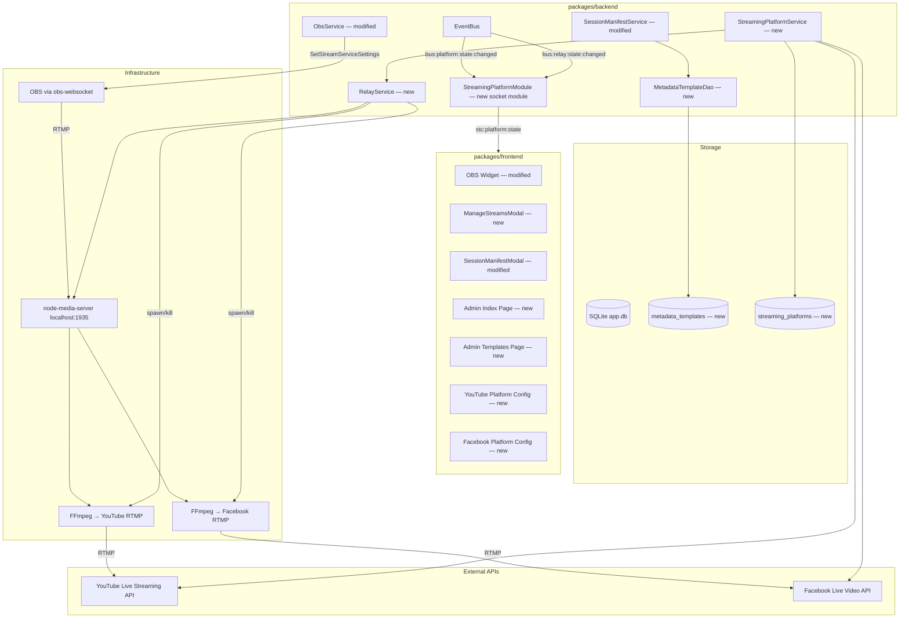

# Design Document — Multi-Platform Streaming

## Overview

This document extends the foundational `livestream-control-system` design with multi-platform streaming capabilities. It covers the architecture, interfaces, data models, state machines, and component specifications required to stream simultaneously to YouTube and Facebook from a single OBS source.

This is an extension document — it references and builds on the original design doc at `.kiro/specs/livestream-control-system/design.md`. Patterns, conventions, and components defined there remain authoritative unless explicitly superseded here.

### What This Release Adds

- RTMP relay infrastructure (node-media-server + per-destination FFmpeg forwarders)
- Platform API integrations (YouTube Live Streaming API, Facebook Live Video API)
- OAuth 2.0 token lifecycle management with proactive refresh
- Named metadata templates with role-based visibility and a validate-then-save admin workflow
- Multi-template interpolation with `{verseText}` token (KJV verse text lookup)
- `ManageStreamsModal` for per-platform stream control during a live session
- Platform state machine (Idle → Starting → Streaming → Stopping → Idle, plus No Source → Recovering)
- Extended `ConnectionStatus` model (boolean `healthy` → four-value `status` field)
- Admin Index Page (`/admin`) as the ADMIN post-login landing page
- Template management page (`/admin/templates`) with side-by-side category lists

### Breaking Changes to the Original Design

- **`ConnectionStatus` interface**: The boolean `healthy` field is replaced by `status: "healthy" | "degraded" | "unhealthy" | "inactive"`. All existing usages must be migrated. The `WidgetContainer` component, its CSS dot classes, and the popover text all change.
- **`SessionManifest` interface**: Two new fields added: `titleTemplateId?: string` and `descriptionTemplateId?: string`. The backend `SessionManifestEventMap` payload gains `interpolatedDescription: string`.
- **`SessionManifestService` constructor**: No longer accepts a template string. Reads templates from the database via a DAO.
- **`interpolateStreamTitle` in `packages/shared`**: Reworked to support multiple templates and the `{verseText}` token. Function signature changes.
- **OBS widget connection list**: Expands from one entry (`"OBS"`) to three (`"OBS"`, `"Relay"`, `"Stream"`).
- **ADMIN post-login navigation**: Redirects to `/admin` instead of the Dashboard Selection Screen.

---

## Architecture

### Extended Topology



### New Communication Boundaries

| Boundary | Protocol | Notes |
|---|---|---|
| Backend → YouTube/Facebook APIs | HTTPS (REST) | OAuth 2.0 bearer tokens |
| OBS → Relay | RTMP | `rtmp://localhost:{RELAY_PORT}/live/stream` |
| Relay → Platform ingest | RTMP via FFmpeg | `-c copy`, no re-encoding |
| Frontend ↔ Backend (platform state) | Socket.io | New `stc:platform:state` and `cts:platform:command` events |
| Frontend → Backend (templates) | REST | `GET/POST/PUT/DELETE /admin/templates` |
| Frontend → Backend (platform config) | REST | `/admin/platforms/*` |
| Frontend → Backend (OAuth callbacks) | REST | `GET /api/auth/callback/{youtube,facebook}` |

### Key Architectural Decisions

**Relay as always-on infrastructure**: The `node-media-server` relay starts on backend startup and runs for the lifetime of the process — it is not started/stopped per streaming session. This eliminates startup latency when the volunteer taps "Go Live" and ensures OBS can be pre-configured to point at the relay at all times.

**One FFmpeg process per destination**: Each platform gets its own FFmpeg child process reading from the relay. This provides failure isolation — if the YouTube FFmpeg crashes, Facebook continues unaffected. Starting or stopping a platform mid-stream is a simple spawn/kill of a single process.

**Platform API calls are backend-only**: The frontend never communicates with YouTube or Facebook APIs directly. All OAuth token management, broadcast creation, and health polling happens in the backend. The frontend sees only platform state updates via Socket.io.

**SessionManifestService owns interpolation, reads templates via DAO**: Template CRUD is handled by REST route handlers talking to `MetadataTemplateDao`. `SessionManifestService` reads templates from the same DAO when it needs to interpolate. No separate template service class — the DAO is sufficient for data access.

**OBS stream settings always point at the relay**: `ObsService` configures OBS to stream to `rtmp://localhost:{RELAY_PORT}/live/stream` on every connection (not just on stream start). Before starting the OBS stream, it verifies the settings haven't been changed externally and auto-corrects if needed.

---

## Backend Services

### RelayService (New)

Manages the `node-media-server` lifecycle and all FFmpeg forwarder processes. This is the only service that interacts with the relay or spawns child processes.

```typescript
interface RelayService {
  start(): Promise<void>;                                    // Start node-media-server on RELAY_PORT
  stop(): Promise<void>;                                     // Stop relay and all forwarders
  getRelayState(): RelayState;                               // Current relay health
  isObsConnected(): boolean;                                 // Whether OBS is publishing to the relay
  startForwarder(platformId: string, rtmpUrl: string): void; // Spawn FFmpeg for one platform
  stopForwarder(platformId: string): void;                   // Kill FFmpeg for one platform
  stopAllForwarders(): void;                                 // Kill all FFmpeg processes
  // Emits bus:relay:state:changed on EventBus when relay or OBS connection state changes
  // Emits bus:forwarder:exited on EventBus when an FFmpeg process exits unexpectedly
}

type RelayState = "healthy" | "unhealthy" | "inactive";
// healthy:   relay running, OBS connected
// inactive:  relay running, OBS not connected (or no platforms configured)
// unhealthy: relay failed to start or crashed and recovery failed
```

**Relay lifecycle**: Started in `index.ts` on backend startup, before `ObsService.connect()`. If the relay fails to start (port conflict), `RelayService` emits `bus:relay:state:changed` with `"unhealthy"` and logs a clear error. The relay runs for the lifetime of the backend process.

**OBS connection detection**: `node-media-server` emits `postPublish` and `donePublish` events when a publisher connects/disconnects. `RelayService` subscribes to these and emits `bus:relay:state:changed` accordingly. This is the mechanism for the "No Source" detection specified in Req 5.10.

**Relay TCP keepalive**: `node-media-server` is configured with `ping: 5` and `ping_timeout: 3` (seconds) so that OBS crashes (process killed, machine power loss) are detected within ~8 seconds rather than relying on the OS default TCP timeout (which can be 30+ seconds). Without this, a half-open TCP connection from a crashed OBS would leave the relay in a false "OBS connected" state.

**FFmpeg process management**: Each forwarder is a `child_process.spawn("ffmpeg", [...])` with args:

```
ffmpeg -i rtmp://localhost:{RELAY_PORT}/live/stream -c copy -f flv {platformRtmpUrl}
```

`RelayService` tracks active forwarders in a `Map<string, ChildProcess>` keyed by `platformId`. When a process exits unexpectedly, it emits `bus:forwarder:exited` with the platform ID and exit code. The auto-recovery logic (Req 5.4) lives in `StreamingPlatformService`, not here — `RelayService` only reports the exit.

**Relay crash recovery**: If `node-media-server` crashes during operation, `RelayService` attempts restart up to 3 times with 5-second delays. On success, emits a self-clearing Banner via `bus:relay:state:changed`. On exhaustion, emits persistent `"unhealthy"` state.

**Cleanup on shutdown**: `RelayService.stop()` is called from signal handlers (`SIGTERM`, `SIGINT`) registered in `index.ts`. It kills all FFmpeg child processes and stops the relay.

```typescript
// EventMap slice — merged into root EventMap
interface RelayEventMap {
  [BUS_RELAY_STATE_CHANGED]: { state: RelayState };
  [BUS_FORWARDER_EXITED]: { platformId: string; exitCode: number | null; stderr: string };
}
```

---

### PlatformConfig (New Type)

The decoded representation of a `streaming_platforms` row. Tokens are decrypted by the DAO before being passed to services — no service handles encrypted blobs directly.

```typescript
interface PlatformConfig {
  id: string;
  platformType: "youtube" | "facebook";
  label: string;
  enabled: boolean;
  accessToken: string;            // decrypted by DAO
  refreshToken: string;           // decrypted by DAO
  tokenExpiresAt: string | null;  // ISO 8601 or null (Facebook tokens don't expire)
  platformMetadata: YouTubeMetadata | FacebookMetadata; // decoded from JSON by DAO
  createdAt: string;
}

interface YouTubeMetadata {
  privacy: "public" | "unlisted" | "private";
  channelId: string;
}

interface FacebookMetadata {
  pageId: string;
  pageName: string;
}
```

The DAO decrypts tokens via the existing `decrypt()` utility and parses `platformMetadata` from JSON. REST GET endpoints never return `accessToken` or `refreshToken` — those fields are write-only from the API perspective.

---

### StreamingPlatformService (New)

Manages platform configurations, OAuth token lifecycle, broadcast CRUD, health polling, and the platform state machine. This is the orchestrator for the multi-platform streaming flow.

**Manifest authority**: `StreamingPlatformService` does not receive the manifest from the frontend. It reads the current manifest and interpolated strings from `SessionManifestService.getInterpolated()` at the moment of broadcast creation. This ensures the backend's authoritative manifest is always used — if another client updated the manifest between the volunteer's last state sync and their "Go Live" tap, the backend uses the latest version.

```typescript
interface StreamingPlatformService {
  // Platform configuration
  getEnabledPlatforms(): PlatformConfig[];
  getPlatformHealth(): PlatformHealthMap;           // Token validity + page access for each platform

  // Broadcast lifecycle — reads manifest from SessionManifestService internally
  startAll(): Promise<void>;
  startPlatform(platformId: string): Promise<void>;
  stopAll(): Promise<void>;
  stopPlatform(platformId: string): Promise<void>;

  // State
  getPlatformStates(): Map<string, PlatformStreamState>;

  // Called by index.ts on startup
  validateTokensOnStartup(): Promise<void>;

  destroy(): void;
  // Emits bus:platform:state:changed on EventBus for every state transition
  // Subscribes to bus:forwarder:exited for auto-recovery
  // Subscribes to bus:relay:state:changed for No Source detection
}
```

**Platform state machine**:

```
                    ┌──────────────────────────────────────────────┐
                    │                                              │
                    ▼                                              │
  ┌──────┐    ┌──────────┐    ┌───────────┐    ┌──────────┐    ┌─────┐
  │ Idle │───▶│ Starting │───▶│ Streaming │───▶│ Stopping │───▶│Idle │
  └──────┘    └──────────┘    └───────────┘    └──────────┘    └─────┘
                  │                │                                ▲
                  │                │  OBS disconnects               │
                  │                ▼                                │
                  │          ┌───────────┐    ┌────────────┐       │
                  │          │ No Source │───▶│ Recovering │───────┘
                  │          └───────────┘    └────────────┘
                  │                                │
                  │                                │ broadcast ended
                  ▼                                ▼
              ┌───────┐                        ┌───────┐
              │ Error │◀───────────────────────│ Error │
              └───────┘                        └───────┘
                  │
                  │ volunteer taps Start
                  │ (best-effort end old broadcast)
                  ▼
              ┌──────────┐
              │ Starting │
              └──────────┘
```

**State transitions**:

| From | To | Trigger |
|---|---|---|
| Idle | Starting | User taps Start / Start All |
| Starting | Streaming | Broadcast created + FFmpeg spawned + OBS streaming |
| Starting | Error | Timeout (30s) or API failure |
| Streaming | Stopping | User taps Stop / Stop All |
| Streaming | No Source | OBS disconnects from relay (publisher disconnect event) |
| Stopping | Idle | FFmpeg killed + broadcast ended via API |
| No Source | Recovering | OBS reconnects to relay (publisher connect event) |
| Recovering | Streaming | Platform API confirms broadcast still active |
| Recovering | Error | Platform API reports broadcast ended |
| Error | Starting | User taps Start (best-effort end old broadcast first) |

**Parallel start orchestration (Req 6.4)**: `startAll()` executes the per-platform sequence in parallel via `Promise.allSettled()`. Step (c) — ensuring OBS is streaming to the relay — is a shared prerequisite protected by a mutex. All parallel platform sequences await this mutex before proceeding to step (d).

```typescript
// Simplified orchestration logic
async startAll(): Promise<void> {
  // Read interpolated strings from the backend's authoritative manifest
  const { interpolatedStreamTitle, interpolatedDescription } = this.manifestService.getInterpolated();

  const platforms = this.getEnabledPlatforms();
  // Steps (a) and (b) run per-platform in parallel
  const broadcasts = await Promise.allSettled(
    platforms.map((p) => this.createBroadcast(p, interpolatedStreamTitle, interpolatedDescription))
  );
  // Step (c) runs once — shared prerequisite
  const obsResult = await this.ensureObsStreamingToRelay();
  if (!obsResult.success) {
    // Step (c) failed — clean up any successfully created broadcasts
    for (const result of broadcasts) {
      if (result.status === "fulfilled") {
        this.endBroadcastBestEffort(result.value.platformId, result.value.broadcastId);
        this.transitionPlatform(result.value.platformId, "error", "Could not start OBS stream");
      }
    }
    return;
  }
  // Step (d) runs per-platform for successful broadcasts
  for (const result of broadcasts) {
    if (result.status === "fulfilled") {
      this.relayService.startForwarder(result.value.platformId, result.value.rtmpUrl);
    }
  }
}
```

**Auto-recovery (Req 5.4)**: `StreamingPlatformService` subscribes to `bus:forwarder:exited`. When an FFmpeg process exits while the platform is in "Streaming" state, it runs the recovery sequence: wait 2s → respawn → wait 5s → poll API to verify broadcast is alive. If the platform is in "No Source" state, auto-recovery is suppressed — the exit is expected and recovery is deferred until OBS reconnects.

**No Source handling (Req 5.10)**: `StreamingPlatformService` subscribes to `bus:relay:state:changed`. When OBS disconnects (relay transitions from `"healthy"` to `"inactive"`), all platforms in "Streaming" state transition to "No Source". FFmpeg processes are left running (they'll stall but not exit immediately). When OBS reconnects (relay transitions back to `"healthy"`), platforms in "No Source" transition to "Recovering" and the API verification poll runs.

**OBS stream stop when all platforms idle (Req 7.7)**: After each platform transitions to "Idle" or "Error", `StreamingPlatformService` checks if any platforms remain in an active state ("Streaming", "Starting", "Stopping", "No Source", "Recovering"). If none do and OBS is still streaming to the relay, it calls `ObsService.stopStream()`.

**Health polling (Req 8.1)**: While any platform is in "Streaming" state, a `setInterval` polls each platform's API every 30 seconds. Results are emitted via `bus:platform:health:updated`. The interval is cleared when no platforms are streaming.

**Token lifecycle**: On startup, `validateTokensOnStartup()` makes a lightweight API call per enabled platform. For YouTube, it also checks token expiry and refreshes proactively if within 5 minutes. For Facebook, it validates Page access. Failures emit Banner notifications. A background timer checks YouTube token expiry every minute and refreshes proactively.

---

### StreamingPlatformClient Interface (New)

Each platform's API integration implements this common interface. YouTube and Facebook are separate modules.

```typescript
interface StreamingPlatformClient {
  readonly platformType: "youtube" | "facebook";

  validateCredentials(): Promise<Result<void, PlatformError>>;
  refreshTokenIfNeeded(): Promise<Result<void, PlatformError>>;

  createBroadcast(title: string, description: string, config: PlatformConfig): Promise<Result<BroadcastInfo, PlatformError>>;
  endBroadcast(broadcastId: string): Promise<Result<void, PlatformError>>;

  getBroadcastHealth(broadcastId: string): Promise<Result<PlatformHealth, PlatformError>>;
  isBroadcastActive(broadcastId: string): Promise<Result<boolean, PlatformError>>;

  getAccountName(config: PlatformConfig): Promise<Result<string, PlatformError>>;
}

interface BroadcastInfo {
  broadcastId: string;
  rtmpUrl: string;
}

type PlatformHealth = "good" | "ok" | "bad" | "noData";

class PlatformError extends Error {
  constructor(
    public readonly code: PlatformErrorCode,
    message: string,
  ) {
    super(message);
    this.name = "PlatformError";
  }
}

type PlatformErrorCode =
  | "TOKEN_EXPIRED"
  | "TOKEN_REFRESH_FAILED"
  | "BROADCAST_CREATE_FAILED"
  | "BROADCAST_END_FAILED"
  | "HEALTH_POLL_FAILED"
  | "PAGE_INACCESSIBLE"
  | "QUOTA_EXCEEDED"
  | "NETWORK_ERROR";
```

**YouTube client specifics**: Uses `googleapis` npm package. Creates `liveBroadcast` + `liveStream`, binds them, sets `enableAutoStart: true` and `enableAutoStop: true`. Privacy setting read from `platformMetadata.privacy`.

**Facebook client specifics**: Uses direct HTTPS calls to the Graph API. Creates a `LiveVideo` on the configured Page. Page ID read from `platformMetadata.pageId`.

---

### SessionManifestService (Modified)

The existing `SessionManifestService` is modified to support multiple templates and the `{verseText}` token.

**Changes from original**:

1. Constructor no longer accepts a `template` string parameter. Instead, it receives a `Database` reference and reads templates via `MetadataTemplateDao`.
2. `update()` now reads the selected `titleTemplateId` and `descriptionTemplateId` from the manifest, fetches the corresponding format strings from the database, and interpolates both.
3. The `BUS_SESSION_MANIFEST_UPDATED` event payload gains `interpolatedDescription: string`.
4. `{verseText}` interpolation requires a KJV database query — this is performed in the backend only (not in `packages/shared`).

```typescript
// Modified constructor
constructor(private readonly database: Database) {
  // No template parameter — templates come from the database
  this.templateDao = new MetadataTemplateDao(database);
  // ... existing EventBus subscription for OBS state
}

// New — returns current interpolated strings without triggering an update or event.
// Used by StreamingPlatformService for broadcast creation and by emitInitialState().
getInterpolated(): { interpolatedStreamTitle: string; interpolatedDescription: string; manifestReady: boolean } {
  return {
    interpolatedStreamTitle: this.cachedInterpolatedTitle,
    interpolatedDescription: this.cachedInterpolatedDescription,
    manifestReady: this.cachedManifestReady,
  };
}

// Modified update — now interpolates both title and description, computes manifestReady
update(patch: Partial<SessionManifest>, actor: JwtPayload): Result<SessionManifest, never> {
  this.manifest = { ...this.manifest, ...patch };

  const titleTemplate = this.manifest.titleTemplateId
    ? this.templateDao.getById(this.manifest.titleTemplateId)
    : null;
  const descriptionTemplate = this.manifest.descriptionTemplateId
    ? this.templateDao.getById(this.manifest.descriptionTemplateId)
    : null;

  this.cachedInterpolatedTitle = interpolateTemplate(
    this.manifest,
    titleTemplate?.formatString ?? DEFAULT_STREAM_TITLE_TEMPLATE,
    this.verseTextResolver,
  );
  this.cachedInterpolatedDescription = descriptionTemplate && descriptionTemplate.formatString
    ? interpolateTemplate(this.manifest, descriptionTemplate.formatString, this.verseTextResolver)
    : "";

  // manifestReady: true when templates are selected AND all required tokens have values.
  // A token is "required" if it appears in either selected template (excluding {Date}).
  this.cachedManifestReady = this.computeManifestReady(titleTemplate, descriptionTemplate);

  eventBus.emit(BUS_SESSION_MANIFEST_UPDATED, {
    manifest: { ...this.manifest },
    interpolatedStreamTitle: this.cachedInterpolatedTitle,
    interpolatedDescription: this.cachedInterpolatedDescription,
    manifestReady: this.cachedManifestReady,
  });

  return { success: true, value: { ...this.manifest } };
}

// Checks whether all tokens referenced by the selected templates have values in the manifest.
private computeManifestReady(titleTemplate: MetadataTemplateRow | null, descriptionTemplate: MetadataTemplateRow | null): boolean {
  if (!this.manifest.titleTemplateId) return false; // no title template selected
  const tokens = new Set<string>();
  for (const t of [titleTemplate, descriptionTemplate]) {
    if (!t?.formatString) continue;
    for (const match of t.formatString.matchAll(/\{(\w+)\}/g)) {
      if (match[1] !== "Date") tokens.add(match[1]!);
    }
  }
  for (const token of tokens) {
    switch (token) {
      case "Speaker": if (!this.manifest.speaker?.trim()) return false; break;
      case "Title": if (!this.manifest.title?.trim()) return false; break;
      case "Scripture":
      case "verseText": if (!this.manifest.scripture) return false; break;
    }
  }
  return true;
}
```

**`interpolateTemplate` replaces `interpolateStreamTitle`**: The shared function in `packages/shared/src/interpolation.ts` is extended to handle `{verseText}`. However, `{verseText}` requires a database query, which is backend-only. The function signature becomes:

```typescript
// packages/shared/src/interpolation.ts
export function interpolateTemplate(
  manifest: SessionManifestFields,
  template: string,
  verseTextResolver?: (ref: ScriptureReference) => string,
): string;
```

The backend passes a resolver that queries the KJV table. The frontend passes no resolver — `{verseText}` tokens in the frontend preview are replaced with the formatted scripture reference followed by `(full text included on stream)` (e.g., `John 3:16 (full text included on stream)`), since the frontend does not have access to the KJV database. The full verse text is only visible in the backend-computed `interpolatedDescription` that is broadcast to clients.

---

### MetadataTemplateDao (New)

Data access object for the `metadata_templates` table. Used by both REST route handlers (CRUD) and `SessionManifestService` (read for interpolation).

```typescript
interface MetadataTemplateDao {
  getAll(): MetadataTemplateRow[];
  getById(id: string): MetadataTemplateRow | null;
  getByCategory(category: TemplateCategory): MetadataTemplateRow[];
  getByCategoryAndRole(category: TemplateCategory, role: Role): MetadataTemplateRow[];
  create(template: CreateTemplateRequest): MetadataTemplateRow;
  update(id: string, template: UpdateTemplateRequest): MetadataTemplateRow;
  delete(id: string): void;
  countByCategoryAndRole(category: TemplateCategory, role: Role): number;
  titleTemplateCount(): number; // For last-template-deletion guard
}

interface MetadataTemplateRow {
  id: string;
  name: string;
  category: TemplateCategory;
  formatString: string;
  roleMinimum: Role;
  createdAt: string;
}

type TemplateCategory = "title" | "description";

interface CreateTemplateRequest {
  name: string;
  category: TemplateCategory;
  formatString: string;
  roleMinimum: Role;
}

interface UpdateTemplateRequest {
  name?: string;
  formatString?: string;
  roleMinimum?: Role;
}
```

`getByCategoryAndRole(category, role)` returns templates where `roleMinimum` is at or below the given role in the hierarchy. This is the query used by the frontend template dropdown — the REST endpoint filters by the authenticated user's role before returning results.

---

### ObsService (Modified)

**Changes from original**:

1. `startStream()` no longer calls `updateStreamMetadata()` via `SetStreamServiceSettings`. Metadata is set via platform APIs, not OBS. The safe-start sequence is replaced by the relay-aware flow.
2. On connect, `ObsService` configures OBS to stream to `rtmp://localhost:{RELAY_PORT}/live/stream` via `SetStreamServiceSettings`. Before starting the stream, it verifies the settings haven't been changed externally and auto-corrects if needed.
3. `startStream()` and `stopStream()` are now called by `StreamingPlatformService` as part of the platform start/stop orchestration — they are no longer triggered directly by the OBS widget's stream button (which is replaced by "Manage Streams").
4. Recording controls (`startRecording`, `stopRecording`) remain unchanged and are still triggered directly from the OBS widget.

```typescript
// New method — called on every OBS connection
private async configureRelayTarget(): Promise<void> {
  const relayUrl = `rtmp://localhost:${process.env["RELAY_PORT"] ?? "1935"}/live/stream`;
  await this.obs.call("SetStreamServiceSettings", {
    streamServiceType: "rtmp_custom",
    streamServiceSettings: { server: relayUrl, key: "" },
  });
}

// Modified startStream — no longer updates metadata, just starts OBS streaming
async startStream(): Promise<Result<ObsState, ObsError>> {
  // Verify relay target hasn't been changed externally
  const settings = await this.obs.call("GetStreamServiceSettings");
  const expected = `rtmp://localhost:${process.env["RELAY_PORT"] ?? "1935"}/live/stream`;
  if (settings.streamServiceSettings.server !== expected) {
    logger.warn("OBS stream settings were changed externally — auto-correcting");
    await this.configureRelayTarget();
  }
  // Start streaming (to the relay)
  await this.obs.call("StartStream");
  // ... existing state update and event emission
}
```

---

## Database Schema

Two new tables are added to `schema.ts` via `applySchema()`:

```sql
CREATE TABLE IF NOT EXISTS streaming_platforms (
  id TEXT PRIMARY KEY NOT NULL,
  platformType TEXT NOT NULL UNIQUE CHECK(platformType IN ('youtube', 'facebook')),
  label TEXT NOT NULL,
  enabled INTEGER NOT NULL DEFAULT 1,
  encryptedAccessToken TEXT,
  encryptedRefreshToken TEXT,
  tokenExpiresAt TEXT,
  platformMetadata TEXT NOT NULL DEFAULT '{}',
  createdAt TEXT NOT NULL
);

CREATE TABLE IF NOT EXISTS metadata_templates (
  id TEXT PRIMARY KEY NOT NULL,
  name TEXT NOT NULL,
  category TEXT NOT NULL CHECK(category IN ('title', 'description')),
  formatString TEXT NOT NULL,
  roleMinimum TEXT NOT NULL CHECK(roleMinimum IN ('ADMIN', 'AvPowerUser', 'AvVolunteer')),
  createdAt TEXT NOT NULL,
  UNIQUE(category, name)
);
```

**`streaming_platforms.platformMetadata`** is a JSON string decoded by the DAO. Contents vary by platform:

- YouTube: `{ "privacy": "public" | "unlisted" | "private", "channelId": "..." }`
- Facebook: `{ "pageId": "...", "pageName": "..." }`

**`metadata_templates` unique constraint**: `UNIQUE(category, name)` ensures no two templates in the same category share a name. This is the database-level enforcement of validation check (c) from Req 3.9.

**Bootstrap**: On first startup, if `metadata_templates` is empty, the backend auto-creates:

1. Title template: `{ name: "Speaker and Title", category: "title", roleMinimum: "AvVolunteer", formatString: "{Date} – {Speaker} – {Title}" }`
2. Description "None" template: `{ name: "None", category: "description", roleMinimum: "AvVolunteer", formatString: "" }`

This runs in `index.ts` after `applySchema()`, following the same pattern as `authService.bootstrapIfEmpty()`.

---

## Event Constants

### Backend-Only EventBus Constants

Added to `packages/backend/src/eventBus/types.ts`:

```typescript
// Relay events
export const BUS_RELAY_STATE_CHANGED = "bus:relay:state:changed" as const;
export const BUS_FORWARDER_EXITED = "bus:forwarder:exited" as const;

// Platform events
export const BUS_PLATFORM_STATE_CHANGED = "bus:platform:state:changed" as const;
export const BUS_PLATFORM_HEALTH_UPDATED = "bus:platform:health:updated" as const;
```

### Shared Socket.io Event Constants

Added to `packages/shared/src/socketEvents.ts`:

```typescript
// Client → Server
export const CTS_PLATFORM_COMMAND = "cts:platform:command" as const;

// Server → Client
export const STC_PLATFORM_STATE = "stc:platform:state" as const;
export const STC_PLATFORM_HEALTH = "stc:platform:health" as const;
export const STC_RELAY_STATE = "stc:relay:state" as const;
```

### EventMap Extension

The root `EventMap` in `eventBus.ts` gains two new slices:

```typescript
export interface EventMap extends ObsEventMap, SessionManifestEventMap, RelayEventMap, PlatformEventMap {}
```

```typescript
// RelayEventMap — in relay module types.ts
interface RelayEventMap {
  [BUS_RELAY_STATE_CHANGED]: { state: RelayState };
  [BUS_FORWARDER_EXITED]: { platformId: string; exitCode: number | null; stderr: string };
}

// PlatformEventMap — in platform module types.ts
interface PlatformEventMap {
  [BUS_PLATFORM_STATE_CHANGED]: { platformId: string; state: PlatformStreamState };
  [BUS_PLATFORM_HEALTH_UPDATED]: { platformId: string; health: PlatformHealth };
}
```

### SessionManifestEventMap (Modified)

The existing payload gains `interpolatedDescription`:

```typescript
interface SessionManifestEventMap {
  [BUS_SESSION_MANIFEST_UPDATED]: {
    manifest: SessionManifest;
    interpolatedStreamTitle: string;
    interpolatedDescription: string; // new — empty string when "None" template selected
    manifestReady: boolean;          // new — true when templates selected and all required fields populated
  };
}
```

---

## Socket.io Gateway

### StreamingPlatformModule (New)

Implements the `SocketModule` interface. Follows the same pattern as `ObsModule`.

```typescript
export class StreamingPlatformModule implements SocketModule {
  constructor(
    private readonly platformService: StreamingPlatformService,
    private readonly relayService: RelayService,
  ) {}

  register(io: Server): void {
    // Forward platform state changes to all clients
    eventBus.subscribe(BUS_PLATFORM_STATE_CHANGED, (payload) => {
      io.emit(STC_PLATFORM_STATE, payload);
    });

    eventBus.subscribe(BUS_PLATFORM_HEALTH_UPDATED, (payload) => {
      io.emit(STC_PLATFORM_HEALTH, payload);
    });

    eventBus.subscribe(BUS_RELAY_STATE_CHANGED, (payload) => {
      io.emit(STC_RELAY_STATE, payload);
    });
  }

  registerSocket(auth: AuthenticatedSocket): void {
    const { socket, jwtPayload } = auth;

    socket.on(CTS_PLATFORM_COMMAND, async (command: PlatformCommand, ack: (result: CommandResult) => void) => {
      logger.info("Platform command received", { userId: jwtPayload.sub, context: { command } });
      try {
        switch (command.type) {
          case "startAll":
            await this.platformService.startAll();
            break;
          case "startPlatform":
            await this.platformService.startPlatform(command.platformId);
            break;
          case "stopAll":
            await this.platformService.stopAll();
            break;
          case "stopPlatform":
            await this.platformService.stopPlatform(command.platformId);
            break;
        }
        ack({ success: true });
      } catch (err: unknown) {
        ack({ success: false, error: err instanceof Error ? err.message : String(err) });
      }
    });
  }

  emitInitialState(auth: AuthenticatedSocket): void {
    // Emit current state for all platforms
    for (const [platformId, state] of this.platformService.getPlatformStates()) {
      auth.socket.emit(STC_PLATFORM_STATE, { platformId, state });
    }
    // Emit relay state
    auth.socket.emit(STC_RELAY_STATE, { state: this.relayService.getRelayState() });
  }
}
```

### PlatformCommand Type

The frontend sends only the command type and platform ID. The backend reads the manifest and interpolated strings from its own `SessionManifestService` — the frontend never sends manifest data with start commands.

```typescript
type PlatformCommand =
  | { type: "startAll" }
  | { type: "startPlatform"; platformId: string }
  | { type: "stopAll" }
  | { type: "stopPlatform"; platformId: string };
```

### Modified SessionManifestModule

The `emitInitialState` method now includes `interpolatedDescription` in the payload:

```typescript
emitInitialState(auth: AuthenticatedSocket): void {
  const manifest = this.manifestService.get();
  const { interpolatedStreamTitle, interpolatedDescription, manifestReady } = this.manifestService.getInterpolated();
  auth.socket.emit(STC_SESSION_MANIFEST_UPDATED, { manifest, interpolatedStreamTitle, interpolatedDescription, manifestReady });
}
```

---

## REST Routes

### Template Routes (New)

Two routers serve template data at different paths with different auth requirements:

**Admin CRUD** — `createAdminTemplateRouter(database: Database, authService: AuthService): Router`

Mounted at `/admin/templates`. Requires ADMIN role.

| Method | Path | Description |
|---|---|---|
| `GET` | `/admin/templates` | List all templates (unfiltered, for admin management page) |
| `POST` | `/admin/templates` | Create template (runs validation) |
| `PUT` | `/admin/templates/:id` | Update template (runs validation) |
| `DELETE` | `/admin/templates/:id` | Delete template (guards last title template) |
| `POST` | `/admin/templates/validate` | Validate without saving — returns blockers and warnings |

**Volunteer read** — `createTemplateRouter(database: Database, authService: AuthService): Router`

Mounted at `/api/templates`. Requires authentication (any role). Used by `SessionManifestModal` to populate template dropdowns.

| Method | Path | Description |
|---|---|---|
| `GET` | `/api/templates?category={title\|description}` | List templates filtered by the authenticated user's role (derived from JWT, not a query param) |

The backend reads the user's role from the JWT payload and filters templates where `roleMinimum` is at or below that role in the hierarchy. The `category` query parameter is optional — if omitted, both categories are returned.

**Validation endpoint**: `POST /admin/templates/validate` accepts the same body as create/update but returns validation results without persisting. Response:

```typescript
interface ValidationResult {
  valid: boolean;
  blockers: ValidationIssue[];  // Red errors — must be fixed
  warnings: ValidationIssue[];  // Amber warnings — can be acknowledged
}

interface ValidationIssue {
  field: string;
  code: "UNKNOWN_TOKEN" | "DUPLICATE_FORMAT" | "DUPLICATE_NAME" | "VOLUNTEER_MULTIPLE";
  message: string;
}
```

### Platform Routes (New)

`createPlatformRouter(database: Database, authService: AuthService): Router`

| Method | Path | Auth | Description |
|---|---|---|---|
| `GET` | `/admin/platforms` | ADMIN | List all platform configs (tokens excluded) |
| `GET` | `/admin/platforms/:platformType` | ADMIN | Get single platform config |
| `PUT` | `/admin/platforms/:platformType` | ADMIN | Update platform config (enable/disable, privacy, etc.) |
| `DELETE` | `/admin/platforms/:platformType` | ADMIN | Disconnect platform (revoke + delete tokens) |
| `GET` | `/api/auth/callback/youtube` | Unauthenticated | OAuth callback — exchanges code for tokens |
| `GET` | `/api/auth/callback/facebook` | Unauthenticated | OAuth callback — exchanges code for tokens |
| `GET` | `/api/platforms/health` | Authenticated | Platform readiness (token validity, page access) for widget icons |

The OAuth callback endpoints are unauthenticated because the browser redirects from the platform's consent screen — the JWT cookie is present but the redirect is a GET, not an API call. The callback validates the `state` parameter (CSRF protection) before processing.

`GET /api/platforms/health` is used by the OBS widget's platform readiness icons (Req 8.11). It returns a lightweight summary without exposing tokens:

```typescript
interface PlatformHealthResponse {
  platforms: Array<{
    platformType: "youtube" | "facebook";
    label: string;
    healthy: boolean;
    privacy?: "public" | "unlisted" | "private"; // YouTube only
  }>;
}
```

---

## Frontend Data Models

### Modified Types (`packages/frontend/src/types.ts`)

```typescript
// Extended SessionManifest — adds template selection
export interface SessionManifest {
  speaker?: string;
  title?: string;
  scripture?: ScriptureReference;
  titleTemplateId?: string;       // new
  descriptionTemplateId?: string;  // new
}

// New — platform stream state for ManageStreamsModal
export type PlatformStatus = "idle" | "starting" | "streaming" | "stopping" | "no-source" | "recovering" | "error";

export interface PlatformStreamState {
  platformId: string;
  platformType: "youtube" | "facebook";
  label: string;
  status: PlatformStatus;
  health?: PlatformHealth;
  statusMessage?: string;       // Step-level progress or error message
  privacy?: "public" | "unlisted" | "private"; // YouTube only, display in modal
}

export type PlatformHealth = "good" | "ok" | "bad" | "noData";

export type RelayState = "healthy" | "unhealthy" | "inactive";

// Modified ConnectionStatus — boolean healthy → four-value status
export interface ConnectionStatus {
  label: string;
  status: "healthy" | "degraded" | "unhealthy" | "inactive";
}

// New — metadata template for dropdown population
export interface MetadataTemplate {
  id: string;
  name: string;
  category: "title" | "description";
  formatString: string;
  roleMinimum: Role;
}

// New — platform command sent via Socket.io (backend reads its own manifest)
export type PlatformCommand =
  | { type: "startAll" }
  | { type: "startPlatform"; platformId: string }
  | { type: "stopAll" }
  | { type: "stopPlatform"; platformId: string };

// New — platform health summary for widget readiness icons
export interface PlatformHealthSummary {
  platformType: "youtube" | "facebook";
  label: string;
  healthy: boolean;
  privacy?: "public" | "unlisted" | "private";
}
```

---

## Frontend State Management

### New Slices

**`platformSlice`** — updated by `STC_PLATFORM_STATE` and `STC_PLATFORM_HEALTH` Socket.io events.

```typescript
export interface PlatformSlice {
  platformStates: Map<string, PlatformStreamState>;
  relayState: RelayState;
  setPlatformState: (platformId: string, state: PlatformStreamState) => void;
  setRelayState: (state: RelayState) => void;
  setPlatformHealth: (platformId: string, health: PlatformHealth) => void;
}

export const createPlatformSlice: StateCreator<PlatformSlice> = (set, get) => ({
  platformStates: new Map(),
  relayState: "inactive",
  setPlatformState: (platformId, state) => {
    const next = new Map(get().platformStates);
    next.set(platformId, state);
    set({ platformStates: next });
  },
  setRelayState: (relayState) => set({ relayState }),
  setPlatformHealth: (platformId, health) => {
    const next = new Map(get().platformStates);
    const existing = next.get(platformId);
    if (existing) {
      next.set(platformId, { ...existing, health });
      set({ platformStates: next });
    }
  },
});
```

**Modified `sessionManifestSlice`** — adds `interpolatedDescription` and `manifestReady`:

```typescript
export interface SessionManifestSlice {
  manifest: SessionManifest;
  interpolatedStreamTitle: string;
  interpolatedDescription: string; // new
  manifestReady: boolean;          // new — backend-computed, true when templates selected + required fields populated
  setManifest: (manifest: SessionManifest, interpolatedStreamTitle: string, interpolatedDescription: string, manifestReady: boolean) => void;
}
```

**Modified store composition**:

```typescript
export type AppStore = AuthSlice & ObsSlice & SessionManifestSlice & NotificationSlice & PlatformSlice;

export const useStore = create<AppStore>()((...args) => ({
  ...createAuthSlice(...args),
  ...createObsSlice(...args),
  ...createSessionManifestSlice(...args),
  ...createNotificationSlice(...args),
  ...createPlatformSlice(...args),
}));
```

### New Hooks

**`usePlatformState`** — selects platform state for the ManageStreamsModal:

```typescript
export function usePlatformState(): {
  platforms: PlatformStreamState[];
  relayState: RelayState;
  isAnyStarting: boolean;
  isAnyStopping: boolean;
  isAnyStreaming: boolean;
  sendCommand: (command: PlatformCommand) => Promise<CommandResult>;
} {
  const platformStates = useStore((s) => s.platformStates);
  const relayState = useStore((s) => s.relayState);
  // ... derived booleans and socket emit wrapper
}
```

### SocketProvider Additions

New event listeners in `SocketProvider`:

```typescript
newSocket.on(STC_PLATFORM_STATE, (payload: { platformId: string; state: PlatformStreamState }) => {
  useStore.getState().setPlatformState(payload.platformId, payload.state);
});

newSocket.on(STC_PLATFORM_HEALTH, (payload: { platformId: string; health: PlatformHealth }) => {
  useStore.getState().setPlatformHealth(payload.platformId, payload.health);
});

newSocket.on(STC_RELAY_STATE, (payload: { state: RelayState }) => {
  useStore.getState().setRelayState(payload.state);
});

// Modified manifest handler — now includes interpolatedDescription and manifestReady
newSocket.on(STC_SESSION_MANIFEST_UPDATED, (payload: {
  manifest: SessionManifest;
  interpolatedStreamTitle: string;
  interpolatedDescription: string;
  manifestReady: boolean;
}) => {
  useStore.getState().setManifest(payload.manifest, payload.interpolatedStreamTitle, payload.interpolatedDescription, payload.manifestReady);
});
```

---

## CSS Additions

### New Dot Classes (`variables.css`)

```css
.widget-dot-degraded {
  color: var(--color-warning);
}

.widget-dot-inactive {
  color: var(--color-text-muted);
}
```

No animation on degraded or inactive — only `widget-dot-unhealthy` blinks. The degraded amber dot is solid and static, distinct from both the green healthy dot and the red blinking unhealthy dot. The inactive grey dot is also solid and static.

### New Component Classes (`shared.css`)

```css
/* ManageStreamsModal platform row */
.platform-row {
  display: flex;
  align-items: center;
  gap: var(--space-control-gap);
  padding: var(--space-widget-inner) 0;
  border-bottom: 1px solid var(--color-border);
}

.platform-row:last-child {
  border-bottom: none;
}

/* Platform status label */
.platform-status {
  display: flex;
  align-items: center;
  gap: 0.375rem;
}

/* Template admin page — side-by-side lists */
.template-lists {
  display: flex;
  gap: var(--space-grid-gap);
}

.template-list {
  flex: 1;
  display: flex;
  flex-direction: column;
}

.template-list-scroll {
  height: 20rem;
  overflow-y: auto;
  border: 1px solid var(--color-border);
  border-radius: 0.375rem;
  background: var(--color-surface);
}

.template-item {
  display: flex;
  align-items: center;
  padding: 0.625rem var(--space-widget-inner);
  border-bottom: 1px solid var(--color-border);
}

.template-item:last-child {
  border-bottom: none;
}

/* Platform readiness icons below Manage Streams button */
.platform-readiness {
  display: flex;
  align-items: center;
  justify-content: center;
  gap: 0.5rem;
  margin-top: 0.25rem;
}

.platform-readiness-icon {
  display: flex;
  align-items: center;
  gap: 0.25rem;
  font-size: 0.875rem;
}
```

---

## Frontend Components

### WidgetContainer (Modified)

**Breaking change**: `ConnectionStatus.healthy: boolean` → `ConnectionStatus.status: "healthy" | "degraded" | "unhealthy" | "inactive"`.

The dot rendering logic changes from a binary class selection to a four-way mapping:

```typescript
const DOT_CLASS: Record<ConnectionStatus["status"], string> = {
  healthy: "widget-dot-healthy",
  degraded: "widget-dot-degraded",
  unhealthy: "widget-dot-unhealthy",
  inactive: "widget-dot-inactive",
};

const STATUS_LABEL: Record<ConnectionStatus["status"], string> = {
  healthy: "Healthy",
  degraded: "Degraded",
  unhealthy: "Unhealthy",
  inactive: "Inactive",
};
```

The popover now shows the status label from this map instead of the binary "Healthy" / "Unhealthy". For the "Stream" indicator, the popover additionally lists which platform(s) are degraded or failed (Req 8.10).

`data-testid` values unchanged. New `data-status` attribute on each dot span for test assertions: `data-status="healthy"`, `data-status="degraded"`, etc.

---

### ObsWidget (Modified)

The OBS widget's connection list expands from one entry to three:

```typescript
const connections: ConnectionStatus[] = [
  { label: "OBS", status: obsState.connected ? "healthy" : "unhealthy" },
  { label: "Relay", status: relayStatus },
  { label: "Stream", status: streamAggregateStatus },
];
```

**`relayStatus`** is derived from the `relayState` in the platform store slice:

```typescript
const relayState = useStore((s) => s.relayState);
// Direct mapping — RelayState values match ConnectionStatus.status values
const relayStatus: ConnectionStatus["status"] = relayState; // "healthy" | "unhealthy" | "inactive"
```

**`streamAggregateStatus`** is derived from all platform states:

```typescript
function deriveStreamStatus(platforms: Map<string, PlatformStreamState>): ConnectionStatus["status"] {
  const streaming = [...platforms.values()].filter((p) => p.status === "streaming");
  if (streaming.length === 0) return "inactive";
  if (streaming.some((p) => p.health === "bad" || p.status === "no-source")) return "unhealthy";
  if (streaming.some((p) => p.health === "ok" || p.health === "noData")) return "degraded";
  return "healthy";
}
```

**Relay popover text** uses a custom `popoverText` field on the connection object (or derived inline):

| Relay State | Popover Text |
|---|---|
| `healthy` | "Relay: Healthy" |
| `inactive` (OBS not connected) | "Relay: Waiting for OBS" |
| `inactive` (no platforms configured) | "Relay: No platforms configured" |
| `unhealthy` | "Relay: Failed" |

The distinction between the two `inactive` cases requires checking whether any platforms are configured. This is derived from the platform store.

**"Manage Streams" button replaces "Start Stream"**: The stream button in `ObsControls` is replaced by a "Manage Streams" button. Recording controls remain unchanged.

**`ObsStatusBar` content during multi-platform streaming**: The status bar adapts to the current streaming state:
- **Idle** (no platforms streaming): Normal idle state — no stream dot, no timecode
- **Starting** (start sequence in progress): "Going Live…" replaces the normal stream status (Req 6.11)
- **Streaming** (at least one platform live): Green stream dot + OBS timecode. The timecode reflects the duration since OBS started streaming to the relay, not the platform broadcast duration. This is documented here because the relay stream may start a few seconds before the platform broadcasts go live.
- **Stopping** (stop sequence in progress): "Stopping…" replaces the normal stream status

```
ObsWidget (2×2)
└── WidgetContainer (title: "OBS", connections: [OBS, Relay, Stream])
    ├── ObsStatusBar          — stream status dot, timecode, recording indicator, Edit Details button
    ├── ObsMetadataPreview    — interpolated title + description preview (modified)
    ├── WidgetErrorOverlay (wraps ObsControls when !obsState.connected)
    │   └── ObsControls (modified)
    │       ├── ManageStreamsButton  — "Manage Streams" / "Starting…" / disabled with sub-label
    │       │   └── PlatformReadinessIcons — YouTube/Facebook Ionicons with status dots
    │       └── ObsRecordingControls — Start/Stop Recording (unchanged)
    ├── ManageStreamsModal     — new, opened from ManageStreamsButton
    ├── SessionManifestModal  — modified (template dropdowns, dynamic fields)
    └── ConfirmationModal     — reused for Go Live, Stop Stream, Stop All confirmations
```

**ManageStreamsButton sub-label priority** (Req 12.4):

```typescript
function getManageStreamsSubLabel(
  relayState: RelayState,
  obsConnected: boolean,
  manifest: SessionManifest,
  manifestReady: boolean,
): string | undefined {
  if (relayState === "unhealthy") return "Streaming unavailable";
  if (!obsConnected) return "OBS not connected";
  if (!manifest.titleTemplateId) return "Select templates";
  if (!manifestReady) return "Enter metadata";
  return undefined; // enabled — no sub-label
}
```

`manifestReady` is read from the Zustand store — it is computed by the backend and broadcast via the `BUS_SESSION_MANIFEST_UPDATED` event. The frontend never parses template format strings to determine which fields are required.

**Tapping the disabled button** (Req 12.5): If the sub-label is "Select templates" or "Enter metadata", opens `SessionManifestModal`. If "Streaming unavailable" or "OBS not connected", shows a Toast with the sub-label text.

---

### ObsMetadataPreview (Modified)

Adds a description preview row below the existing title preview:

```
┌────────────────────────────────────────┐
│ Apr 8 – J. Smith – Grace          ✏   │  ← title (existing, truncated with ellipsis)
│ John 3:16 – For God so loved…         │  ← description (new, truncated, tap for popover)
└────────────────────────────────────────┘
```

When the "None" description template is selected, the description row shows "No description" in `text-muted`. Tapping the description row opens an Ionic popover with the full multi-line description (line breaks preserved), using the existing `popover-content` class.

The preview height increases from `3rem` to `4.5rem` to accommodate the second line. The `obs-metadata-preview` class is updated:

```css
.obs-metadata-preview {
  height: 4.5rem;
  /* ... existing flex properties unchanged */
}
```

This reduces the available height for `ObsControls` by `1.5rem`. At the base viewport (1024×768 landscape), the controls area shrinks from ≈326px to ≈302px — still well above WCAG touch target minimums.

---

### ManageStreamsModal (New)

A full-screen Ionic modal opened from the "Manage Streams" button. Displays per-platform stream control.

```
┌──────────────────────────────────────────┐
│  Manage Streams                    [X]   │
├──────────────────────────────────────────┤
│                                          │
│  ┌────────────────────────────────────┐  │
│  │ YouTube (Public)                   │  │
│  │ ● Streaming (Good)    [Stop Stream]│  │
│  └────────────────────────────────────┘  │
│  ┌────────────────────────────────────┐  │
│  │ Facebook                           │  │
│  │ ● Streaming (Good)    [Stop Stream]│  │
│  └────────────────────────────────────┘  │
│                                          │
│  ┌──────────────┐  ┌───────────────┐     │
│  │  Start All   │  │   Stop All    │     │
│  └──────────────┘  └───────────────┘     │
└──────────────────────────────────────────┘
```

Each platform row uses the `platform-row` class and meets WCAG 2.5.5 touch target minimums for the action button (`button-touch-target`).

**Status display per platform state**:

| Status | Dot | Label | Action Button |
|---|---|---|---|
| Idle | Grey (`widget-dot-inactive`) | "Idle" | "Start Stream" |
| Starting | Amber spinner | "Creating broadcast…" / "Connecting…" | Disabled |
| Streaming | Green (`widget-dot-healthy`) | "Streaming (Good)" | "Stop Stream" |
| Stopping | Grey spinner | "Stopping…" | Disabled |
| No Source | Red (`widget-dot-unhealthy`) | "No Source — waiting for OBS…" | None |
| Recovering | Amber spinner | "Verifying stream…" | Disabled |
| Error | Red (`widget-dot-unhealthy`) | Error message | "Start Stream" |

**"Start All" / "Stop All" buttons**: Positioned at the bottom of the modal. "Start All" is disabled (greyed out) when all platforms are streaming or when a start sequence is in progress. "Stop All" is disabled when no platforms are streaming or when a stop sequence is in progress.

**Confirmation modals**: "Start All" and individual "Start Stream" show a `ConfirmationModal` with "Start streaming to {label1} and {label2}?" / confirm "Go Live" / cancel "Cancel" / variant `primary`. "Stop All" shows "Stop all streams?" / confirm "Stop All" / cancel "Cancel" / variant `danger`. Individual "Stop Stream" shows "Stop streaming to {label}?" / confirm "Stop" / cancel "Cancel" / variant `danger`.

**Modal stays open after operations complete** (Req 6.12): The modal does not auto-close after Start All or Stop All finishes. The volunteer verifies platform statuses and dismisses manually.

**Dismissable during operations** (Req 6.11): The modal can be closed while a start/stop sequence is in progress. Reopening shows the current state — the backend is the authority.

```typescript
interface ManageStreamsModalProps {
  isOpen: boolean;
  onClose: () => void;
}
```

`data-testid="manage-streams-modal"`, `data-testid="platform-row"`, `data-testid="start-all-btn"`, `data-testid="stop-all-btn"`.

---

### SessionManifestModal (Modified)

Adds template selection dropdowns above the existing metadata fields.

```
┌──────────────────────────────────────────┐
│  Session Details                   [X]   │
├──────────────────────────────────────────┤
│                                          │
│  Title Format ▼     Description Format ▼ │  ← two dropdowns, side-by-side
│                                          │
│  Speaker  [___________________________]  │  ← fields appear after both selected
│  Title    [___________________________]  │
│  Scripture [book] [ch] [v] – [v]         │  ← shown if {Scripture} or {verseText} in templates
│                                          │
│  Stream title preview                    │
│  ┌────────────────────────────────────┐  │
│  │ Apr 8 – J. Smith – Grace          │  │
│  └────────────────────────────────────┘  │
│  Description preview                     │
│  ┌────────────────────────────────────┐  │
│  │ John 3:16 – For God so loved...   │  │
│  └────────────────────────────────────┘  │
│                                          │
│  [Clear All]              [Cancel] [Save]│
└──────────────────────────────────────────┘
```

**Template fetching**: Templates are fetched via `GET /api/templates` when the modal opens. The backend filters by the authenticated user's role (derived from the JWT, not a query parameter). Not pushed via Socket.io — the list is stable for the modal's lifetime.

**Auto-select logic** (Req 4.1): After fetching, the frontend applies auto-selection:
- Title: if exactly one non-"None" template visible → auto-select it
- Description: if exactly one non-"None" template visible → auto-select it; if zero non-"None" → auto-select "None"
- Two or more non-"None" in either category → leave unselected

**localStorage persistence** (Req 4.9): Last-used template IDs stored in `localStorage` keyed as `lastTemplateIds:{deviceId}` (where `deviceId` is a stable identifier for the device, e.g., from the dashboard ID). On modal open, if no templates are selected in the current SessionManifest, pre-select from localStorage.

**Dynamic field rendering** (Req 4.3): After both templates are selected, compute the union of placeholder tokens across both format strings. Render one input per unique token (excluding `{Date}`). `{Scripture}` and `{verseText}` share the existing `ScriptureReferenceInput`.

**Stale template handling** (Req 4.13): If a template ID in the manifest or localStorage references a template not in the fetched list (deleted or role changed), clear that selection and leave the dropdown unselected.

---

### AdminIndexPage (New)

Route: `/admin`. Accessible only to ADMIN users.

```
┌──────────────────────────────────────────┐
│  Administration                          │
├──────────────────────────────────────────┤
│                                          │
│  ┌──────────────┐  ┌──────────────────┐  │
│  │ 👤 Users     │  │ 🔌 Devices       │  │
│  └──────────────┘  └──────────────────┘  │
│  ┌──────────────┐  ┌──────────────────┐  │
│  │ 📝 Templates │  │ 📺 YouTube       │  │
│  └──────────────┘  └──────────────────┘  │
│  ┌──────────────┐  ┌──────────────────┐  │
│  │ 📘 Facebook  │  │ 🖥 Dashboards    │  │
│  └──────────────┘  └──────────────────┘  │
│                                          │
└──────────────────────────────────────────┘
```

Each card links to the corresponding admin route. Uses `dashboard-option` class for consistent card styling. The "Dashboards" card navigates to the Dashboard Selection Screen.

`data-testid="admin-index-page"`, `data-testid="admin-link-{section}"`.

---

### AdminTemplatesPage (New)

Route: `/admin/templates`. Accessible only to ADMIN users.

Two side-by-side scrollable lists with create/edit/delete functionality. See Req 3.5–3.9 for the full specification.

**Template create/edit modal** uses the validate-then-save flow:

```
┌──────────────────────────────────────────┐
│  Create Title Template             [X]   │
├──────────────────────────────────────────┤
│                                          │
│  Name     [___________________________]  │
│  Role     [AvVolunteer ▼]               │
│  Template [{Date} – {Speaker} – {Title}] │  ← single-line for title
│                                          │
│  ⚠ Volunteers will see multiple title    │  ← amber warning (if applicable)
│    templates and must choose between them│
│                                          │
│  ✗ Unknown token: {Foo}                  │  ← red blocker (if applicable)
│                                          │
│                          [Validate]      │  ← or [Save] after successful validation
└──────────────────────────────────────────┘
```

For description templates, the Template field is a multi-line `<textarea>` instead of a single-line `<input>`.

`data-testid="template-list-title"`, `data-testid="template-list-description"`, `data-testid="template-create-btn"`, `data-testid="template-edit-btn"`, `data-testid="template-delete-btn"`, `data-testid="template-validate-btn"`, `data-testid="template-save-btn"`.

---

## Navigation

### New Routes

| Route | Accessible to | Description |
|---|---|---|
| `/admin` | ADMIN only | Admin Index Page — links to all admin sections |
| `/admin/templates` | ADMIN only | Metadata template management |
| `/admin/platforms/youtube` | ADMIN only | YouTube platform configuration + OAuth |
| `/admin/platforms/facebook` | ADMIN only | Facebook platform configuration + OAuth |

### New REST Endpoints

| Endpoint | Role | Description |
|---|---|---|
| `GET /admin/templates` | ADMIN | List all templates (unfiltered) |
| `POST /admin/templates` | ADMIN | Create template |
| `PUT /admin/templates/:id` | ADMIN | Update template |
| `DELETE /admin/templates/:id` | ADMIN | Delete template |
| `POST /admin/templates/validate` | ADMIN | Validate template without saving |
| `GET /api/templates?category=` | Authenticated | List templates filtered by user's role (from JWT) |
| `GET /admin/platforms` | ADMIN | List platform configs |
| `GET /admin/platforms/:platformType` | ADMIN | Get single platform config |
| `PUT /admin/platforms/:platformType` | ADMIN | Update platform config |
| `DELETE /admin/platforms/:platformType` | ADMIN | Disconnect platform |
| `GET /api/auth/callback/youtube` | Unauthenticated | YouTube OAuth callback |
| `GET /api/auth/callback/facebook` | Unauthenticated | Facebook OAuth callback |
| `GET /api/platforms/health` | Authenticated | Platform readiness for widget icons |

### Modified ADMIN Post-Login Flow

The original spec's Flow 7 (auto-select single dashboard) is modified for ADMIN users:

1. ADMIN logs in → navigates to `/admin` (Admin Index Page)
2. ADMIN taps "Dashboards" card → navigates to Dashboard Selection Screen
3. From there, the original dashboard selection flows apply

Non-ADMIN users are unaffected — they continue to navigate to the Dashboard Selection Screen.

The `GlobalTitleBar` dashboard navigation label links to `/admin` for ADMIN users instead of `/dashboards`.

---

## Verse Text Interpolation

The `interpolateTemplate` function in `packages/shared/src/interpolation.ts` is extended to support `{verseText}`. Since verse text requires a KJV database query, the function accepts an optional resolver:

```typescript
export function interpolateTemplate(
  manifest: SessionManifestFields,
  template: string,
  verseTextResolver?: (ref: ScriptureReference) => string,
): string {
  // ... existing token replacements for {Date}, {Speaker}, {Title}, {Scripture}

  // {verseText} — requires database access, backend-only
  result = result.replace(/\{verseText\}/g, () => {
    if (!manifest.scripture) return "[No Verse Text]";
    if (!verseTextResolver) {
      // Frontend fallback — show the scripture reference with a note
      const ref = manifest.scripture;
      const refText = ref ? formatScripture(ref) : "";
      return refText ? `${refText} (full text included on stream)` : "[No Verse Text]";
    }
    return verseTextResolver(manifest.scripture);
  });

  return result;
}
```

**Backend verse text resolver**: Queries the `kjv` table and formats per Req 9:

```typescript
function createVerseTextResolver(database: Database): (ref: ScriptureReference) => string {
  return (ref: ScriptureReference): string => {
    const rows = database.prepare(
      "SELECT VERSENO, VERSETEXT FROM kjv WHERE BOOKID = ? AND CHAPTERNO = ? AND VERSENO BETWEEN ? AND ? ORDER BY VERSENO",
    ).all(ref.bookId, ref.chapter, ref.verse, ref.verseEnd ?? ref.verse) as Array<{ VERSENO: number; VERSETEXT: string }>;

    if (rows.length === 0) return "[No Verse Text]";

    const bookName = BIBLE_BOOKS[ref.bookId] ?? `Book ${ref.bookId}`;
    const displayVerse = ref.verse === 0 ? 1 : ref.verse;
    const displayVerseEnd = ref.verseEnd ?? ref.verse;
    const isSingleVerse = !ref.verseEnd || ref.verseEnd === ref.verse;
    const isChapterOnly = ref.verse === 0 && !ref.verseEnd;

    // Format the reference line
    let refLine: string;
    if (isChapterOnly) {
      refLine = `${bookName} ${ref.chapter}`;
    } else if (isSingleVerse) {
      refLine = `${bookName} ${ref.chapter}:${displayVerse}`;
    } else {
      refLine = `${bookName} ${ref.chapter}:${displayVerse}-${displayVerseEnd}`;
    }

    // Single verse — inline format
    if (isSingleVerse && ref.verse !== 0) {
      return `${refLine} – ${rows[0]!.VERSETEXT}`;
    }

    // Multi-verse or verse 0 — block format
    const lines = [refLine];
    for (const row of rows) {
      if (row.VERSENO === 0) {
        lines.push(row.VERSETEXT); // verse 0: no number prefix
      } else {
        lines.push(`${row.VERSENO}. ${row.VERSETEXT}`);
      }
    }
    return lines.join("\n");
  };
}
```

---

## Error Notification Mapping (Additions)

| Condition | Level | Severity | Auto-resolves? |
|---|---|---|---|
| Platform broadcast creation failed | Banner | error | No — volunteer retries from ManageStreamsModal |
| Platform broadcast creation timed out (30s) | Banner | error | No |
| FFmpeg forwarder crashed (auto-recovering) | Banner | warning | Yes — on successful recovery |
| FFmpeg recovery failed / broadcast ended | Banner | error | No — volunteer restarts from ManageStreamsModal |
| Platform stream quality poor | Banner | warning | Yes — when health improves |
| Platform token expired / revoked | Banner | error | No — admin must reconnect |
| Facebook Page inaccessible | Banner | error | No — admin must reconnect |
| Relay failed to start | Banner | error | No — requires server restart |
| Relay crashed and recovered | Banner | info | Yes — auto-clears |
| Relay crashed and recovery failed | Banner | error | No — requires server restart |
| OBS disconnect during multi-platform stream | Modal | error | Yes — when OBS reconnects (existing behavior) |
| Platform broadcast ended during OBS disconnect | Banner | error | No — volunteer creates new broadcast |
| Stop broadcast API failed after 3 retries | Banner | warning | No — "Check {platform} manually" |

---

## Correctness Properties (Additions)

### Property 22: Parallel start step (c) executes exactly once

_For any_ "Start All" command targeting N platforms, the shared prerequisite step (c) — ensuring OBS is streaming to the relay — SHALL execute exactly once, regardless of N. All N platform sequences SHALL wait for step (c) to complete before proceeding to step (d).

**Validates: Req 6.4**

---

### Property 23: Auto-recovery suppressed during No Source

_For any_ FFmpeg forwarder exit event that occurs while the associated platform is in "No Source" state, the backend SHALL NOT trigger the auto-recovery sequence from Req 5.4. Recovery is deferred until OBS reconnects and the platform transitions to "Recovering".

**Validates: Req 5.10**

---

### Property 24: Platform state machine transitions are valid

_For any_ platform state transition, the new state SHALL be reachable from the current state according to the state machine defined in this document. No transition outside the defined edges SHALL occur.

**Validates: Reqs 5.10, 6.3, 6.4, 7.3, 7.4**

---

### Property 25: Template role visibility filtering

_For any_ authenticated user with role R, the template list returned by `GET /admin/templates?role=R` SHALL contain only templates where `roleMinimum` is at or below R in the hierarchy (ADMIN > AvPowerUser > AvVolunteer). Templates with `roleMinimum` above R SHALL NOT appear.

**Validates: Req 4.1**

---

### Property 26: Template auto-select determinism

_For any_ set of templates visible to a user in a given category: if exactly one non-"None" template exists, it SHALL be auto-selected; if zero non-"None" templates exist (description only), "None" SHALL be auto-selected; if two or more non-"None" templates exist, no template SHALL be auto-selected.

**Validates: Req 4.1**

---

### Property 27: Validate-then-save gate

_For any_ template create or edit operation, the "Save" button SHALL NOT be available while any blocking validation error exists. Any edit to the Name, Format String, or Role Minimum fields SHALL revert the button to "Validate".

**Validates: Reqs 3.8, 3.9**

---

### Property 28: OBS stream stops when all platforms idle

_For any_ state where all platforms are in "Idle" or "Error" state and OBS is streaming to the relay, the backend SHALL stop the OBS stream. This check SHALL run after every individual platform state transition to "Idle" or "Error".

**Validates: Req 7.7**

---

### Property 29: Sub-label priority ordering

_For any_ combination of active blockers on the "Manage Streams" button, the displayed sub-label SHALL be the highest-priority applicable reason: (1) "Streaming unavailable" > (2) "OBS not connected" > (3) "Select templates" > (4) "Enter metadata".

**Validates: Req 12.4**

---

### Property 30: Best-effort old broadcast cleanup on restart from Error

_For any_ platform transitioning from "Error" to "Starting", the backend SHALL attempt to end the previous broadcast via the platform's API before creating a new one. If the end-broadcast call fails, the backend SHALL log a warning and proceed with the new broadcast — the failure SHALL NOT block the new broadcast creation.

**Validates: Req 7.3**

---

## Testing Strategy (Additions)

### Unit Tests (Vitest)

Backend:
- `RelayService`: relay start/stop, OBS connect/disconnect detection, FFmpeg spawn/kill, crash recovery
- `StreamingPlatformService`: state machine transitions, parallel start orchestration, auto-recovery with API verification, No Source handling, OBS stream stop check
- `MetadataTemplateDao`: CRUD, role filtering, category filtering, last-template guard
- Template validation: unknown tokens, duplicate format strings (whitespace-collapsed), duplicate names, volunteer exposure warning
- `interpolateTemplate`: all token types including `{verseText}`, missing fields, verse 0 handling
- YouTube/Facebook client: broadcast create/end, token refresh, health polling

Frontend:
- `ManageStreamsModal`: platform row rendering per status, Start All/Stop All disabled states, confirmation modals, dismissable during operations
- `ObsWidget` (modified): three connection indicators, Manage Streams button sub-label priority, tap-to-open for priorities 3/4, Toast for priorities 1/2
- `SessionManifestModal` (modified): template dropdown rendering, auto-select logic, dynamic field rendering, stale template handling, localStorage persistence
- `AdminTemplatesPage`: side-by-side lists, create/edit modal, validate-then-save flow, blocker/warning display
- `WidgetContainer` (modified): four-state dot rendering, popover text per status
- `usePlatformState` hook: state derivation, aggregate stream status

### Property-Based Tests (Vitest + fast-check)

| Property | Test target | What varies |
|---|---|---|
| P22: Parallel start step (c) once | `StreamingPlatformService.startAll()` | 1–5 platforms, step (c) success/failure |
| P23: Auto-recovery suppressed in No Source | `StreamingPlatformService` | FFmpeg exit events during various platform states |
| P24: Valid state transitions | `StreamingPlatformService` | Arbitrary sequences of start/stop/disconnect/reconnect events |
| P25: Template role filtering | `MetadataTemplateDao.getByCategoryAndRole()` | All role × template roleMinimum combinations |
| P26: Template auto-select | `SessionManifestModal` auto-select logic | 0–5 templates per category with various roleMinimum values |
| P27: Validate-then-save gate | Template validation logic | Arbitrary template names, format strings, roles |
| P28: OBS stops when all idle | `StreamingPlatformService` | Arbitrary sequences of platform state transitions |
| P29: Sub-label priority | `getManageStreamsSubLabel()` | All combinations of relay/OBS/template/metadata states |
| P30: Best-effort cleanup | `StreamingPlatformService.startPlatform()` from Error | End-broadcast success/failure × new broadcast success/failure |

### Integration Tests (Playwright)

- `multi-platform-stream-start-flow.spec.ts` — Manage Streams → Start All → confirmation → Go Live → platforms transition to Streaming
- `multi-platform-stream-stop-flow.spec.ts` — Stop All → confirmation → platforms transition to Idle
- `multi-platform-individual-start-stop.spec.ts` — Start/stop individual platforms independently
- `multi-platform-obs-disconnect.spec.ts` — OBS disconnects → platforms show No Source → OBS reconnects → Recovering → Streaming
- `multi-platform-ffmpeg-recovery.spec.ts` — FFmpeg exits → Banner → recovery succeeds/fails
- `manage-streams-button-states.spec.ts` — sub-label priority, tap-to-open behavior, Starting spinner
- `template-selection-flow.spec.ts` — dropdown rendering, auto-select, dynamic fields, localStorage persistence
- `template-admin-crud.spec.ts` — create/edit/delete templates, validate-then-save, blocker/warning display
- `admin-index-navigation.spec.ts` — ADMIN login → /admin → navigate to each section
- `connection-status-four-state.spec.ts` — healthy/degraded/unhealthy/inactive dot rendering and popover text
