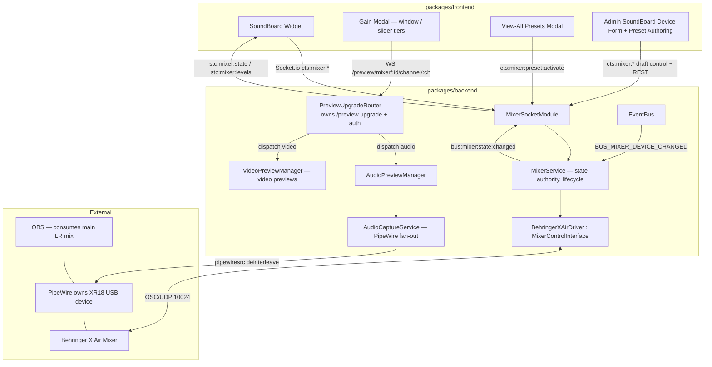

# Design Document — Sound Board Control

## Overview

This document extends the system design with **audio mixer control**: a Mixer Hardware Abstraction Layer (HAL), a Behringer X Air OSC driver, a multi-consumer audio capture layer, a capability-driven Sound Board widget (faders, mute, per-channel metering, gain control with a gain window, board presets), and an admin mixer device type with preset authoring.

This is an extension document — it references and builds on:

- `.kiro/specs/livestream-control-system/design.md` (auth, dashboard, event bus, notifications, socket module pattern)
- `.kiro/specs/multi-platform-streaming/design.md` (per-platform health/status precedent). Note: the concrete `ConnectionStatus` type used by the "Controls" indicator is defined in `packages/frontend/src/types.ts` (`"healthy" | "degraded" | "unhealthy" | "inactive"`) and consumed via `WidgetContainer`'s `connections` prop — it is frontend-local, not part of the multi-platform-streaming design. The "Controls" indicator uses the `healthy`/`unhealthy` subset.
- `.kiro/specs/video-control-and-preview/design.md` (dedicated binary `/preview/*` WebSocket transport, `PreviewStreamManager` — renamed to `VideoPreviewManager` by this spec, `AudioLevelMeter`, capability-driven widget, admin device form + preset-before-save, ws+Socket.io upgrade coexistence)
- `.kiro/specs/dashboard-management/design.md` (widget type registry, four-grid layout, `ResizeObserver` sizing)

Patterns, conventions, and components defined there remain authoritative unless explicitly superseded here.

### What This Release Adds

- `MixerControlInterface` HAL + driver factory keyed off model
- `BehringerXAirDriver` — OSC over UDP (`@mxfriend/osc`), fader/mute/gain/name, `/xremote` + `/meters` lifecycle, read-back reconciliation, fader taper
- `AudioCaptureService` — PipeWire/GStreamer multi-consumer isolated channel capture, decimated envelope stream for the gain window (multitrack recording accommodated but not built)
- `MixerService` — instance management, state authority, metering lifecycle, hot-reload
- `MixerSocketModule` (backend) + `mixerSocketModule` (frontend) — `cts:`/`stc:` command & state
- Preview transport restructured into `PreviewUpgradeRouter` (owns `/preview/*` upgrade + auth, dispatches by path), `VideoPreviewManager` (renamed from `PreviewStreamManager` — video previews), and `AudioPreviewManager` (new — audio-level previews over the binary WS; gain-window envelope is its first consumer)
- `SoundBoardWidget` with channel strips, vertical faders (real dB taper), mono per-channel meters, mute buttons, gain modal (two tiers), presets + "View all" modal, pagination, "Controls" status indicator
- Interaction hold model (suppress-in 300 ms / throttle-out ~50 ms) as a reusable hook
- Admin `SoundBoardDeviceForm` + preset authoring with live control before save
- `mixer_presets` table
- Setup script + docs updates (PipeWire, USB routing)

### Breaking Changes

- **`device_connections` table**: `deviceType` values expanded to include `"soundboard"`. Capability toggles stored in the existing dedicated **`features` column** (`Record<string, boolean>`, as camera/OBS do); `model`, `channelCount`, and `usbSlotMap` stored in the existing **`metadata` column** (JSON, with a mixer-specific typed parse since `metadata` is generically typed `Record<string, string>`). `host`/`port` reused for OSC connectivity (port default `10024`). No column migration.
- **New table**: `mixer_presets` for board-preset storage.
- **Widget type registry**: new `soundboard` entry (min 3×3).
- **Caddy routing**: `/preview/*` already routes to the backend (added by the video-control spec). The new mixer channel-audio endpoint lives under `/preview/mixer/*` and needs no additional Caddy change.
- **New dependency**: `@mxfriend/osc` (pinned). System dependency: PipeWire + `gstreamer1.0-pipewire`.

---

## Architecture

### Topology



### Key Architectural Decisions

**HAL expresses intent, driver owns transport mechanics.** `MixerControlInterface` methods are stated in domain terms (`setFader`, `getChannelState`, `startChannelMonitor`). Whether a value is obtained by OSC query, `/xremote` push, `/meters` blob, or USB capture is entirely internal to `BehringerXAirDriver`. Callers (the socket module, presets, admin) never branch on "poll here, stream there." This directly satisfies steering §2 (single backend abstraction per integration) and the user's explicit requirement.

**Control and monitoring travel different transports — exactly like the camera.** The camera uses VISCA for control and NDI/GStreamer for video. The mixer uses OSC for control and PipeWire/GStreamer for isolated channel audio. Reusing that mental model keeps the architecture consistent: `MixerControlInterface` for control, `AudioCaptureService` (surfaced to the frontend by `AudioPreviewManager`) for the envelope.

**OSC is fire-and-forget; the mixer is authoritative via read-back.** UDP has no ACK, and the console can be changed from the physical surface or the Behringer app. We therefore (a) subscribe with `/xremote` so external changes push to us, and (b) after any command, query the address and broadcast the mixer-reported value. The UI is optimistic locally (suppression window) but reconciles to the mixer. This is the audio-correctness guarantee.

**One USB device, one owner (PipeWire), many consumers.** A raw ALSA `hw:` device is exclusive-open. PipeWire owns the XR18 and fans it out, so OBS (main mix) and our capture (per-channel pre-fader) coexist without conflict. "Processed vs. pre-processed" is not a software fork — they are different USB channel indices in the same stream, selected by mixer-side routing. We build only the _consumer_ (`pipewiresrc` → `deinterleave`), and document the routing + ownership as prerequisites.

**Backend computes the envelope, not the frontend.** For the gain window we send a decimated **min/max envelope** (~60 pairs/s), not PCM. This bounds bandwidth to a trivial amount, avoids a choppy/"stammered" graph, and the frontend never needs to decode or play audio — it just draws. This is the "faster option" the user chose.

**Multi-consumer seam is built now, recording is not.** `AudioCaptureService` exposes a `subscribe(channels, consumer)` fan-out. The gain-window envelope consumer is built; a future `MultitrackRecorder` consumer can subscribe to all channels and write files with zero changes to the capture layer or the gain window. Requirement 4.2 is enforced by a test that registers a second consumer.

**Interaction hold model as a reusable hook.** The suppress-in/throttle-out behavior is identical for the vertical fader and the horizontal gain slider, so it lives in one hook (`useHeldControl`) rather than being reimplemented. Mute and preset activation are discrete and bypass it.

**Capability-driven UI with runtime override.** The widget renders controls purely from `getCapabilities()`. Admin toggles set intended capabilities; runtime availability (e.g., PipeWire missing) can _downgrade_ `channel-audio-capture` to unavailable, flipping the gain modal to the slider tier. The UI never special-cases beyond "which tier/what's present."

---

## Shared Package Changes

### Types — `packages/shared/src/types/mixer.ts` (new)

```typescript
export type MixerModel = "behringer-xair";

export type MixerFeature = "gain-control" | "channel-metering" | "channel-audio-capture";
// Note: "fader" and "mute" are core and always present — not in this list.

export interface MixerCapabilities {
  features: MixerFeature[]; // runtime wire form (driver→frontend): the enabled-feature list, derived from the stored `features` column (Record<string, boolean>) minus any runtime downgrades
  /** Model-declared preamp gain range in dB. X Air: { minDb: -12, maxDb: 60 }. */
  gainRange: { minDb: number; maxDb: number };
}

export interface MixerChannelState {
  channel: number; // 1-based
  name: string;
  fader: number; // normalized 0.0–1.0 (console taper)
  faderDb: number; // convenience: dB equivalent for display
  muted: boolean; // true = muted (interface sense; driver inverts to mix/on)
  gainDb: number; // preamp gain in dB, within capabilities.gainRange
}

export interface MixerState {
  mixerId: string;
  connected: boolean;
  model: MixerModel;
  channelCount: number;
  capabilities: MixerCapabilities;
  channels: MixerChannelState[];
  presets: MixerPresetSummary[];
}

export interface MixerPresetSummary {
  id: string;
  name: string;
  sortOrder: number;
}

/** Open address→value map. Values are the primitive OSC arg (number for fader/gain, 0/1 for mute). */
export type MixerPresetPayload = Record<string, number | string>;

/** Per-channel level for the always-visible meter (mono, dBFS). */
export interface MixerChannelLevel {
  channel: number;
  levelDb: number; // dBFS, clamped -60..0
}

/** One decimated envelope frame for the gain window (min/max in dBFS). */
export interface EnvelopePair {
  minDb: number;
  maxDb: number;
}

export interface MixerCommand {
  mixerId: string;
  channel: number;
  fader?: number; // 0.0–1.0
  muted?: boolean;
  gainDb?: number;
}
```

### Fader Taper Utility — `packages/shared/src/mixerTaper.ts` (new)

Shared so the driver (dB↔float) and the widget (dB ticks) agree. Implements the standard X Air/X32 taper.

```typescript
/**
 * X Air / X32 fader taper. 0.0 → -inf dB, ~0.75 → 0 dB, 1.0 → +10 dB.
 * Piecewise linear in dB across float, matching the console's documented curve.
 * WHY: a linear 0–100% control would misrepresent where "0 dB" sits and make
 * fine control near unity impossible. Real dB ticks require the true taper.
 */
export function faderFloatToDb(float: number): number {
  /* ... */
}
export function faderDbToFloat(db: number): number {
  /* ... */
}

/** dB tick positions for the vertical fader scale. -Infinity renders as "-inf". */
export const FADER_TICKS_DB: number[] = [10, 5, 0, -5, -10, -20, -30, -50, -Infinity];
```

### Level / Axis Constants — `packages/shared/src/constants/mixer.ts` (new)

```typescript
/** Fixed industry-standard dBFS display range — reused from AudioLevelMeter convention. */
export const LEVEL_AXIS_MAX_DBFS = 0;
export const LEVEL_AXIS_MIN_DBFS = -60;

/** Gain window LEVEL axis max height (easy to change per requirement 7.4). */
export const GAIN_WINDOW_MAX_HEIGHT_REM = 25; // ~400px at 16px root

/**
 * Gain-staging target band and danger fades, in dBFS (Req 7.4.2). Sensible
 * broadcast defaults from standard gain-staging guidance — tune freely.
 * Sources: "-18 dBFS is the new 0 dBu" reference level; safe zone ≈ -10..-20 dBFS;
 * peaks kept below ≈ -6 dBFS; 0 dBFS = hard clip; Audient Smartgain targets ≈ -12 dBFS peaks.
 * The "good" band centers on the -18 dBFS average target and extends up to -8 so typical
 * peaks land at its upper edge; -6..0 is "approaching clip" (red); -40..-60 is
 * "approaching noise floor" (blue).
 */
export const GOOD_RANGE_BAND_DBFS = { topDb: -8, bottomDb: -18 };
export const RED_FADE_DBFS = { topDb: 0, bottomDb: -6 }; // darkest at 0 (clip)
export const BLUE_FADE_DBFS = { topDb: -40, bottomDb: -60 }; // darkest at -60 (noise)

/** Interaction hold model. */
export const CONTROL_SUPPRESS_MS = 300; // inbound-suppression window after last local change
export const CONTROL_THROTTLE_MS = 50; // outbound throttle while dragging

/** Envelope decimation for the gain window. */
export const ENVELOPE_PAIRS_PER_SEC = 60;

/** OSC / subscription cadences (X Air). */
export const OSC_PORT_DEFAULT = 10024;
export const XREMOTE_RENEW_MS = 8000; // console drops after ~10s
export const METERS_RENEW_MS = 1000;

/**
 * /meters bank selection (X Air, verified against Patrick-Gilles Maillot's OSC doc).
 * Bank 1 idx 0–15 = per-channel PRE-FADER input (always-visible meter, Req 5.4).
 * Bank 2 idx 0–15 = post-preamp/pre-processing (gain-window envelope tap, Req 4.5);
 *                   idx 18–35 = 18× USB-in (setup verification of USB routing).
 * Blob: leading 32-bit BIG-endian count of int16 samples; each sample 16-bit
 * SIGNED LITTLE-endian at 1/256 dB; values below NOISE_FLOOR_DBFS → -inf.
 */
export const METERS_BANK_CHANNEL_PREFADER = 1;
export const METERS_BANK_PREAMP_IN = 2;
export const METERS_CHANNEL_INDEX_BASE = 0; // channels occupy indices 0..15 in both banks
export const NOISE_FLOOR_DBFS = -90;

/** Connection probe (Req 9.4): send /xinfo, await reply within this window. */
export const MIXER_PROBE_TIMEOUT_MS = 800;

/** Read-back reconciliation retry (Req 2.7) — UDP has no delivery guarantee. */
export const READBACK_TIMEOUT_MS = 250;
export const READBACK_MAX_RETRIES = 3;

/**
 * Status indicator freshness — no confirmed mixer round-trip within this window → unhealthy.
 * MUST be > XREMOTE_RENEW_MS (8000) + margin: on a quiet board with no external changes,
 * the periodic /xremote renewal round-trip is the guaranteed liveness signal, so the
 * freshness window has to outlast one renewal interval or a healthy idle board flaps red
 * (Req 12.2). 12000 = 8000 renewal + 4000 margin (~1.5x).
 */
export const CONTROLS_FRESHNESS_MS = 12000;
```

### Widget Type Registry — `packages/shared/src/widgetTypeRegistry.ts` (modified)

```typescript
soundboard: {
  displayName: "Sound Board",
  minColSpan: 3, // fits the 3-channel minimum on small-portrait (3 cols)
  maxColSpan: null, // uses extra width for more channels
  minRowSpan: 3, // name + gain button + fader/meter + mute + preset row
  maxRowSpan: null,
},
```

### Socket Event Constants — `packages/shared/src/constants/socketEvents.ts` (modified)

```typescript
// ── Mixer: Server → Client ────────────────────────────────────────────────────
export const STC_MIXER_STATE = "stc:mixer:state" as const; // full state (initial + on change)
export const STC_MIXER_STATE_UPDATE = "stc:mixer:state:update" as const; // single mixer/channel delta
export const STC_MIXER_LEVELS = "stc:mixer:levels" as const; // per-channel meter levels (throttled)

// ── Mixer: Client → Server ────────────────────────────────────────────────────
export const CTS_MIXER_SET = "cts:mixer:set" as const; // { mixerId, channel, fader?/muted?/gainDb? }
export const CTS_MIXER_PRESET_ACTIVATE = "cts:mixer:preset:activate" as const; // { mixerId, presetId }
export const CTS_MIXER_MONITOR_START = "cts:mixer:monitor:start" as const; // { mixerId, channel }
export const CTS_MIXER_MONITOR_STOP = "cts:mixer:monitor:stop" as const; // { mixerId, channel }
export const CTS_MIXER_WIDGET_PRESENT = "cts:mixer:widget:present" as const; // { mixerId: string; present: boolean } — per-mixer metering lifecycle
```

Exports added to `packages/shared/src/index.ts` for all new types/constants/utilities.

---

## Backend — EventBus Events

`packages/backend/src/eventBus/types.ts` (modified):

```typescript
export const BUS_MIXER_STATE_CHANGED = "bus:mixer:state:changed";
export const BUS_MIXER_LEVELS = "bus:mixer:levels";
export const BUS_MIXER_DEVICE_CHANGED = "bus:mixer:device:changed"; // hot-reload
export const BUS_MIXER_CAPTURE_PATH_LOST = "bus:mixer:capture:lost"; // catastrophic capture-path fault (Req 15.7)
export const BUS_MIXER_CAPTURE_PATH_RESTORED = "bus:mixer:capture:restored"; // resolution — auto-clears the modal

interface MixerEventMap {
  [BUS_MIXER_STATE_CHANGED]: { mixerId: string; state: MixerState };
  [BUS_MIXER_LEVELS]: { mixerId: string; levels: MixerChannelLevel[] };
  [BUS_MIXER_DEVICE_CHANGED]: { action: "created" | "updated" | "deleted"; mixerId: string };
  [BUS_MIXER_CAPTURE_PATH_LOST]: { mixerId: string; reason: string };
  [BUS_MIXER_CAPTURE_PATH_RESTORED]: { mixerId: string };
}
```

**Catastrophic capture-path modal (Req 15.7).** `BUS_MIXER_CAPTURE_PATH_LOST` (raise) and `BUS_MIXER_CAPTURE_PATH_RESTORED` (resolution) are the named pair driving the catastrophic **modal** (`NotificationLevel: "modal"`, same tier as `OBS_UNREACHABLE`). The frontend raises the modal on the `stc:` broadcast of the lost event and **auto-clears** it on the restored event — so the modal can never be un-clearable (Task 30 asserts the raise+resolve cycle). This mirrors the existing `OBS_UNREACHABLE` raise/resolution contract so there is a single established pattern for catastrophic auto-clearing modals.

`MixerSocketModule.register(io)` subscribes to `BUS_MIXER_STATE_CHANGED` → broadcasts `STC_MIXER_STATE_UPDATE`, and `BUS_MIXER_LEVELS` → broadcasts `STC_MIXER_LEVELS`. `MixerService` subscribes to `BUS_MIXER_DEVICE_CHANGED` (emitted by admin routes) to add/refresh/remove instances — the established hot-reload pattern (steering §7).

Hot-reload table addition (steering §7):

| Event                      | Emitted by                                       | Subscribers    | Effect                                                                                                             |
| -------------------------- | ------------------------------------------------ | -------------- | ------------------------------------------------------------------------------------------------------------------ |
| `BUS_MIXER_DEVICE_CHANGED` | `adminDeviceRoutes` (POST/PUT/DELETE soundboard) | `MixerService` | Adds, updates, or removes the mixer instance (OSC connection, subscriptions, capabilities) and re-broadcasts state |

---

## Database Schema

### `device_connections` — Mixer Usage

Mixer-specific configuration is split between the existing `device_connections` columns exactly as camera/OBS do it: the dedicated **`features` column** (`Record<string, boolean>`) holds the capability toggles, and the **`metadata` column** holds the rest. `host`/`port` are reused for OSC (`port` default `10024`). No migration needed.

```typescript
// Stored in the dedicated `features` column (Record<string, boolean>) — same as camera/OBS.
type MixerFeatureFlags = Record<MixerFeature, boolean>; // gain-control / channel-metering / channel-audio-capture

// Stored in the `metadata` column. NOTE: the shared adminDeviceRoutes types `metadata` as
// Record<string, string>, but the mixer needs a numeric channelCount and a numeric usbSlotMap.
// These are therefore JSON-encoded and parsed with a mixer-specific reader (a small typed
// parse on read), NOT read through the generic Record<string, string> typing. usbSlotMap
// JSON keys are strings, so it round-trips as Record<string, number>.
interface MixerMetadata {
  model: MixerModel; // "behringer-xair"
  channelCount: number; // admin-configured, drives strip count
  // Channel → USB input slot for the post-preamp capture tap. X Air USB routing is
  // user-configurable, so this is NOT assumed identity. Defaults to identity
  // (channel N → slot N), editable in the device form when channel-audio-capture is
  // enabled (Req 4, Req 9.2). Omitted when capture is disabled.
  usbSlotMap?: Record<string, number>; // keyed by channel number as a string (JSON)
}
```

`MixerFeature` capability toggles live in the `features` column (not `metadata`) to stay faithful to the camera/OBS storage precedent this spec follows. The `MixerMetadata` above is the JSON shape of the `metadata` column only.

### New: `mixer_presets`

A separate table (independent CRUD lifecycle, cascade delete, avoids read-modify-write on the metadata blob). The captured values are an **open address→value map** stored as JSON, so future parameters need no schema change.

```sql
CREATE TABLE mixer_presets (
  id TEXT PRIMARY KEY,
  mixerId TEXT NOT NULL REFERENCES device_connections(id) ON DELETE CASCADE,
  name TEXT NOT NULL,
  sortOrder INTEGER NOT NULL DEFAULT 0,
  -- Open OSC address→value map (JSON). v1 contains fader/mute/gain for all channels.
  payload TEXT NOT NULL DEFAULT '{}',
  createdAt TEXT NOT NULL
);

CREATE INDEX idx_mixer_presets_mixer ON mixer_presets(mixerId);
```

The table is kept separate from `device_connections` (rather than nesting presets in the `metadata` blob) for the same reasons as `camera_presets`: an **independent CRUD lifecycle** (create/rename/reorder/delete without rewriting the device row), **cascade delete** when the device is removed, and avoiding read-modify-write churn on the JSON blob every time a preset changes.

**No channel-shrink guard.** An earlier draft denormalized a `maxChannelReferenced` column to block reducing `channelCount` below a channel a preset referenced. This has been **removed**: per the project's trust model, the admin is trusted to author presets and channel counts correctly, and any resulting mismatch is manually recoverable. A preset that references a now-out-of-range channel simply has that entry ignored on apply (the driver only writes addresses for configured channels).

---

## Backend Services

### MixerControlInterface

`packages/backend/src/mixer/MixerControlInterface.ts` (new) — models the camera HAL precedent.

```typescript
export interface MixerControlInterface {
  connect(): Promise<boolean>;
  disconnect(): void;
  isConnected(): boolean;

  getCapabilities(): MixerCapabilities;

  setFader(channel: number, level: number): Promise<void>; // 0.0–1.0
  setMute(channel: number, muted: boolean): Promise<void>;
  setGain(channel: number, gainDb: number): Promise<void>;

  getChannelState(channel: number): MixerChannelState | null;
  getAllChannelStates(): MixerChannelState[];

  /** Capture the current board (all settable values, all channels) into an address→value map. */
  capturePreset(): Promise<MixerPresetPayload>;
  /** Apply a preset payload to the mixer (writes each address). */
  activatePreset(payload: MixerPresetPayload): Promise<void>;

  /** Metering observation intent — driver decides mechanism (OSC /meters). */
  onMeterUpdate(listener: (levels: MixerChannelLevel[]) => void): () => void;
  setMeteringEnabled(enabled: boolean): void; // lifecycle-gated to widget presence

  /** External-change + reconciliation intent. */
  onStateChange(listener: (state: MixerChannelState) => void): () => void;

  /** Isolated audio monitoring intent — driver delegates to AudioCaptureService. */
  startChannelMonitor(channel: number): void;
  stopChannelMonitor(channel: number): void;
}

/** Driver factory keyed off model (camera-model precedent). */
export function createMixerDriver(model: MixerModel, config: MixerDriverConfig, capture: AudioCaptureService): MixerControlInterface;
```

### BehringerXAirDriver

`packages/backend/src/mixer/BehringerXAirDriver.ts` (new).

```typescript
/**
 * OSC-over-UDP driver for the Behringer X Air family.
 *
 * WHY @mxfriend/osc: TypeScript-native, maintained, and part of an ecosystem built
 * specifically for Behringer/Midas OSC. It separates the OSC codec from transport,
 * so we own the UDP socket + /xremote and /meters subscription lifecycle (which is
 * exactly the control we need). FALLBACK: `osc` (osc.js) — mature and spec-compliant
 * but low-activity and not TS-native. Swap point is confined to this file.
 *
 * OSC address provenance is documented in requirements.md "Provenance of Model-Specific Values".
 * Mute is INVERTED: interface muted=true → /ch/NN/mix/on 0.
 */
class BehringerXAirDriver implements MixerControlInterface {
  private capabilities: MixerCapabilities; // { features, gainRange: { minDb: -12, maxDb: 60 } }
  private xremoteTimer: NodeJS.Timeout | null; // renew every XREMOTE_RENEW_MS
  private metersTimer: NodeJS.Timeout | null; // renew every METERS_RENEW_MS while enabled
  // fader taper via shared faderDbToFloat / faderFloatToDb
  // read-back reconciliation: after each set, query the address; emit mixer-reported value
}
```

Address builders (channel `NN` = `String(channel).padStart(2, "0")`; headamp index `NNN` = `String(channel - 1).padStart(3, "0")`):

```typescript
const chFader = (ch: number) => `/ch/${pad2(ch)}/mix/fader`;
const chOn = (ch: number) => `/ch/${pad2(ch)}/mix/on`; // 1 = unmuted
const chName = (ch: number) => `/ch/${pad2(ch)}/config/name`;
const headampGain = (ch: number) => `/headamp/${pad3(ch - 1)}/gain`;
```

`/meters` decode: read leading `int32` (LE) = count of `int16`; each `int16 / 256` = dB; clamp to `[-60, 0]` for display; map channel index → `MixerChannelLevel`.

### AudioCaptureService

`packages/backend/src/mixer/AudioCaptureService.ts` (new) — the multi-consumer seam.

```typescript
/**
 * Owns the isolated-channel capture from the mixer's USB device via PipeWire.
 *
 * WHY multi-consumer: the gain window needs one channel now; multitrack recording
 * (future spec) needs all channels. Both read from ONE device capture fanned out by
 * PipeWire + this service. Adding a consumer must not change existing consumers
 * (Req 4.2) — enforced by a test that registers a second consumer.
 *
 * Pipeline per active capture: pipewiresrc ! audioconvert ! deinterleave name=d
 *   → per requested channel: d.src_<usbSlot> ! level/appsink → decimated min/max envelope,
 *     where <usbSlot> comes from the device's channel→USB-slot map (Req 9.2), NOT the
 *     channel number (X Air USB routing is user-configurable — do not assume identity).
 * Tap point is POST-PREAMP, PRE-PROCESSING — set by mixer-side USB routing
 * (documented in setup.md; verifiable via /meters/2 USB-in), so the envelope reflects
 * what the preamp gain affects.
 */
interface AudioConsumer {
  id: string;
  channels: number[];
  onEnvelope: (channel: number, pair: EnvelopePair) => void;
}

class AudioCaptureService {
  isAvailable(): boolean; // probes pipewiresrc + device enumeration; false → gain window degrades
  subscribe(consumer: AudioConsumer): () => void; // returns unsubscribe
  // lazy spawn on first subscriber for a channel; teardown when last unsubscribes
  destroy(): void;
}
```

Runtime availability probe (`gst-inspect-1.0 pipewiresrc` + device presence). When unavailable, `MixerService` downgrades `channel-audio-capture` in the broadcast capabilities so the frontend picks the slider tier (Req 4.7 / Req 15.1).

### Preview Transport (PreviewUpgradeRouter + VideoPreviewManager + AudioPreviewManager)

The gain-window envelope is delivered over a binary WebSocket at `/preview/mixer/:mixerId/channel/:channel`, over the same `/preview/*` upgrade seam and cookie-JWT auth used by video previews. This spec restructures the preview transport into three focused components with a single responsibility each.

**Motivation — the existing class does two jobs and its name is video-specific (verified against `packages/backend/src/services/previewStreamManager.ts`).** The existing `PreviewStreamManager` (a) owns the raw `server.on("upgrade")` registration + cookie-JWT verification, and (b) manages GStreamer/NDI **video** streams (`PreviewSource` with `ndiName`, video/`audioProcess`/`levelProcess`, `spawnPipeline`, per-source restart/grace, `MAX_PREVIEW_STREAMS`). The mixer envelope needs the upgrade entry point but none of the video machinery — it is small `EnvelopePair` frames from `AudioCaptureService` (PipeWire), no NDI, no encoder. Rather than have the video class forward to an audio peer (coupling video↔audio and burying upgrade-routing in a misnamed class), the upgrade entry point is **extracted** into a dedicated router; the two media handlers become peers that know nothing about each other.

**Three components:**

| Component              | File                                                                                            | Responsibility                                                                                                                                                                                                   |
| ---------------------- | ----------------------------------------------------------------------------------------------- | ---------------------------------------------------------------------------------------------------------------------------------------------------------------------------------------------------------------- |
| `PreviewUpgradeRouter` | `packages/backend/src/services/previewUpgradeRouter.ts` (new)                                   | Owns `server.on("upgrade")` for `/preview/*`. Verifies the cookie JWT **once**. Dispatches by path to a media handler. Media-agnostic. 401 on bad token, 404 on unmatched path.                                  |
| `VideoPreviewManager`  | `packages/backend/src/services/videoPreviewManager.ts` (renamed from `previewStreamManager.ts`) | NDI/GStreamer video previews for OBS + cameras (all existing video logic, unchanged). Loses ownership of the upgrade registration; gains `handleUpgrade(req, socket, head, user)`.                               |
| `AudioPreviewManager`  | `packages/backend/src/services/audioPreviewManager.ts` (new)                                    | Audio-level previews over the binary WS. The mixer gain-window envelope is its first consumer; the name is generic to audio so future audio previews reuse it. Exposes `handleUpgrade(req, socket, head, user)`. |

**Dispatch (in `PreviewUpgradeRouter`):**

```typescript
// server.on("upgrade") → verify cookie JWT once → dispatch by path:
if (url.startsWith("/preview/mixer/")) return this.audioPreviewManager.handleUpgrade(req, socket, head, user);
if (url.startsWith("/preview/obs") || url.startsWith("/preview/camera/")) return this.videoPreviewManager.handleUpgrade(req, socket, head, user);
// else: 404
```

The router is the only component that references both managers; neither manager references the other. Each manager owns its own `WebSocketServer({ noServer: true })` and receives the already-verified user. Adding a future preview transport is a new handler + one dispatch line — no existing manager changes (steering: adding X must not require modifying existing services).

**`AudioPreviewManager` responsibilities:**

```typescript
class AudioPreviewManager {
  handleUpgrade(request, socket, head, user): void; // parse "/preview/mixer/:mixerId/channel/:channel"; 404 on bad path
  // On connection: AudioCaptureService.subscribe({ channels: [channel], onEnvelope }); forward frames to this ws.
  // On close/disconnect/last-unsubscribe: unsubscribe from AudioCaptureService (→ capture teardown when no consumers remain).
  // Reuses the ping/keepalive convention; no GStreamer, no restart/grace machinery.
  destroy(): void;
}
```

**Wire format (follows existing precedent).** The video manager sends raw binary `Buffer` frames (JPEG payloads with a 1-byte type prefix). The envelope follows the same binary convention: each frame is a compact binary encoding of a small batch of `EnvelopePair`s (`minDb`, `maxDb` as `float32`), defined in a shared codec in `packages/shared` (`encodeEnvelopeFrame`/`decodeEnvelopeFrame`) so the backend encoder and the frontend `EnvelopeCanvas` decoder cannot drift. JSON is not used — binary matches the transport's framing and avoids per-frame parse cost.

**Stream-cap.** `MAX_PREVIEW_STREAMS` lives in `VideoPreviewManager` and applies only to GStreamer video pipelines. Audio previews are dispatched to a different manager and never touch the video source map, so they are inherently exempt — a gain window never starves or evicts a live camera/OBS preview, and vice-versa. This is a structural consequence of the router split, not a special case.

**Monitor lifecycle & failure.** Opening the `/preview/mixer/*` WebSocket = `startChannelMonitor` (subscribe to `AudioCaptureService`); WebSocket close or client disconnect = `stopChannelMonitor` (unsubscribe → capture teardown when no consumers remain), so a crashed tablet never leaves capture running. IF the capture pipeline dies while open, `AudioPreviewManager` stops forwarding frames; the frontend detects the stall and flips the modal to the slider tier (Req 15.6).

**Refactor scope (flagged).** Renaming `PreviewStreamManager → VideoPreviewManager` and extracting `PreviewUpgradeRouter` re-touches shipped, tested code from the video-control spec. The video _stream_ logic is unchanged — only the upgrade-registration/auth plumbing moves to the router, and the class + file are renamed. Existing preview tests MUST stay green: auth/routing test cases move to `PreviewUpgradeRouter`, video stream test cases stay with `VideoPreviewManager`, and fakes/`AppContext`/`buildApp` wiring are updated (`createFakePreviewManager` → `createFakeVideoPreviewManager`, plus a `createFakeAudioPreviewManager`). See tasks 24a/24b.

### MixerService

`packages/backend/src/mixer/MixerService.ts` (new).

```typescript
class MixerService {
  initialize(): Promise<void>; // load soundboard devices, create drivers via factory, connect
  getMixerState(mixerId: string): MixerState | null;
  getAllMixerStates(): MixerState[];

  // Commands (from socket module)
  setChannel(mixerId: string, command: MixerCommand): Promise<void>; // routes to correct instance; enforces capability (Req 1.7)
  activatePreset(mixerId: string, presetId: string): Promise<Result<void, string>>;

  // Metering lifecycle (Req 12.4) — ref-counted PER MIXER (a client viewing mixer A
  // must not start mixer B's /meters subscription).
  setWidgetPresence(mixerId: string, present: boolean): void; // → per-mixer setMeteringEnabled

  // Admin
  capturePreset(mixerId: string): Promise<MixerPresetPayload>; // for preset authoring snapshot
  reloadMixer(mixerId: string, action: "created" | "updated" | "deleted"): Promise<void>; // hot-reload (connection-preserving; see below)

  destroy(): void;
}
```

`MixerService` wires driver `onStateChange`/`onMeterUpdate` to `BUS_MIXER_STATE_CHANGED`/`BUS_MIXER_LEVELS`, applies read-back reconciliation results as authoritative, and supports multiple mixer instances (routing by `mixerId`).

**Per-field command → per-address write + read-back.** A `MixerCommand` may carry any of `fader`/`muted`/`gainDb`. On the X Air these are **three separate OSC addresses**; there is no single "set channel" message. `setChannel` therefore issues one OSC write per present field and reconciles each independently (its own `/xremote`-or-query read-back with bounded retry, Req 2.7). This is stated so an implementer does not assume one command = one write = one read-back.

**Connection-preserving hot-reload (Req 9.8).** `reloadMixer` must not blank the live board during a service. It compares the changed fields:

- **connection fields changed** (host/port/model): reconnect the driver (teardown + recreate OSC socket and subscriptions).
- **only non-connection fields changed** (feature toggles, `usbSlotMap`, channel count, presets): update the existing instance **in place** — keep the OSC connection and `/xremote`/`/meters` subscriptions alive, adjust capabilities/routing, and re-broadcast state. This keeps a mid-service edit from interrupting live monitoring. The mixer control path is fully independent of OBS's main-mix audio (owned by OBS via PipeWire), so no mixer reload can affect the livestream/recording audio.

**Capture-path health monitoring & recovery (Req 15.7).** `MixerService` owns a single monitor for the mixer's **own capture path** — mixer USB device lost from PipeWire, capture pipeline crash, or subscription failure — and attempts automatic recovery (respawn capture, re-subscribe, reconnect). `AudioCaptureService` is the **single owner** of capture-pipeline lifecycle/respawn; the gain-modal stall detection (Req 15.6) only observes the frame stream and reacts (flip to slider tier), it does not independently respawn — this avoids two owners racing on the same pipeline. On unrecoverable failure it emits a catastrophic event so the frontend raises a **modal** (`NotificationLevel: "modal"`, the catastrophic tier per steering §4, same tier as `OBS_UNREACHABLE` — NOT a dismissible banner), with a defined resolution-event id that auto-clears the modal when the path recovers.

**Scope boundary (Req 15.7 is capture-path health only — it does NOT claim to protect stream-bound audio).** This monitor observes only the _mixer's_ control path and _its own_ USB capture consumer. It deliberately does **not** claim to guarantee the audio actually reaching the livestream/recording, because that path is **OBS → PipeWire → main-LR mix**, which this system does not own or observe. Stream connectivity and platform health are already covered by `StreamingPlatformService` (relay `obsConnected`, per-platform `pollHealth`); detecting silent-but-connected outgoing audio is an OBS-level concern explicitly **out of scope** for this spec. WHY the honest scope: over-promising "we protect your stream audio" would give a false sense of safety — the mixer widget can show green while OBS has lost the device. Keeping the claim narrow prevents that false confidence.

### MixerSocketModule

`packages/backend/src/gateway/modules/mixer/mixerModule.ts` (new) — implements `SocketModule`.

- `register(io)`: subscribe to `BUS_MIXER_STATE_CHANGED` → `STC_MIXER_STATE_UPDATE`; `BUS_MIXER_LEVELS` → `STC_MIXER_LEVELS`.
- `registerSocket(auth)`: per-socket handlers for `CTS_MIXER_SET`, `CTS_MIXER_PRESET_ACTIVATE`, `CTS_MIXER_MONITOR_START`/`STOP`, `CTS_MIXER_WIDGET_PRESENT` (`{ mixerId, present }`). All require AvVolunteer+. Capability is re-checked server-side (Req 1.7).
  - **Widget-presence ref-counting.** `CTS_MIXER_WIDGET_PRESENT` is ref-counted **per-mixer** (viewing mixer A must not start mixer B's `/meters`) and tolerant of **multiple widgets on one socket**. The module MUST register a per-socket `disconnect` handler that decrements every presence count the socket held, so a crashed/backgrounded tablet cannot leak a metering subscription (a Socket.io event, unlike the WS-subscription auto-close used for the envelope, has no implicit teardown). `MixerService.setWidgetPresence(mixerId, present)` receives the net per-mixer count transitions.
- `emitInitialState(auth)`: emit `STC_MIXER_STATE` with all mixer states (channels, capabilities, presets) on connect/reconnect (Req 11.4).

Registered in `socketGateway.ts` (backend) and `SocketProvider.tsx` (frontend) — no existing module changes (steering §7).

---

## REST API — Admin

Follows the existing admin device + camera-preset route patterns.

Mixer devices use the shared admin device routes (`adminDeviceRoutes`) with `deviceType = "soundboard"`; create/update/delete emit `BUS_MIXER_DEVICE_CHANGED` with `action` + `mixerId`.

**Per-type validation seam (verified need).** Today `adminDeviceRoutes` (mounted at `/api/admin/devices`) dispatches by `deviceType` via inline `if (deviceType === "camera-ptz")`-style checks and performs only generic `deviceType/label/host/port` validation — there is **no** per-type metadata validation. Rather than adding more scattered `if` blocks, this spec introduces a small **per-type validator seam** (a map from `deviceType` → a validate function) so the `soundboard` validation (model, channel count > 0, feature flags, `usbSlotMap`) is registered alongside the existing types without further bloating the shared handler. Note the existing PUT handler keys its bus emit off `row.deviceType` (the OLD stored type); the mixer emit MUST follow the same pattern (emit `BUS_MIXER_DEVICE_CHANGED` when the stored/target type is `soundboard`). Because this touches the shared POST/PUT handler that camera/OBS also flow through, the existing device-CRUD E2E tests are a required regression gate.

**Endpoint placement (matches the camera precedent — the probe does NOT live in `adminDeviceRoutes`).** `adminDeviceRoutes` mounts at `/api/admin/devices` and cannot serve `/api/admin/mixers/*`. The camera precedent (verified in `app.ts`) mounts its preset router at `/api/admin/cameras/:cameraId/presets` and registers its `discover` endpoint as a **separate inline route** at `/api/admin/cameras/discover/:axis`. The mixer follows the same shape:

| Method   | Path                                           | Auth  | Description                                                                                                                                                                                                                                                                           |
| -------- | ---------------------------------------------- | ----- | ------------------------------------------------------------------------------------------------------------------------------------------------------------------------------------------------------------------------------------------------------------------------------------- |
| `POST`   | `/api/admin/mixers/probe`                      | ADMIN | Connection probe (inline route, registered before the `:mixerId` preset router so the literal `probe` segment is not captured as a `:mixerId`): send `/xinfo` to draft `{ host, port }`, await reply within `MIXER_PROBE_TIMEOUT_MS` → `{ ok, model?, firmware?, reason? }` (Req 9.4) |
| `GET`    | `/api/admin/mixers/:mixerId/presets`           | ADMIN | List presets                                                                                                                                                                                                                                                                          |
| `POST`   | `/api/admin/mixers/:mixerId/presets`           | ADMIN | Create preset (payload = captured snapshot)                                                                                                                                                                                                                                           |
| `PUT`    | `/api/admin/mixers/:mixerId/presets/:presetId` | ADMIN | Update preset (rename / re-capture)                                                                                                                                                                                                                                                   |
| `DELETE` | `/api/admin/mixers/:mixerId/presets/:presetId` | ADMIN | Delete preset                                                                                                                                                                                                                                                                         |
| `PUT`    | `/api/admin/mixers/:mixerId/presets/order`     | ADMIN | Reorder (`{ presetIds: string[] }`)                                                                                                                                                                                                                                                   |
| `POST`   | `/api/admin/mixers/:mixerId/capture-preset`    | ADMIN | Snapshot current board → `MixerPresetPayload`                                                                                                                                                                                                                                         |

`adminMixerPresetRoutes` is a router mounted at `/api/admin/mixers/:mixerId/presets` (mirroring `adminPresetRoutes` for cameras). The `probe` and `capture-preset` endpoints are registered as inline routes on the `/api/admin/mixers` mount (like camera `discover`), so no route collides with `:mixerId`.

**Connection probe (Req 9.4):** OSC/UDP is fire-and-forget, so "success" is defined by response, not send. The probe opens a UDP socket to the draft host/port, sends `/xinfo`, and waits for a reply within a short timeout constant (~500 ms–1 s). Reply → `{ ok: true, model, firmware }`; timeout → `{ ok: false, reason: "no response from mixer at host:port" }`. This is the mixer analogue of the camera form's test-connection affordance.

**Preset-before-save (camera precedent):** the preset config modal controls the mixer live using **draft** connection info before the device is saved — the admin can hear/see changes while authoring. Capture reads current values via `capturePreset()`.

**No channel-shrink validation.** Per the project trust model (the admin is trusted to configure presets and channel counts correctly, and mismatches are manually recoverable), device updates do **not** block reducing `channelCount` below a preset's referenced channel. Preset entries for out-of-range channels are simply ignored on apply. (This removes the earlier `409`/`maxChannelReferenced` guard.)

---

## Frontend — Sound Board Widget

### Zustand Slice — `packages/frontend/src/store/mixerSlice.ts` (new)

```typescript
interface MixerSlice {
  mixerStates: Record<string, MixerState>; // by mixerId
  mixerLevels: Record<string, Record<number, number>>; // mixerId → channel → dBFS
  setMixerState: (mixerId: string, state: MixerState) => void;
  applyMixerStateUpdate: (mixerId: string, channel: MixerChannelState) => void;
  setMixerLevels: (mixerId: string, levels: MixerChannelLevel[]) => void;
  setAllMixerStates: (states: MixerState[]) => void;
}
```

The frontend socket module (`mixerSocketModule.ts`) wires `STC_MIXER_STATE`/`STC_MIXER_STATE_UPDATE`/`STC_MIXER_LEVELS` to these actions.

### `useHeldControl` Hook (the interaction hold model)

`packages/frontend/src/components/soundboard/useHeldControl.ts` (new) — shared by the vertical fader and the horizontal gain slider (the two continuous controls).

```typescript
/**
 * Local-authority hold for a continuous control.
 * - While interacting AND for CONTROL_SUPPRESS_MS (300ms) after the last local change,
 *   incoming backend values are IGNORED (dropped, not queued) so the control never
 *   jumps back mid-adjustment.
 * - Outbound emits are throttled to CONTROL_THROTTLE_MS (~50ms) while dragging, with a
 *   GUARANTEED final emit on release (exact released value).
 * Returns { value, onBackendValue, onLocalChange, onRelease }.
 * NOT used for discrete controls (mute, preset).
 */
export function useHeldControl(initial: number, emit: (value: number) => void): HeldControl;
```

Tests assert: during-window backend update dropped; after-window applied; final emit on release; throttle spacing.

### Widget Structure

```
WidgetContainer (title: "Sound Board", connections: [{ label: "Controls", status }])   ← Req 12
├── MixerDropdown (react-select; disabled if only one mixer)                            ← Req 11 / multi-mixer
├── WidgetErrorOverlay (scrim when mixer offline)                                        ← Req 12.5
├── ChannelStripRow (height = widgetHeight − presetAreaHeight)                           ← Req 5.5
│   ├── ChannelStrip × N (visible page)                                                  ← Req 5.2
│   │   ├── ChannelName (verbatim)
│   │   ├── AdjustGainButton (if gain-control)                                           ← Req 7.1
│   │   ├── FaderMeterRow
│   │   │   ├── VerticalFader (real dB taper + ticks, useHeldControl)                    ← Req 5.3, 8
│   │   │   └── ChannelLevelMeter (mono AudioLevelMeter variant, pre-fader, if metering) ← Req 5.4
│   │   └── MuteButton (physical style, "Audio: On/Off" + dot, "Mute" label)             ← Req 6
│   └── PaginationSlot (replaces last strip when channels overflow)                      ← Req 13
├── PresetsArea (below strips; wraps to ≤2 rows; "View all presets" on overflow)         ← Req 10.3/10.4
└── [Modals: GainModal, ViewAllPresetsModal]
```

### VerticalFader & ChannelLevelMeter

- **VerticalFader:** a vertical **MUI `Slider`** (`@mui/material`, `orientation="vertical"`) — the same slider component used by the camera zoom/focus controls, for consistency and because `ion-range` has no vertical mode. Styled with dB ticks from `FADER_TICKS_DB` (via the slider's `marks`). Value shown in dB via `faderFloatToDb`. Uses `useHeldControl`; emits `CTS_MIXER_SET { channel, fader }`. Reflects `mixerStates[id].channels[ch].fader` (subject to suppression).

> **Slider convention (all sliders in this widget).** Every slider in the Sound Board — the vertical fader and the horizontal gain slider — uses the MUI `Slider` from `@mui/material`, matching the camera controls. `ion-range` is not used (no vertical support, and MUI is already the established slider in this codebase). Sliders map their 0–1 (or dB) domain to the control's range exactly as the camera zoom/focus sliders do (`onChange` with mapped value).

- **ChannelLevelMeter:** a **mono** refactor of `AudioLevelMeter`. Extraction note (verified): the existing `AudioLevelMeter` keeps `MeterBar` private and holds the **peak-hold decay logic in the parent component**, applied per-channel (L/R) inline; `dBToPercent` is already exported. The refactor must therefore lift `MeterBar` **and** the per-channel peak-hold into the shared mono meter, then have the OBS stereo meter compose two mono meters — the existing OBS `AudioLevelMeter` tests must stay green (this is a real refactor of shared OBS code, not a trivial extract). Preserve the documented `--fill-percent` CSS-var inline-style exception (code-style §No-Inline-Styles). Reads `mixerLevels[id][ch]`, `eventsFlowing` = levels fresh. Shows **pre-fader input** level (does not drop with fader) — the driver supplies the pre-fader meter value.

**Two meters, two truth sources (by design — no on-screen labels needed).** The OBS widget's stereo meter and the Sound Board's per-channel meters measure **different things** and can legitimately disagree: the OBS meter reflects the **post-fader main mix** that goes to the stream (and is sourced from the OBS **NDI** preview level tap — `BUS_OBS_AUDIO_LEVELS`, not the USB device, so it does **not** contend with the mixer USB capture), whereas the Sound Board meters reflect **per-channel pre-fader input**. The UI context makes each self-evident (one sits by the OBS preview, the other by each channel fader), so no on-screen "to stream" vs "per-channel input" labels are added. This note exists so a future developer does not mistake the expected divergence for a bug and try to "reconcile" them. (Setup note: because the OBS level tap rides NDI, the setup docs' guidance to have OBS consume the main mix via PipeWire does not change this meter's source.)

### MuteButton (Req 6)

```
data-testid="mixer-mute-{channel}"  data-state={muted ? "muted" : "active"}  (or "unknown")
[ Audio: On ● (green) ]   ← or "Audio: Off ● (red)"  ← or "Audio: Unknown ● (yellow)" on read-back-exhausted (Req 6.6)
┌───────────────┐
│     Mute      │  ← physical-button affordance; light-grey label
└───────────────┘
```

Discrete: toggling emits `CTS_MIXER_SET { channel, muted }` and applies backend mute changes immediately (bypasses `useHeldControl`).

### GainModal (Req 7)

Gain is adjusted with a horizontal gain slider (`useHeldControl`). The `GainSemicircle` reflects the slider. When the device has `channel-audio-capture`, a gain-window visualization renders above the slider.

```
GainModal (per channel)
├── Header:  "Gain for Channel X (<Name>)" (top-left)   │   GainSemicircle (top-right)  ← Req 7.2
│                                                           fill: 0%=minDb(-12) → 100%=maxDb(+60)
└── Body:
    ├── [if channel-audio-capture] gain-window visualization ABOVE the slider            ← Req 7.4
    │   ├── LevelAxis (vertical "LEVEL (dB)" 0..-60 dBFS, ticks, max height GAIN_WINDOW_MAX_HEIGHT_REM)
    │   └── EnvelopeCanvas (live post-preamp min/max envelope on the dBFS axis)
    │       ├── GoodRangeBand (default -18..-8 dBFS)                                      ← Req 7.4.2
    │       ├── red fade above band (-6..0 dBFS, darkest at 0)
    │       └── blue fade below band (-40..-60 dBFS, darkest at -60)
    │       envelope moves vertically as the slider changes gain; 0 dBFS = clipping       ← Req 7.4.3
    │       on open → CTS_MIXER_MONITOR_START; on close/unmount → CTS_MIXER_MONITOR_STOP
    │       envelope source: WS /preview/mixer/:id/channel/:ch (binary), post-preamp
    │       [else: no visualization, no monitor request; runtime-unavailable note if applicable — Req 7.5]    └── HorizontalGainSlider (useHeldControl) + GainSemicircle
```

The `EnvelopeCanvas` draws using `requestAnimationFrame`, keeping a ring buffer of `EnvelopePair`s sized to the visible time window (~a few seconds at `ENVELOPE_PAIRS_PER_SEC`). It draws only — never plays audio. The Good-Range Band and red/blue fades are drawn at the dB positions in `constants/mixer.ts`. The envelope is mapped from dBFS to screen position on the axis, so changing gain with the slider moves the trace vertically (raising gain lifts it toward 0 dBFS) while the band stays at its fixed position; the operator raises or lowers gain until the trace sits in the band. A trace at 0 dBFS indicates clipping.

Tier selection is `state.capabilities.features.includes("channel-audio-capture")` (downgraded by the backend when runtime-unavailable, Req 15.1).

### Good-Range Band & Fade Constants (Req 7.4.2)

Defaults are derived from standard gain-staging guidance and defined as easily-changed named constants in `packages/shared/src/constants/mixer.ts`:

```typescript
/**
 * Gain-staging target band and danger fades, in dBFS. Sensible broadcast defaults —
 * tune freely. Sources (see requirements provenance discussion): the widely-cited
 * "-18 dBFS is the new 0 dBu" reference level; a safe zone of roughly -10..-20 dBFS;
 * peaks kept below ~-6 dBFS; 0 dBFS = hard clip. Interfaces like Audient's Smartgain
 * target ~-12 dBFS peaks. We center the "good" band on the -18 dBFS average target,
 * extend its top to -8 so typical peaks land at the band's upper edge, mark -6..0 as
 * "approaching clip" (red), and -40..-60 as "approaching noise floor" (blue).
 */
export const GOOD_RANGE_BAND_DBFS = { topDb: -8, bottomDb: -18 };
export const RED_FADE_DBFS = { topDb: 0, bottomDb: -6 }; // darkest at 0 (clip)
export const BLUE_FADE_DBFS = { topDb: -40, bottomDb: -60 }; // darkest at -60 (noise)
```

### Pagination (Req 13)

A `ResizeObserver` on the strip row computes `stripsThatFit = floor(availableWidth / STRIP_MIN_WIDTH_REM)`. If `channelCount > stripsThatFit`, one slot becomes the pagination control and `perPage = stripsThatFit − 1`. Pages step one at a time. The pagination slot has **two fixed positions**: the previous-range button is anchored at the top, the next-range button at the bottom. Each button keeps its position whether or not the other is shown — on the first page the top position is empty and only the bottom (next) button appears; on the last page the bottom position is empty and only the top (previous) button appears; in the middle both appear. The empty position is left as reserved space (not reflowed), so a visible button never moves between pages. Labels read "See channels {n+1}–{m} of {total}". Adjusting a control always uses the channel's absolute index (page offset applied), so off-page channels get correct commands.

**Why a new pagination component (not reusing `lower-thirds/PaginationControls`).** The existing `PaginationControls` is scripture-specific — it is bound to `LowerThirdItem`/`ScriptureContent`/`PageBreakdown` and renders a Bible verse reference via `BIBLE_BOOKS` with a ◀/▶ affordance. It is not a generic pager and exposes no reusable abstraction. The soundboard's pagination is a different UX (a strip-slot replacement with range labels and a stacked two-button middle page), so it is legitimate net-new work rather than duplication. It reuses only the shared conventions: `TEST_ID_*` constants from `constants/testIds.ts` and kebab-case `data-testid` values.

### Presets (Req 10)

`PresetsArea` renders preset buttons wrapping to ≤2 rows (measured). Overflow → "View all presets" button → `ViewAllPresetsModal` (same visual style, vertical scroll). Activating a preset (either place) emits `CTS_MIXER_PRESET_ACTIVATE`, shows a toast ("Applied: {name}"), and — from the modal — auto-closes. The board updates as reconciled state arrives.

### Status Indicator (Req 12)

The `WidgetContainer` "Controls" connection uses a freshness derivation mirroring OBS/camera:

```typescript
function deriveControlsStatus(connected: boolean, stateFresh: boolean): ConnectionStatus["status"] {
  if (!connected) return "unhealthy"; // red — mixer offline
  return stateFresh ? "healthy" : "unhealthy"; // green when fresh within CONTROLS_FRESHNESS_MS
}
```

`stateFresh` is driven by any confirmed mixer round-trip within `CONTROLS_FRESHNESS_MS` — a `/xremote` renewal acknowledgement, any read-back/query reply, or an unsolicited `/xremote` push (surfaced as `STC_MIXER_STATE*`/`STC_MIXER_LEVELS`) — so a healthy but idle board (no external changes mid-sermon) stays green on the periodic renewal alone, while a lapsed subscription or unreachable mixer goes red. Metering-stopped-but-control-alive stays green (control liveness is tracked separately from meter freshness); the level bars have their own inactive state.

---

## Frontend — Admin SoundBoard Configuration

### Device Type Registry (modified)

```typescript
// packages/frontend/src/pages/deviceForms/deviceTypeRegistry.ts
soundboard: { displayName: "Sound Board", formComponent: SoundBoardDeviceForm },
```

### `SoundBoardDeviceForm`

```
SoundBoardDeviceForm
├── ConnectionSection
│   ├── LabelInput
│   ├── ModelSelect (react-select; "Behringer X Air" only)
│   ├── HostInput
│   ├── PortInput (default 10024)
│   ├── ChannelCountInput (number; shrink-with-referenced-presets blocked on save)
│   └── ProbeResult (green check | red X + reason)
├── FeaturesSection (toggles)
│   ├── FeatureToggle "gain-control"
│   ├── FeatureToggle "channel-metering"
│   └── FeatureToggle "channel-audio-capture"
│       (no gain-range field — model-declared)
└── PresetsSection
    ├── PresetRow (draggable; name; Edit/Delete)
    ├── AddPresetButton
    └── [PresetConfigModal]
        ├── NameInput
        ├── LiveBoardControls (reuses SoundBoard channel controls; controls the DRAFT device live) ← preset-before-save
        ├── CaptureSnapshotButton → POST capture-preset (or draft in-memory capture pre-save)
        ├── CapturedSummary ("9 channels captured: faders, mutes, gain")
        ├── Cancel / Save
```

The `PresetConfigModal` **reuses the widget's channel-control components** to drive the mixer live while authoring (camera precedent: control before save). Dirty-check registration follows the `DeviceFormProps.registerDirtyCheck` contract.

---

## Testing Strategy

Per steering `testing.md`: unit/component (Vitest + RTL), property-based (fast-check), backend E2E (Vitest harness with fakes), frontend E2E (Playwright). Coverage thresholds enforced. All hardware mocked at the abstraction boundary — no live mixer.

### New Fake — `createFakeMixer()`

`packages/backend/tests/integration/fakes.ts` (extended) — parallels `createFakeObs()`. Fidelity required by Req 11 tests:

- **Records commands** (fader/mute/gain/preset writes) for assertion.
- **Queryable stateful values** — returns current per-channel state for read-back reconciliation; can be seeded to return a value _different_ from the commanded one (to prove mixer-authority).
- **Unsolicited external pushes** — a method to simulate a change made at the physical console / another surface (`/xremote`-style), verifying broadcast propagation.
- **Fake meter stream** — emit `MixerChannelLevel[]` on demand.
- **Fake envelope stream** — emit `EnvelopePair`s for a monitored channel.
- Injected in place of the real driver + `AudioCaptureService` via `buildApp()` fakes (a `createFakeAudioCapture()` no-op that can push envelope frames).

### Property-Based

- `faderFloatToDb`/`faderDbToFloat` round-trip within tolerance; monotonic; endpoints (0.0→−∞, 1.0→+10, ~0.75→~0 dB). fast-check.
- `/meters` blob decode: random int16 arrays → correct dB mapping and channel indexing.

### Frontend Widget (Vitest + RTL) — grouped with `it.each` where natural

- Capability gating over the **three optional** features (`gain-control`, `channel-metering`, `channel-audio-capture`) — an `it.each` over `[feature, selector]` asserting the control is absent when the feature is off. Fader and mute are **core**: a separate positive test asserts the fader and mute button are always rendered regardless of which optional features are enabled (including with all three off).
- Mute: toggle sends correct message + text/dot update; backend mute change reflects immediately (exempt from suppression).
- Fader: emits correct messages; **during-window** backend update ignored; **after-window** applied; final emit on release; throttle spacing.
- Level meter updates from `STC_MIXER_LEVELS`; inactive state when levels stop.
- Gain button opens modal; **slider tier** vs **window tier** selected by capability.
  - Slider: emits with debounce/throttle; during/after suppression; semicircle updates (local + backend).
  - Window: gain slider emits gain with throttle + suppression (during/after); envelope moves vertically as gain changes; Good-Range Band + fades render at their fixed dB positions; semicircle updates; **opening emits `CTS_MIXER_MONITOR_START`, closing emits `CTS_MIXER_MONITOR_STOP`**; slider-only device makes **no** monitor request.
- "Controls" indicator green on fresh state, red on stale/offline.
- Preset tap emits correct message + **toast shown**; overflow → "View all presets" → modal lists all → tap auto-closes + emits.
- Pagination both directions; correct range labels (first/middle/last); adjusting off-page channel sends correct channel index.
- Offline → `WidgetErrorOverlay` scrim, controls non-interactive.
- Empty states: zero presets → no preset row; zero channels → placeholder, no crash.

### Backend Widget/Service (Vitest E2E harness)

- Fader/mute/gain command → forwarded to `createFakeMixer` with correct address/value (mute inversion verified).
- Preset activate → all relevant addresses written to the fake.
- Meter data from fake → broadcast over socket to frontend (`STC_MIXER_LEVELS`).
- **Read-back reconciliation:** commanded value differs from fake-reported → broadcast reflects the **fake's** value.
- **External change:** unsolicited fake push → broadcast to clients.
- **`emitInitialState`:** fresh socket receives full mixer state (channels/capabilities/presets).
- **Subscription lifecycle:** `/xremote` renew cadence; meters subscribe when a widget is present (`CTS_MIXER_WIDGET_PRESENT`) and stop when none present.
- **Capture lifecycle:** monitor-start spins up capture consumer; monitor-stop AND client-disconnect tear it down.
- **Capability enforcement:** gain command to a device without `gain-control` rejected/ignored, not forwarded.
- **Multiple mixers:** commands route to the correct instance.
- **Multi-consumer seam:** a second `AudioConsumer` can subscribe without affecting the first (Req 4.2).
- **Graceful degradation:** capture unavailable → capabilities broadcast downgrades `channel-audio-capture`.
- **Hot-reload:** create/update/delete mixer via admin → instance added/refreshed/removed without restart; state re-broadcast.

### Backend Admin (Vitest E2E)

- Control a mixer **before it is saved** (draft) for preset authoring.
- Create / retrieve / edit device connection + presets.
- Connection probe: `/xinfo` reply → success (with model/firmware); timeout → failure with reason.
- 403 sweep: non-admin on admin mixer routes → 403 (added to existing sweep).
- Validation: invalid host/port, channel count ≤ 0 / absurd, invalid `usbSlotMap`, duplicate label → descriptive errors (added to `edge-cases`).

### Frontend Admin (Playwright + component)

- Unsaved-changes warning: creating with changes; switching device with changes; does **not** fire when no changes — both cases.
- Enter connection info; features round-trip on reopen.
- Author presets for a **non-saved** device (live control to backend) and for a **saved** device.
- Save creates/updates; reopening recalls connection + presets.
- Delete device (confirm modal) cascades presets.

### Sanity checks carried over from other device types

- `emitInitialState` on connect/reconnect; hot-reload bus event; optimistic + reconcile + external-sync; graceful degradation when the optional native path is missing; `data-state`/`data-status` assertions via attributes (not internals).

---

## Setup, Dependencies & Steering Updates

### Dependencies

- **`@mxfriend/osc`** — added to `packages/backend`, pinned exact version. Rationale + `osc` fallback recorded in `BehringerXAirDriver` source.
- **System:** PipeWire (`pipewire`, `pipewire-pulse`, `wireplumber`) and `gstreamer1.0-pipewire`.

### `scripts/setup-dev-environment.sh` (modified)

- Verify/install PipeWire packages and `gstreamer1.0-pipewire`.
- Verify `pipewiresrc` via `gst-inspect-1.0 pipewiresrc`.
- Verify the mixer USB device enumerates under PipeWire (informational check).

### `docs/setup.md` (modified)

- Mixer owned by PipeWire; must **not** be grabbed as raw ALSA `hw:`.
- USB routing: **OBS = main LR (post)**, **our capture = per-channel pre-fader input taps** (different USB slots → no per-channel tap conflict).
- Headless servers: `loginctl enable-linger` so PipeWire runs without an interactive login.

### Steering `architecture.md` updates (during implementation)

- **§0 Technology Stack:** add `@mxfriend/osc` (OSC/UDP mixer control) and PipeWire + `gstreamer1.0-pipewire` (multi-consumer USB audio capture) under Device Integration.
- **§1 Scope:** move **Audio Control** from "Future Releases" to active scope.
- **§3 Interfaces & Boundaries:** add the **Mixer HAL** boundary (OSC control) and the **Audio Capture Layer** boundary (PipeWire fan-out; gain-window envelope over `/preview/mixer/*`; designed for future multitrack recording).
- **§7 Event Naming / Hot-Reload:** add `BUS_MIXER_DEVICE_CHANGED` to the hot-reload table (emitter `adminDeviceRoutes`, subscriber `MixerService`).

---

## File Summary

### New Files (selected)

| Path                                                                   | Purpose                                                                                                            |
| ---------------------------------------------------------------------- | ------------------------------------------------------------------------------------------------------------------ |
| `packages/shared/src/types/mixer.ts`                                   | Mixer shared types                                                                                                 |
| `packages/shared/src/mixerTaper.ts`                                    | Fader taper conversion + dB ticks                                                                                  |
| `packages/shared/src/constants/mixer.ts`                               | Level axis, hold-model, cadence, freshness constants                                                               |
| `packages/backend/src/mixer/MixerControlInterface.ts`                  | HAL + driver factory                                                                                               |
| `packages/backend/src/mixer/BehringerXAirDriver.ts`                    | X Air OSC driver                                                                                                   |
| `packages/backend/src/mixer/AudioCaptureService.ts`                    | PipeWire multi-consumer capture                                                                                    |
| `packages/backend/src/services/previewUpgradeRouter.ts`                | Owns `/preview/*` upgrade + cookie-JWT auth; dispatches by path to the video/audio manager                         |
| `packages/backend/src/services/audioPreviewManager.ts`                 | Audio-level previews over the binary WS; gain-window envelope is its first consumer (fed by `AudioCaptureService`) |
| `packages/backend/src/mixer/MixerService.ts`                           | State authority, lifecycle, hot-reload                                                                             |
| `packages/backend/src/gateway/modules/mixer/mixerModule.ts`            | Socket module                                                                                                      |
| `packages/backend/src/routes/adminMixerPresetRoutes.ts`                | Preset CRUD + capture + reorder                                                                                    |
| `packages/frontend/src/store/mixerSlice.ts`                            | Zustand slice                                                                                                      |
| `packages/frontend/src/providers/socketModules/mixerSocketModule.ts`   | Frontend socket wiring                                                                                             |
| `packages/frontend/src/components/soundboard/SoundBoardWidget.tsx`     | Widget                                                                                                             |
| `packages/frontend/src/components/soundboard/useHeldControl.ts`        | Suppress-in/throttle-out hook                                                                                      |
| `packages/frontend/src/components/soundboard/VerticalFader.tsx`        | Fader with dB taper                                                                                                |
| `packages/frontend/src/components/soundboard/ChannelLevelMeter.tsx`    | Mono meter (shared with OBS via refactor)                                                                          |
| `packages/frontend/src/components/soundboard/MuteButton.tsx`           | Mute control                                                                                                       |
| `packages/frontend/src/components/soundboard/GainModal.tsx`            | Two-tier gain modal                                                                                                |
| `packages/frontend/src/components/soundboard/EnvelopeCanvas.tsx`       | Gain-window envelope + fixed Good-Range Band & fades (non-interactive)                                             |
| `packages/frontend/src/components/soundboard/GainSemicircle.tsx`       | Knob-style gain arc                                                                                                |
| `packages/frontend/src/pages/deviceForms/SoundBoardDeviceForm.tsx`     | Admin device form                                                                                                  |
| `packages/frontend/src/pages/deviceForms/soundBoardDeviceFormLogic.ts` | Form logic (testable)                                                                                              |

### Modified Files (selected)

| Path                                                                               | Change                                                                                                                                                                                                                                                                                   |
| ---------------------------------------------------------------------------------- | ---------------------------------------------------------------------------------------------------------------------------------------------------------------------------------------------------------------------------------------------------------------------------------------- |
| `packages/shared/src/widgetTypeRegistry.ts`                                        | Add `soundboard` (3×3 min)                                                                                                                                                                                                                                                               |
| `packages/shared/src/constants/socketEvents.ts`                                    | Add mixer `cts:`/`stc:` events                                                                                                                                                                                                                                                           |
| `packages/shared/src/index.ts`                                                     | Export new modules                                                                                                                                                                                                                                                                       |
| `packages/backend/src/eventBus/types.ts`                                           | Add `BUS_MIXER_*`                                                                                                                                                                                                                                                                        |
| `packages/backend/src/database/schema.ts`                                          | Add `mixer_presets` table                                                                                                                                                                                                                                                                |
| `packages/backend/src/routes/adminDeviceRoutes.ts`                                 | Handle `soundboard` type via a per-type validator seam (model/channelCount/features/usbSlotMap); emit `BUS_MIXER_DEVICE_CHANGED`; add `POST /api/admin/mixers/probe` (`/xinfo` timeout probe)                                                                                            |
| `packages/backend/src/gateway/socketGateway.ts`                                    | Register `MixerSocketModule`                                                                                                                                                                                                                                                             |
| `packages/backend/src/services/previewStreamManager.ts` → `videoPreviewManager.ts` | **Renamed** `PreviewStreamManager` → `VideoPreviewManager`. Upgrade registration + cookie-JWT auth **extracted** to `PreviewUpgradeRouter`; class gains `handleUpgrade(req, socket, head, user)`. Video stream logic (`spawnPipeline`, restart, grace, `MAX_PREVIEW_STREAMS`) unchanged. |
| `packages/backend/src/app.ts`                                                      | Create `PreviewUpgradeRouter`, `VideoPreviewManager`, `AudioPreviewManager`, `MixerService`, `AudioCaptureService`; register the router's `/preview/*` upgrade handler; place all on `AppContext` (fakes in tests)                                                                       |
| `packages/backend/tests/integration/fakes.ts`                                      | `createFakeMixer()`, `createFakeAudioCapture()`                                                                                                                                                                                                                                          |
| `packages/frontend/src/components/widgetRenderer.tsx`                              | Map `soundboard` → `SoundBoardWidget`                                                                                                                                                                                                                                                    |
| `packages/frontend/src/components/obs-preview/AudioLevelMeter.tsx`                 | Extract shared mono meter                                                                                                                                                                                                                                                                |
| `packages/frontend/src/pages/deviceForms/deviceTypeRegistry.ts`                    | Add `soundboard` entry                                                                                                                                                                                                                                                                   |
| `packages/frontend/src/providers/SocketProvider.tsx`                               | Register `mixerSocketModule`                                                                                                                                                                                                                                                             |
| `scripts/setup-dev-environment.sh`, `docs/setup.md`                                | PipeWire install/verify + routing docs                                                                                                                                                                                                                                                   |
| `.kiro/steering/architecture.md`                                                   | §0/§1/§3/§7 updates                                                                                                                                                                                                                                                                      |
