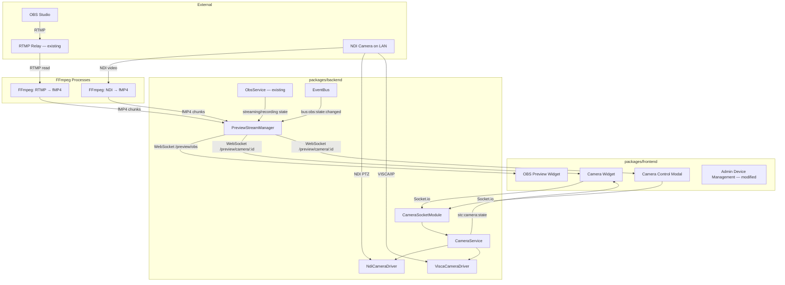

# Design Document — Video Control and Preview

## Overview

This document extends the existing system design with real-time video preview and NDI/VISCA camera control capabilities. It covers the preview streaming infrastructure, OBS preview widget, Camera HAL abstraction, camera control widget with virtual joystick, preset management, and admin configuration.

This is an extension document — it references and builds on the designs at `.kiro/specs/livestream-control-system/design.md` and `.kiro/specs/multi-platform-streaming/design.md`. Patterns, conventions, and components defined there remain authoritative unless explicitly superseded here.

### What This Release Adds

- Preview WebSocket infrastructure (fMP4 over dedicated WebSocket, MSE playback, fan-out)
- FFmpeg hardware encoder auto-detection (VA-API, QSV, NVENC) with software fallback
- OBS Preview widget (`obs-preview`) — 2×2, live stream/recording preview with audio toggle
- `CameraControlInterface` — protocol-agnostic PTZ abstraction (NDI + VISCA implementations)
- `CameraService` — manages camera connections, state polling, dead-man's switch
- Camera widget (`camera`) — 6×4, live preview with virtual joystick PTZ controls
- Camera preset system — database-stored with optional onboard camera mirroring
- Admin camera device type with feature toggles, preset configuration modal
- `CameraSocketModule` — Socket.io gateway for PTZ commands and state broadcast
- NDI SDK dynamic loading with graceful degradation

### Breaking Changes

- **`device_connections` table**: `deviceType` CHECK constraint expanded to include `"camera"`. New nullable columns for camera-specific config: `controlProtocol`, `viscaHost`, `viscaPort`, `ndiSourceName`, `fovWideAngle`, `features`.
- **New table**: `camera_presets` for preset storage.
- **`seed-dashboard.ts`**: Two new widget entries (OBS Preview at 2×2, Camera at 6×4); existing widget positions adjusted to avoid overlap.

---

## Architecture

### Extended Topology



### Key Architectural Decisions

**Dedicated WebSocket for video (not Socket.io)**: Binary video data at 2-5 Mbps would saturate the Socket.io command channel and make debugging impossible. Separate WebSocket endpoints allow independent lifecycle, authentication, and monitoring. Socket.io remains for structured command/event exchange.

**fMP4 + MSE over WebRTC**: WebRTC adds ICE/STUN complexity for a LAN-only system where NAT traversal is unnecessary. fMP4 over WebSocket achieves equivalent latency (<500ms) with simpler implementation, no STUN server, and easier debugging (binary frames over a single TCP connection).

**Single FFmpeg per source with fan-out**: Avoids redundant transcoding when multiple clients view the same preview. The `PreviewStreamManager` buffers the latest keyframe + subsequent frames so new subscribers get immediate playback without waiting for the next keyframe.

**NDI SDK as optional dynamic dependency**: The NDI SDK requires native bindings (`grandiose`) that need C++ build tools. Making it a dynamic import (`import()` with try/catch) means `npm install` succeeds on any machine, and the system degrades gracefully to VISCA-only control without video preview.

**Virtual joystick over D-pad**: Touch devices benefit from proportional analog input. The joystick provides natural diagonal movement, proportional speed control (distance from center), and better ergonomics for sustained operation during a service.

**Adaptive speed tied to zoom**: Prevents PTZ overshoot at telephoto without requiring the operator to manually adjust speed. The formula `speed * (1 - zoom * 0.7)` gives 100% at wide angle, 30% at full telephoto.

**Hybrid preset storage**: Database-first with optional camera onboard mirroring. Database presets are camera-agnostic (survive camera replacement), store metadata cameras can't (toggle states), and have well-defined content. Onboard presets provide MotionSync smooth recall on cameras that support it.

---

## Database Schema

### Modified: `device_connections`

```sql
-- Existing columns remain unchanged. New columns for camera devices:
ALTER TABLE device_connections ADD COLUMN controlProtocol TEXT; -- 'ndi' | 'visca'
ALTER TABLE device_connections ADD COLUMN viscaHost TEXT;
ALTER TABLE device_connections ADD COLUMN viscaPort INTEGER DEFAULT 5500;
ALTER TABLE device_connections ADD COLUMN ndiSourceName TEXT;
ALTER TABLE device_connections ADD COLUMN fovWideAngle REAL DEFAULT 60.0;
ALTER TABLE device_connections ADD COLUMN features TEXT; -- JSON string: ["pan","tilt","zoom","focus","ai-tracking","ai-tracking-tilt-disable","ai-tracking-zoom-disable"]
```

`deviceType` CHECK constraint updated: `CHECK(deviceType IN ('obs', 'camera'))`

### New: `camera_presets`

```sql
CREATE TABLE camera_presets (
  id TEXT PRIMARY KEY,
  cameraId TEXT NOT NULL REFERENCES device_connections(id) ON DELETE CASCADE,
  name TEXT NOT NULL,
  sortOrder INTEGER NOT NULL DEFAULT 0,
  storedOnCamera INTEGER NOT NULL DEFAULT 0, -- boolean
  cameraPresetSlot INTEGER,
  pan REAL,
  tilt REAL,
  zoom REAL,
  focus REAL,
  autoFocus INTEGER NOT NULL DEFAULT 1, -- boolean
  aiTracking INTEGER NOT NULL DEFAULT 0, -- boolean
  disableTilt INTEGER NOT NULL DEFAULT 0, -- boolean
  disableZoom INTEGER NOT NULL DEFAULT 0, -- boolean
  createdAt TEXT NOT NULL
);

CREATE INDEX idx_camera_presets_camera ON camera_presets(cameraId);
```

---

## Backend Services

### PreviewStreamManager (New)

Manages FFmpeg lifecycle, WebSocket fan-out, and hardware encoder selection.

```typescript
interface PreviewStreamManager {
  // Called at startup — probes FFmpeg encoders, caches result
  initialize(): Promise<void>;

  // WebSocket endpoint registration (called during Express setup)
  registerEndpoints(server: HttpServer): void;

  // Source availability (called by ObsService/CameraService)
  setSourceAvailable(sourceId: string, available: boolean, inputUrl: string): void;

  // Metrics
  getActiveStreams(): number;
  getSubscriberCount(sourceId: string): number;

  destroy(): void;
}

// Internal types
interface PreviewSource {
  sourceId: string;          // e.g., "obs", "camera-{id}"
  inputUrl: string;          // e.g., "rtmp://localhost:1935/live/stream" or NDI pipe path
  ffmpegProcess: ChildProcess | null;
  subscribers: Set<WebSocket>;
  initSegment: Buffer | null; // fMP4 init segment (moov atom) — sent to new subscribers
  graceTimeout: NodeJS.Timeout | null;
  restartCount: number;
}

type HardwareEncoder = "h264_vaapi" | "h264_qsv" | "h264_nvenc" | null;
```

**Constants:**

```typescript
const PREVIEW_RESOLUTION = { width: 1280, height: 720 };
const MAX_PREVIEW_STREAMS = 4;
const GRACE_PERIOD_MS = 3000;
const MAX_RESTART_ATTEMPTS = 3;
const RESTART_DELAY_MS = 2000;
```

**FFmpeg command construction:**

```typescript
function buildFfmpegArgs(input: string, encoder: HardwareEncoder): string[] {
  const base = [
    "-i", input,
    "-vf", `scale=${PREVIEW_RESOLUTION.width}:${PREVIEW_RESOLUTION.height}`,
    "-r", "30",
    "-g", "30",  // keyframe every 1s for fast subscriber join
    "-an",       // no audio for camera; separate flag for OBS
  ];
  const codecArgs = encoder
    ? ["-c:v", encoder]
    : ["-c:v", "libx264", "-preset", "ultrafast", "-tune", "zerolatency"];
  return [
    ...base,
    ...codecArgs,
    "-f", "mp4",
    "-movflags", "frag_keyframe+empty_moov+default_base_moof",
    "-frag_duration", "100000", // 100ms fragments
    "pipe:1",
  ];
}
```

For OBS preview (which includes audio), `-an` is replaced with `-c:a aac -b:a 64k`.

**Fan-out logic**: FFmpeg stdout is piped through a transform that detects the init segment (first `ftyp`+`moov` atoms). The init segment is cached. On new subscriber connection: send cached init segment, then stream subsequent `moof`+`mdat` pairs as they arrive.

**Hardware encoder probe** (startup):

```typescript
async function probeEncoder(): Promise<HardwareEncoder> {
  const { stdout } = await exec("ffmpeg -encoders -hide_banner");
  const priority: HardwareEncoder[] = ["h264_vaapi", "h264_qsv", "h264_nvenc"];
  for (const enc of priority) {
    if (stdout.includes(enc)) return enc;
  }
  return null;
}
```

---

## Frontend — OBS Preview Widget

### Zustand Slice

```typescript
interface ObsPreviewSlice {
  obsPreviewStatus: "inactive" | "connecting" | "streaming" | "error";
  setObsPreviewStatus: (status: ObsPreviewSlice["obsPreviewStatus"]) => void;
}
```

### Widget: `ObsPreviewWidget`

```
WidgetContainer (title: "OBS Preview", connections: [{ label: "Feed", status }])
├── VideoContainer (position: relative, 100% of content area)
│   ├── <video> (object-fit: contain, centered)
│   ├── MuteButton (bottom-right, 48×48, semi-transparent)
│   └── InactiveOverlay ("No Active Stream or Recording" | "Reconnecting...")
└── [Modal: StreamPreviewModal]
    ├── <video> (same stream, larger, object-fit: contain)
    ├── MuteButton (bottom-right, 48×48)
    └── DismissButton
```

### Connection Status Derivation

```typescript
function deriveObsFeedStatus(obsState: ObsState, wsState: WebSocketState): ConnectionStatus {
  if (!obsState.streaming && !obsState.recording) return "inactive";
  if (wsState === "connected" && framesRecent) return "healthy";
  return "unhealthy";
}
```

### MSE Playback Hook: `usePreviewStream`

```typescript
function usePreviewStream(endpoint: string, enabled: boolean) {
  // Returns: { videoRef, status, error }
  // Manages: WebSocket lifecycle, MediaSource creation, SourceBuffer appending
  // Buffer trim: removes segments > 2s old on each append
  // Seek-to-live: if buffered.end - currentTime > 3s, seek to live edge
  // Reconnect: exponential backoff 1s→2s→4s→10s max
  // Auth: appends ?token=jwt to WebSocket URL
}
```

Shared between OBS Preview and Camera Preview widgets.

### Video Centering CSS

```css
.preview-video-container {
  position: relative;
  width: 100%;
  height: 100%;
  display: flex;
  align-items: center;
  justify-content: center;
  background: var(--color-surface);
}
.preview-video {
  max-width: 100%;
  max-height: 100%;
  object-fit: contain;
}
```

---

## Backend Services — Camera

### CameraControlInterface

```typescript
interface CameraControlInterface {
  panTiltSpeed(panSpeed: number, tiltSpeed: number): Promise<void>;
  panTiltAbsolute(pan: number, tilt: number): Promise<void>;
  zoomAbsolute(zoom: number): Promise<void>;
  focusAuto(): Promise<void>;
  focusManual(position: number): Promise<void>;
  stop(): Promise<void>;
  inquirePosition(): Promise<PositionInquiry>;
  connect(): Promise<boolean>;
  disconnect(): void;
  isConnected(): boolean;
}

interface PositionInquiry {
  pan: number | null;
  tilt: number | null;
  zoom: number | null;
  focus: number | null;
  autoFocus: boolean | null;
}
```

### NdiCameraDriver

```typescript
class NdiCameraDriver implements CameraControlInterface {
  // Uses grandiose (dynamic import) for NDI SDK access
  // PTZ commands: NDIlib_recv_ptz_pan_tilt_speed, NDIlib_recv_ptz_pan_tilt, etc.
  // inquirePosition(): returns last-commanded values (NDI has no position query)
  // connect(): NDI find + receive + ptz_is_supported check
  // Also provides video frame pipe for PreviewStreamManager
  private lastCommanded: PositionInquiry;
  private receiver: NdiReceiver | null;
}
```

### ViscaCameraDriver

```typescript
class ViscaCameraDriver implements CameraControlInterface {
  // Raw TCP socket to camera (host:port)
  // Commands: binary VISCA packets per protocol spec
  // inquirePosition(): CAM_PanTiltPosInq + CAM_ZoomPosInq + CAM_FocusPosInq
  // Handles VISCA ACK/Completion/Error responses
  // Command queue: VISCA allows max 2 concurrent commands
  private socket: net.Socket;
  private commandQueue: ViscaCommand[];
  private host: string;
  private port: number;
}
```

**VISCA value normalization** (16-bit raw ↔ normalized float):

```typescript
// Pan: raw range camera-specific (e.g., 0x0000–0xFFFF maps to -1.0–1.0)
// Zoom: raw 0x0000 (wide) – 0x4000 (tele) maps to 0.0–1.0
// Focus: raw 0x0000 (near) – 0x4000 (far) maps to 0.0–1.0
function normalizeViscaPan(raw: number, maxRaw: number): number {
  return (raw / maxRaw) * 2 - 1; // center = 0
}
function denormalizeViscaPan(normalized: number, maxRaw: number): number {
  return Math.round((normalized + 1) / 2 * maxRaw);
}
```

### CameraService

```typescript
interface CameraService {
  initialize(): Promise<void>;
  getCameraState(cameraId: string): CameraState | null;
  getAllCameraStates(): CameraState[];

  // PTZ commands (from socket module)
  startMove(cameraId: string, panSpeed: number, tiltSpeed: number): void;
  keepAliveMove(cameraId: string, panSpeed: number, tiltSpeed: number): void;
  stopMove(cameraId: string): void;
  setZoom(cameraId: string, zoom: number): void;
  setFocusAuto(cameraId: string): void;
  setFocusManual(cameraId: string, position: number): void;
  tapToCenter(cameraId: string, offsetX: number, offsetY: number): void;

  // Toggles
  setAiTracking(cameraId: string, enabled: boolean): void;
  setDisableTilt(cameraId: string, enabled: boolean): void;
  setDisableZoom(cameraId: string, enabled: boolean): void;

  // Presets
  activatePreset(cameraId: string, presetId: string): Promise<Result<void, string>>;

  // Admin
  reloadCamera(cameraId: string): Promise<void>;
  capturePosition(cameraId: string): Promise<PositionInquiry>;

  destroy(): void;
}

interface CameraState {
  cameraId: string;
  connected: boolean;
  position: PositionInquiry | null;
  autoFocus: boolean;
  aiTracking: boolean;
  disableTilt: boolean;
  disableZoom: boolean;
  activePresetId: string | null;
  features: CameraFeature[];
  presets: CameraPreset[];
}

type CameraFeature = "pan" | "tilt" | "zoom" | "focus" | "ai-tracking" | "ai-tracking-tilt-disable" | "ai-tracking-zoom-disable";

interface CameraPreset {
  id: string;
  name: string;
  sortOrder: number;
  storedOnCamera: boolean;
  cameraPresetSlot: number | null;
  pan: number | null;
  tilt: number | null;
  zoom: number | null;
  focus: number | null;
  autoFocus: boolean;
  aiTracking: boolean;
  disableTilt: boolean;
  disableZoom: boolean;
}
```

**Dead-man's switch implementation:**

```typescript
// Per-camera movement tracking
interface MoveSession {
  cameraId: string;
  lastKeepalive: number; // Date.now()
  timeout: NodeJS.Timeout;
  currentPan: number;
  currentTilt: number;
}

const KEEPALIVE_TIMEOUT_MS = 750;

function onMoveStart(cameraId: string, pan: number, tilt: number) {
  const session: MoveSession = {
    cameraId,
    lastKeepalive: Date.now(),
    timeout: setTimeout(() => deadManStop(cameraId), KEEPALIVE_TIMEOUT_MS),
    currentPan: pan,
    currentTilt: tilt,
  };
  activeSessions.set(cameraId, session);
  issueMove(cameraId, pan, tilt);
}

function onKeepalive(cameraId: string, pan: number, tilt: number) {
  const session = activeSessions.get(cameraId);
  if (!session) return; // stale keepalive, ignore
  clearTimeout(session.timeout);
  session.lastKeepalive = Date.now();
  session.timeout = setTimeout(() => deadManStop(cameraId), KEEPALIVE_TIMEOUT_MS);
  if (pan !== session.currentPan || tilt !== session.currentTilt) {
    session.currentPan = pan;
    session.currentTilt = tilt;
    issueMove(cameraId, pan, tilt);
  }
}

function deadManStop(cameraId: string) {
  activeSessions.delete(cameraId);
  getDriver(cameraId).stop();
}
```

**Adaptive speed:**

```typescript
const ADAPTIVE_SPEED_DAMPING = 0.7;
const MAX_EFFECTIVE_SPEED = 0.6;

function applyAdaptiveSpeed(requestedSpeed: number, zoomLevel: number): number {
  const scaled = requestedSpeed * (1.0 - zoomLevel * ADAPTIVE_SPEED_DAMPING);
  return Math.min(Math.abs(scaled), MAX_EFFECTIVE_SPEED) * Math.sign(scaled);
}
```

**Tap-to-center:**

```typescript
function computeTapTarget(
  currentPan: number,
  currentTilt: number,
  tapOffsetX: number, // -1 to 1
  tapOffsetY: number, // -1 to 1
  fovWideAngle: number,
  currentZoom: number,
): { pan: number; tilt: number } {
  const effectiveFov = fovWideAngle * (1.0 - currentZoom);
  const hFovNorm = effectiveFov / 360; // fraction of full pan range
  const vFovNorm = (effectiveFov * 9 / 16) / 180; // assuming 16:9, fraction of tilt range
  return {
    pan: clamp(currentPan + tapOffsetX * hFovNorm, -1, 1),
    tilt: clamp(currentTilt + tapOffsetY * vFovNorm, -1, 1),
  };
}
```

**Position polling (2s interval):**

```typescript
// Only for cameras with VISCA driver
private pollInterval: NodeJS.Timeout;

startPolling(cameraId: string) {
  this.pollInterval = setInterval(async () => {
    const driver = this.getDriver(cameraId);
    const pos = await driver.inquirePosition();
    const prev = this.states.get(cameraId)?.position;
    if (positionChanged(prev, pos)) {
      this.updateState(cameraId, { position: pos });
      this.broadcastState(cameraId);
    }
  }, 2000);
}
```

---

## Frontend — Camera Widget

### Zustand Slice

```typescript
interface CameraSlice {
  cameraStates: Record<string, CameraState>; // keyed by cameraId
  ndiAvailable: boolean;
  setCameraState: (cameraId: string, state: CameraState) => void;
  setAllCameraStates: (states: CameraState[], ndiAvailable: boolean) => void;
  clearActivePreset: (cameraId: string) => void;
}
```

### Widget: `CameraWidget`

```
WidgetContainer (title: "Camera", connections: [{ label: "Camera", status }])
├── CameraDropdown (hidden if only 1 camera, IonSelect)
├── CompactMode (when widget too small for controls)
│   └── VideoContainer (tap opens CameraControlModal)
│       ├── <video> (object-fit: contain, centered)
│       └── ConnectingOverlay | OfflineOverlay
└── ExpandedMode (when widget large enough)
    ├── VideoSection (left, ~40% width)
    │   ├── <video> (object-fit: contain, centered, tap-to-center enabled)
    │   └── ConnectingOverlay | OfflineOverlay
    └── ControlsSection (right, ~60% width)
        ├── VirtualJoystick
        ├── ZoomSlider (vertical)
        ├── ToggleRow (AI Tracking, Disable Tilt, Disable Zoom)
        ├── FocusRow (Auto Focus toggle + focus slider, power-user only)
        └── PresetList (3 visible, scrollable)
```

### `CameraControlModal`

Same layout as expanded mode but fills the modal content area. Opened from compact mode tap or always available as an expand action.

### ResizeObserver Mode Detection

```typescript
const MIN_EXPANDED_WIDTH = 480; // px — enough for video (200px) + controls (280px)
const MIN_EXPANDED_HEIGHT = 320; // px — enough for joystick + presets stacked

function useWidgetMode(containerRef: RefObject<HTMLElement>) {
  const [mode, setMode] = useState<"compact" | "expanded">("compact");
  useEffect(() => {
    const observer = new ResizeObserver(([entry]) => {
      const { width, height } = entry.contentRect;
      setMode(width >= MIN_EXPANDED_WIDTH && height >= MIN_EXPANDED_HEIGHT
        ? "expanded" : "compact");
    });
    observer.observe(containerRef.current!);
    return () => observer.disconnect();
  }, []);
  return mode;
}
```

### Virtual Joystick: `PtzJoystick`

```typescript
interface PtzJoystickProps {
  onMoveStart: (panSpeed: number, tiltSpeed: number) => void;
  onMove: (panSpeed: number, tiltSpeed: number) => void;
  onMoveEnd: () => void;
  disabled?: boolean;
  panEnabled?: boolean;
  tiltEnabled?: boolean;
}
```

Implementation:
- Circular container, `min-width: 7.5rem; min-height: 7.5rem`
- Track touch/mouse position relative to center
- Compute angle (`atan2`) and distance (clamped to radius)
- Dead-zone: 15% of radius → treat as (0, 0)
- Convert to pan/tilt speeds: `panSpeed = cos(angle) * distance`, `tiltSpeed = -sin(angle) * distance`
- Quantize to 0.05 increments before emitting
- Only emit if quantized value differs from last emission
- Visual: indicator dot tracks finger position, snaps back to center on release

```typescript
const DEAD_ZONE = 0.15;
const QUANTIZE_STEP = 0.05;

function computeJoystickOutput(dx: number, dy: number, radius: number) {
  const distance = Math.min(Math.sqrt(dx * dx + dy * dy) / radius, 1.0);
  if (distance < DEAD_ZONE) return { pan: 0, tilt: 0 };
  const angle = Math.atan2(-dy, dx); // Y inverted for screen coords
  const speed = (distance - DEAD_ZONE) / (1 - DEAD_ZONE); // remap post-deadzone to 0–1
  const pan = Math.cos(angle) * speed;
  const tilt = Math.sin(angle) * speed;
  return {
    pan: quantize(pan, QUANTIZE_STEP),
    tilt: quantize(tilt, QUANTIZE_STEP),
  };
}

function quantize(value: number, step: number): number {
  return Math.round(value / step) * step;
}
```

### Keepalive Timer Hook: `usePtzMove`

```typescript
function usePtzMove(cameraId: string) {
  const intervalRef = useRef<number>();
  const lastSent = useRef({ pan: 0, tilt: 0 });

  function startMove(pan: number, tilt: number) {
    socket.emit(CTS_CAMERA_PTZ_MOVE_START, { cameraId, pan, tilt });
    lastSent.current = { pan, tilt };
    intervalRef.current = setInterval(() => {
      socket.emit(CTS_CAMERA_PTZ_MOVE_KEEPALIVE, { cameraId, ...lastSent.current });
    }, 200);
  }

  function updateMove(pan: number, tilt: number) {
    lastSent.current = { pan, tilt };
    // Next keepalive will carry updated values
  }

  function endMove() {
    clearInterval(intervalRef.current);
    socket.emit(CTS_CAMERA_PTZ_MOVE_STOP, { cameraId });
  }

  return { startMove, updateMove, endMove };
}
```

### Zoom Slider

Vertical `<input type="range">` rotated 90° via CSS transform. Value 0 (bottom, wide) to 1 (top, telephoto). On change, emits `CTS_CAMERA_ZOOM_SET`. Reflects server state from `cameraStates[id].position.zoom`.

```css
.zoom-slider {
  writing-mode: vertical-lr;
  direction: rtl; /* 1.0 at top */
  min-height: 160px;
  width: 36px;
}
```

### Tap-to-Center Handler

```typescript
function handleVideoTap(e: React.MouseEvent, cameraState: CameraState) {
  if (cameraState.aiTracking) {
    showToast("Tap-to-center is disabled when AI Tracking is active.");
    return;
  }
  const rect = e.currentTarget.getBoundingClientRect();
  const offsetX = ((e.clientX - rect.left) / rect.width) * 2 - 1; // -1 to 1
  const offsetY = ((e.clientY - rect.top) / rect.height) * 2 - 1;
  const adjustedY = cameraState.disableTilt ? 0 : offsetY;
  socket.emit(CTS_CAMERA_PTZ_TAP_TO_CENTER, { cameraId, offsetX, offsetY: adjustedY });
}
```

---

## Frontend — Camera Presets

### Preset List Component

```
PresetList (max-height: 3 × 44px, overflow-y: auto)
├── PresetRow
│   ├── PresetName (text, truncate with ellipsis)
│   └── ActivateButton (36px tall)
│       States: "Activate" (enabled) | "Activating..." (disabled, spinner) | "Activated" (disabled, green)
├── PresetRow ...
└── PresetRow ...
```

### Preset Activation Flow

```typescript
async function handleActivatePreset(cameraId: string, presetId: string) {
  // Optimistic: set button to "Activating..."
  socket.emit(CTS_CAMERA_PRESET_ACTIVATE, { cameraId, presetId });
  // Backend broadcasts updated state with activePresetId on success
  // On failure, backend emits toast and state remains without activePresetId
}
```

Active preset clears when `CameraService` detects any manual command (move, zoom, focus, tap-to-center, toggle change) on that camera.

---

## Frontend — Admin Camera Configuration

### Device Detail Panel (Camera Type)

```
CameraDeviceDetail
├── ConnectionSection
│   ├── LabelInput
│   ├── NdiSourceNameInput
│   ├── ControlProtocolSelect ("ndi" | "visca")
│   ├── ViscaHostInput (visible if protocol = visca)
│   ├── ViscaPortInput (visible if protocol = visca, default 5500)
│   ├── FovWideAngleInput (number, default 60, suffix "°")
│   ├── NdiOnlyWarning (visible if protocol = ndi)
│   └── ProbeResult (green checkmark | red X + reason)
├── FeaturesSection
│   ├── FeatureToggle ("pan")
│   ├── FeatureToggle ("tilt")
│   ├── FeatureToggle ("zoom")
│   ├── FeatureToggle ("focus")
│   ├── FeatureToggle ("ai-tracking")
│   ├── FeatureToggle ("ai-tracking-tilt-disable")
│   └── FeatureToggle ("ai-tracking-zoom-disable")
└── PresetsSection
    ├── PresetRow (name, sortOrder, badge: "On Camera" | "Software Only", Edit/Delete)
    ├── PresetRow ...
    └── AddPresetButton
```

### Preset Configuration Modal

```
PresetConfigModal (title: "Configure Preset" | "Edit Preset: {name}")
├── NameInput
├── SortOrderInput (number)
├── StoreOnCameraToggle
│   └── SlotNumberInput (visible when toggled on)
├── LiveVideoPreview (same camera preview stream)
├── PTZ Controls (same VirtualJoystick, ZoomSlider, toggles as widget)
├── CapturePositionButton
│   └── CapturedSummary ("Pan: -0.32, Tilt: 0.15, Zoom: 0.45, Focus: N/A")
├── CancelButton
└── SaveButton
```

**Capture Position flow:**
1. Admin positions camera using interactive controls
2. Taps "Capture Position"
3. Frontend calls `POST /api/cameras/{id}/capture-position`
4. Backend runs `driver.inquirePosition()` (or returns last-commanded for NDI)
5. Response displayed as summary; values stored in modal form state
6. Admin taps "Save" → writes to `camera_presets` table + optional onboard storage

---

## Socket Events

### CameraSocketModule

Follows the established `SocketModule` pattern.

**Server → Client (STC):**

| Event | Payload | Description |
|-------|---------|-------------|
| `stc:camera:state` | `{ cameras: CameraState[], ndiAvailable: boolean }` | Full state broadcast (initial + on change) |
| `stc:camera:state:update` | `CameraState` | Single camera state update |

**Client → Server (CTS):**

| Event | Payload | Description |
|-------|---------|-------------|
| `cts:camera:ptz:move:start` | `{ cameraId, pan, tilt }` | Begin continuous movement |
| `cts:camera:ptz:move:keepalive` | `{ cameraId, pan, tilt }` | Continue movement (every 200ms) |
| `cts:camera:ptz:move:stop` | `{ cameraId }` | End movement |
| `cts:camera:zoom:set` | `{ cameraId, zoom }` | Set absolute zoom (0.0–1.0) |
| `cts:camera:focus:auto` | `{ cameraId }` | Enable auto-focus |
| `cts:camera:focus:set` | `{ cameraId, position }` | Set manual focus (0.0–1.0) |
| `cts:camera:preset:activate` | `{ cameraId, presetId }` | Activate a preset |
| `cts:camera:ptz:tap-to-center` | `{ cameraId, offsetX, offsetY }` | Tap-to-center (-1.0 to 1.0) |
| `cts:camera:ai-tracking:set` | `{ cameraId, enabled }` | Toggle AI tracking |
| `cts:camera:disable-tilt:set` | `{ cameraId, enabled }` | Toggle disable tilt |
| `cts:camera:disable-zoom:set` | `{ cameraId, enabled }` | Toggle disable zoom |

**Event constants** (in `packages/shared/src/constants/socketEvents.ts`):

```typescript
// Camera — Server to Client
export const STC_CAMERA_STATE = "stc:camera:state";
export const STC_CAMERA_STATE_UPDATE = "stc:camera:state:update";

// Camera — Client to Server
export const CTS_CAMERA_PTZ_MOVE_START = "cts:camera:ptz:move:start";
export const CTS_CAMERA_PTZ_MOVE_KEEPALIVE = "cts:camera:ptz:move:keepalive";
export const CTS_CAMERA_PTZ_MOVE_STOP = "cts:camera:ptz:move:stop";
export const CTS_CAMERA_ZOOM_SET = "cts:camera:zoom:set";
export const CTS_CAMERA_FOCUS_AUTO = "cts:camera:focus:auto";
export const CTS_CAMERA_FOCUS_SET = "cts:camera:focus:set";
export const CTS_CAMERA_PRESET_ACTIVATE = "cts:camera:preset:activate";
export const CTS_CAMERA_PTZ_TAP_TO_CENTER = "cts:camera:ptz:tap-to-center";
export const CTS_CAMERA_AI_TRACKING_SET = "cts:camera:ai-tracking:set";
export const CTS_CAMERA_DISABLE_TILT_SET = "cts:camera:disable-tilt:set";
export const CTS_CAMERA_DISABLE_ZOOM_SET = "cts:camera:disable-zoom:set";
```

### `emitInitialState` Handler

```typescript
emitInitialState(socket: Socket) {
  socket.emit(STC_CAMERA_STATE, {
    cameras: this.cameraService.getAllCameraStates(),
    ndiAvailable: this.ndiAvailable,
  });
}
```

---

## REST API

### Camera Preset Endpoints

| Method | Path | Auth | Description |
|--------|------|------|-------------|
| `GET` | `/api/cameras/:cameraId/presets` | ADMIN | List all presets for a camera |
| `POST` | `/api/cameras/:cameraId/presets` | ADMIN | Create a preset |
| `PUT` | `/api/cameras/:cameraId/presets/:presetId` | ADMIN | Update a preset |
| `DELETE` | `/api/cameras/:cameraId/presets/:presetId` | ADMIN | Delete a preset |
| `POST` | `/api/cameras/:cameraId/capture-position` | ADMIN | Poll current camera position |

### Capture Position Response

```typescript
interface CapturePositionResponse {
  pan: number | null;
  tilt: number | null;
  zoom: number | null;
  focus: number | null;
  autoFocus: boolean;
}
```

### Create/Update Preset Body

```typescript
interface PresetBody {
  name: string;
  sortOrder: number;
  storedOnCamera: boolean;
  cameraPresetSlot?: number;
  pan: number | null;
  tilt: number | null;
  zoom: number | null;
  focus: number | null;
  autoFocus: boolean;
  aiTracking: boolean;
  disableTilt: boolean;
  disableZoom: boolean;
}
```

---

## Seed Script Updates

### `seed-dashboard.ts` Changes

```typescript
const OBS_PREVIEW_WIDGET_ID = "obs-preview";
const CAMERA_WIDGET_ID = "camera";

// Existing widgets repositioned:
// OBS controls: col=0, row=0, 3×2 (unchanged position)
// Lower Thirds: col=3, row=0, 3×2 (unchanged position)

// New widgets:
// OBS Preview: col=6, row=0, 2×2
// Camera: col=0, row=2, 6×4

const newWidgets = [
  {
    id: `${DASHBOARD_ID}-${OBS_PREVIEW_WIDGET_ID}`,
    dashboardId: DASHBOARD_ID,
    widgetId: OBS_PREVIEW_WIDGET_ID,
    title: "OBS Preview",
    col: 6, row: 0, colSpan: 2, rowSpan: 2,
    roleMinimum: "AvVolunteer",
  },
  {
    id: `${DASHBOARD_ID}-${CAMERA_WIDGET_ID}`,
    dashboardId: DASHBOARD_ID,
    widgetId: CAMERA_WIDGET_ID,
    title: "Camera",
    col: 0, row: 2, colSpan: 6, rowSpan: 4,
    roleMinimum: "AvVolunteer",
  },
];
```

### Grid Layout (10×6 landscape)

```
Col:  0   1   2   3   4   5   6   7   8   9
Row 0 ┌───────────────┬───────────────┬───────────┐
      │  OBS Controls │ Lower Thirds  │OBS Preview│
Row 1 │     (3×2)     │    (3×2)      │  (2×2)    │
      ├───────────────┴───────────────┼───────────┤
Row 2 │                               │           │
      │         Camera (6×4)          │  (empty)  │
Row 3 │                               │           │
      │                               │           │
Row 4 │                               │           │
      │                               │           │
Row 5 │                               │           │
      └───────────────────────────────┴───────────┘
```

Columns 6–9, rows 2–5 remain available for future widgets.
