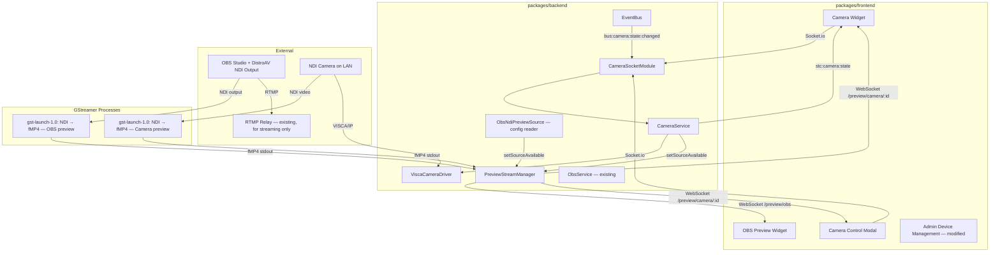

# Design Document — Video Control and Preview

## Overview

This document extends the existing system design with real-time video preview and NDI/VISCA camera control capabilities. It covers the preview streaming infrastructure, OBS preview widget, Camera HAL abstraction, camera control widget with virtual joystick, preset management, and admin configuration.

This is an extension document — it references and builds on the designs at `.kiro/specs/livestream-control-system/design.md` and `.kiro/specs/multi-platform-streaming/design.md`. Patterns, conventions, and components defined there remain authoritative unless explicitly superseded here.

### What This Release Adds

- Preview WebSocket infrastructure (fMP4 over dedicated WebSocket, MSE playback, fan-out)
- GStreamer NDI pipeline with hardware encoder auto-detection (QSV, VA-API, NVENC) and software fallback
- OBS Preview widget (`obs-preview`) — 2×2, live stream/recording preview with audio toggle
- `CameraService` — manages camera connections, state polling, dead-man's switch
- Camera widget (`camera`) — 6×4, live preview with virtual joystick PTZ controls
- Camera preset system — database-stored with optional onboard camera mirroring
- Admin camera device type with Camera Model selector, feature toggles, preset drag-to-reorder
- Model-specific AI tracking driver (Tongveo NVS20A-4KN via HTTP API)
- `CameraSocketModule` — Socket.io gateway for PTZ commands and state broadcast
- VISCA over IP for all PTZ control

### Breaking Changes

- **`device_connections` table**: `deviceType` values expanded to include `"camera-ptz"`. Camera-specific config stored in the existing `metadata` JSON column. The existing `host`/`port` columns are reused for VISCA connectivity (placeholder `"127.0.0.1"`/`5500` when VISCA is not enabled). OBS devices gain an `ndiOutputName` field in their `metadata` JSON for NDI preview output.
- **New table**: `camera_presets` for preset storage.
- **`seed-dashboard.ts`**: Two new widget entries (OBS Preview at 2×2, Camera at 6×4); existing widget positions adjusted to avoid overlap.
- **Caddy routing**: Both `Caddyfile` and `Caddyfile.dev` must add `/preview/*` to the backend route matcher (alongside `/api/*` and `/socket.io/*`). Without this, preview WebSocket upgrade requests are routed to the frontend and fail silently.

---

## Architecture

### Extended Topology



### Key Architectural Decisions

**Dedicated WebSocket for video (not Socket.io)**: Binary video data at 2-5 Mbps would add unnecessary overhead through Socket.io's event framing and protocol layer. Separate raw WebSocket endpoints (via the `ws` library) provide direct binary streaming with minimal latency. The `ws` library handles the WebSocket upgrade on `/preview/*` paths; Socket.io handles `/socket.io/*` — no conflict because they listen on different HTTP upgrade paths. Caddy routes `/preview/*` to the backend alongside `/api/*` and `/socket.io/*`.

**ws + Socket.io coexistence pattern**: `PreviewStreamManager` creates a `WebSocketServer` with `noServer: true` (no automatic upgrade handling). In `buildApp()`, after Socket.io is attached, a manual `httpServer.on('upgrade', (req, socket, head) => { ... })` handler routes upgrades by path: requests matching `/preview/*` are handled by the preview `WebSocketServer` (with cookie-based JWT validation); all other upgrade requests fall through to Socket.io's internal handler. Socket.io must be attached first as it registers its own upgrade handler internally.

**fMP4 + MSE over WebRTC**: WebRTC adds ICE/STUN complexity for a LAN-only system where NAT traversal is unnecessary. fMP4 over WebSocket achieves equivalent latency (<500ms) with simpler implementation, no STUN server, and easier debugging (binary frames over a single TCP connection).

**Single GStreamer process per source with fan-out**: Each preview source runs a single `gst-launch-1.0` process that handles NDI receive, decode, scale, encode, and fMP4 muxing internally. No intermediate pipes or Node.js frame handling. The `PreviewStreamManager` reads fMP4 from the process's stdout and fans it out to all WebSocket subscribers. This eliminates the latency and complexity of the previous grandi → NdiFramePipe → FFmpeg stdin architecture.

**GStreamer over FFmpeg for NDI**: FFmpeg's NDI support requires an out-of-tree patch (removed in FFmpeg 5.0) creating an ongoing maintenance burden. GStreamer's NDI plugin (`gst-plugin-ndi`) is part of the official `gst-plugins-rs` repository, independently versioned from GStreamer core, and builds as a single `.so` from source via Cargo. GStreamer core updates via `apt upgrade` without touching the NDI plugin, and vice versa. Installation is handled by `scripts/install-gstreamer-ndi.sh`.

**GStreamer hardware encoder probing**: At startup, `PreviewStreamManager` probes for hardware encoder elements via `gst-inspect-1.0` (qsvh264enc → vaapih264enc → nvh264enc). Unlike FFmpeg's `-encoders` flag which lists codecs that may not have working hardware, GStreamer element probing is definitive — if `gst-inspect-1.0 qsvh264enc` exits 0, the element is usable. Falls back to `x264enc tune=zerolatency speed-preset=ultrafast`.

**decodebin for NDI demuxing**: NDI sources output `application/x-ndi` caps that require `ndisrcdemux` to split into video/audio. Since `ndisrcdemux` creates pads dynamically, direct pad linking fails in `gst-launch-1.0`. `decodebin` handles dynamic pad negotiation automatically and works reliably with all NDI source types (OBS, hardware cameras, NDI|HX).

**Frame dropping via GStreamer queues**: Each pipeline uses `queue max-size-buffers=1 max-size-time=0 max-size-bytes=0 leaky=downstream` to drop frames when the encoder can't keep up, preventing buffer accumulation and latency growth. Combined with `videorate` capping output at 15fps, this keeps end-to-end latency stable.

**Virtual joystick over D-pad**: Touch devices benefit from proportional analog input. The joystick provides natural diagonal movement, proportional speed control (distance from center), and better ergonomics for sustained operation during a service.

**Adaptive speed tied to zoom**: Prevents PTZ overshoot at telephoto without requiring the operator to manually adjust speed. The formula `speed * (1 - zoom * 0.7)` gives 100% at wide angle, 30% at full telephoto.

**Hybrid preset storage**: Database-first with optional camera onboard mirroring. Database presets are camera-agnostic (survive camera replacement), store metadata cameras can't (toggle states), and have well-defined content. Onboard presets provide MotionSync smooth recall on cameras that support it.

**VISCA over IP for all PTZ control**: All camera pan/tilt/zoom/focus commands are sent via VISCA over IP (TCP socket). GStreamer handles video receive; VISCA handles control. These are fully independent — the video pipeline and PTZ control operate on separate connections to the camera.

**Cookie-based WebSocket authentication**: Preview WebSocket endpoints authenticate via the same HttpOnly JWT cookie used by Socket.io and REST. The browser sends cookies automatically on same-origin WebSocket upgrade requests routed through Caddy. This requires no frontend token handling and maintains consistency with the existing auth model — no token appears in URLs or logs.

**Caddy routing requirement**: The reverse proxy must route `/preview/*` to the backend alongside `/api/*` and `/socket.io/*`. This is a deployment prerequisite documented in the breaking changes section.

### EventBus Events

```typescript
// Camera — Internal Bus Events
export const BUS_CAMERA_STATE_CHANGED = "bus:camera:state:changed";

interface CameraEventMap {
  [BUS_CAMERA_STATE_CHANGED]: { cameraId: string; state: CameraState };
}
```

`CameraSocketModule.register(io)` subscribes to `BUS_CAMERA_STATE_CHANGED` and broadcasts `stc:camera:state:update` to all connected clients. This follows the same pattern as `ObsModule` subscribing to `BUS_OBS_STATE_CHANGED`.

---

## Database Schema

### `device_connections` — Camera Usage

Camera-specific configuration is stored in the existing `metadata` JSON column, consistent with how OBS stores its device-specific settings. No new columns are added to `device_connections`.

The existing `host` and `port` columns are reused for VISCA connectivity:

- When VISCA is enabled: `host` = camera's IP address, `port` = VISCA port (default 5500)
- When VISCA is not enabled: `host` = `"127.0.0.1"` (placeholder), `port` = `5500` (default). The user never sees these values unless they enable VISCA in the admin form.

**Camera metadata schema** (stored as JSON in `metadata` column):

```typescript
interface CameraMetadata {
  ndiSourceName: string; // required — NDI source name for video + PTZ
  fovWideAngle: number; // default 60 — horizontal FOV at full wide (degrees)
  opticalZoomRatio: number; // default 20 — max optical zoom (e.g., 20 for 20x)
  cameraModel: CameraModel; // "generic" | "tongveo-nvs20a-4kn"
  cameraFeatures: CameraFeature[]; // enabled features array
  viscaEnabled: boolean; // whether to use host/port for VISCA polling
  aiHttpCookie?: string; // encrypted — for AI HTTP API (non-generic models only)
  aiCredentialId?: string; // encrypted — for AI HTTP API (non-generic models only)
}
```

**OBS metadata schema** (existing, extended with NDI source name for preview):

```typescript
interface ObsMetadata {
  ndiOutputName?: string; // e.g., "OBS-MACHINE (OBS)" — for NDI preview
  // ... existing OBS fields
}
```

No schema migration needed — the `metadata` column already exists as TEXT. Camera devices simply store a different JSON shape than OBS devices. Validation of `deviceType` values is enforced at the route/TypeScript level.

### New: `camera_presets`

Presets remain in a separate table (not in metadata) because they have independent CRUD lifecycle, benefit from indexing and cascade delete, and avoid read-modify-write race conditions on reorder operations.

```sql
CREATE TABLE camera_presets (
  id TEXT PRIMARY KEY,
  cameraId TEXT NOT NULL REFERENCES device_connections(id) ON DELETE CASCADE,
  name TEXT NOT NULL,
  sortOrder INTEGER NOT NULL DEFAULT 0,
  storedOnCamera INTEGER NOT NULL DEFAULT 0, -- boolean
  cameraPresetSlot INTEGER,
  pan REAL,
  tilt REAL,
  zoom REAL,
  focus REAL,
  autoFocus INTEGER NOT NULL DEFAULT 1, -- boolean
  aiTracking INTEGER NOT NULL DEFAULT 0, -- boolean
  aiTilt INTEGER NOT NULL DEFAULT 0, -- boolean (AI controls tilt axis)
  aiZoom INTEGER NOT NULL DEFAULT 0, -- boolean (AI controls zoom axis)
  createdAt TEXT NOT NULL
);

CREATE INDEX idx_camera_presets_camera ON camera_presets(cameraId);
```

---

## Backend Services

### PreviewStreamManager (New)

Manages FFmpeg lifecycle, WebSocket fan-out, and hardware encoder selection.

```typescript
interface PreviewStreamManager {
  // Called at startup — probes FFmpeg encoders, caches result
  initialize(): Promise<void>;

  // WebSocket endpoint registration (called during Express setup)
  registerEndpoints(server: HttpServer): void;

  // Source availability (called by ObsService/CameraService)
  setSourceAvailable(sourceId: string, available: boolean, inputUrl: string): void;

  // Metrics
  getActiveStreams(): number;
  getSubscriberCount(sourceId: string): number;

  destroy(): void;
}

// Internal types
interface PreviewSource {
  sourceId: string; // e.g., "obs", "camera-{id}"
  inputUrl: string; // e.g., "rtmp://localhost:1935/live/stream" or NDI pipe path
  ffmpegProcess: ChildProcess | null;
  subscribers: Set<WebSocket>;
  initSegment: Buffer | null; // fMP4 init segment (moov atom) — sent to new subscribers
  graceTimeout: NodeJS.Timeout | null;
  restartCount: number;
}

type HardwareEncoder = "h264_vaapi" | "h264_qsv" | "h264_nvenc" | null;
```

**Constants:**

```typescript
const PREVIEW_RESOLUTION = { width: 1280, height: 720 };
const MAX_PREVIEW_STREAMS = 4;
const GRACE_PERIOD_MS = 3000;
const MAX_RESTART_ATTEMPTS = 3;
const RESTART_DELAY_MS = 2000;
```

**Integration in `buildApp()`**: `PreviewStreamManager` is instantiated in `buildApp()` after `httpServer = createServer(app)` and after Socket.io is attached. It receives `httpServer` (for upgrade handling), `authService` (for JWT validation on upgrade), and references to NDI source configurations (from `device_connections` table). It is included in `AppContext` for test access. In tests, a `createFakePreviewManager()` no-op implementation is injected.

**FFmpeg command construction:**

```typescript
function buildFfmpegArgs(input: string, encoder: HardwareEncoder, withAudio: boolean): string[] {
  const base = [
    "-i",
    input,
    "-vf",
    `scale=${PREVIEW_RESOLUTION.width}:${PREVIEW_RESOLUTION.height}`,
    "-r",
    "15",
    "-g",
    "15", // keyframe every 1s for fast subscriber join
  ];
  const audioArgs = withAudio ? ["-c:a", "aac", "-b:a", "64k"] : ["-an"];
  const codecArgs = encoder ? ["-c:v", encoder] : ["-c:v", "libx264", "-preset", "ultrafast", "-tune", "zerolatency"];
  return [
    ...base,
    ...audioArgs,
    ...codecArgs,
    "-f",
    "mp4",
    "-movflags",
    "frag_keyframe+empty_moov+default_base_moof",
    "-frag_duration",
    "100000", // 100ms fragments
    "pipe:1",
  ];
}

// For piped NDI sources (raw video on stdin) — forces software encode with baseline profile
function buildFfmpegArgsWithInput(inputArgs: string[], encoder: HardwareEncoder, withAudio: boolean): string[] {
  const output = ["-vf", `scale=${PREVIEW_RESOLUTION.width}:${PREVIEW_RESOLUTION.height},format=yuv420p`, "-r", "15", "-g", "15"];
  const audioArgs = withAudio ? ["-c:a", "aac", "-b:a", "64k"] : ["-an"];
  // Hardware encoders can't accept raw piped input through software scale filter — use libx264
  const codecArgs = ["-c:v", "libx264", "-preset", "ultrafast", "-tune", "zerolatency", "-profile:v", "baseline", "-level", "3.1"];
  return ["-probesize", "32", "-analyzeduration", "0", ...inputArgs, ...output, ...audioArgs, ...codecArgs,
    "-f", "mp4", "-movflags", "frag_keyframe+empty_moov+default_base_moof", "-frag_duration", "33333", "pipe:1"];
}
```

OBS preview passes `withAudio: true`; camera previews pass `withAudio: false`.

**Fan-out logic**: FFmpeg stdout is piped through a transform that detects the init segment (first `ftyp`+`moov` atoms). The init segment is cached. On new subscriber connection: send cached init segment, then stream subsequent `moof`+`mdat` pairs as they arrive.

**Hardware encoder probe** (startup):

```typescript
async function probeEncoder(): Promise<HardwareEncoder> {
  const { stdout } = await exec("ffmpeg -encoders -hide_banner");
  const priority: HardwareEncoder[] = ["h264_vaapi", "h264_qsv", "h264_nvenc"];
  for (const enc of priority) {
    if (stdout.includes(enc)) return enc;
  }
  return null;
}
```

---

## Frontend — OBS Preview Widget

### Zustand Slice

```typescript
interface ObsPreviewSlice {
  obsPreviewStatus: "inactive" | "connecting" | "streaming" | "error";
  setObsPreviewStatus: (status: ObsPreviewSlice["obsPreviewStatus"]) => void;
}
```

### Widget: `ObsPreviewWidget`

```
WidgetContainer (title: "OBS Preview", connections: [{ label: "Feed", status }])
├── VideoContainer (position: relative, 100% of content area)
│   ├── <video> (object-fit: contain, centered)
│   ├── MuteButton (bottom-right, 48×48, semi-transparent)
│   └── InactiveOverlay ("No Active Stream or Recording" | "Reconnecting...")
└── [Modal: StreamPreviewModal]
    ├── <video> (same stream, larger, object-fit: contain)
    ├── MuteButton (bottom-right, 48×48)
    └── DismissButton
```

### Connection Status Derivation

```typescript
function deriveObsFeedStatus(wsState: WebSocketState, framesRecent: boolean, ndiSourceConfigured: boolean): ConnectionStatus["status"] {
  if (!ndiSourceConfigured) return "inactive";
  if (wsState === "connected" && framesRecent) return "healthy";
  return "unhealthy";
}
```

### MSE Playback Hook: `usePreviewStream`

```typescript
function usePreviewStream(endpoint: string, enabled: boolean) {
  // Returns: { videoRef, status, error }
  // Manages: WebSocket lifecycle, MediaSource creation, SourceBuffer appending
  // Buffer trim: removes segments > 2s old on each append
  // Seek-to-live: if buffered.end - currentTime > 3s, seek to live edge
  // Reconnect: exponential backoff 1s→2s→4s→10s max
  // Auth: browser sends HttpOnly JWT cookie automatically on same-origin WS upgrade
}
```

Shared between OBS Preview and Camera Preview widgets.

### Video Centering CSS

```css
.preview-video-container {
  position: relative;
  width: 100%;
  height: 100%;
  display: flex;
  align-items: center;
  justify-content: center;
  background: var(--color-surface);
}
.preview-video {
  max-width: 100%;
  max-height: 100%;
  object-fit: contain;
}
```

---

## Backend Services — Camera

### CameraControlInterface

```typescript
interface CameraControlInterface {
  panTiltSpeed(panSpeed: number, tiltSpeed: number): Promise<void>;
  panTiltAbsolute(pan: number, tilt: number): Promise<void>;
  zoomAbsolute(zoom: number): Promise<void>;
  focusAuto(): Promise<void>;
  focusManual(position: number): Promise<void>;
  stop(): Promise<void>;
  inquirePosition(): Promise<PositionInquiry>;
  connect(): Promise<boolean>;
  disconnect(): void;
  isConnected(): boolean;
}

interface PositionInquiry {
  pan: number | null;
  tilt: number | null;
  zoom: number | null;
  focus: number | null;
  autoFocus: boolean | null;
}
```

### NdiCameraDriver

```typescript
class NdiCameraDriver implements CameraControlInterface {
  // Uses grandi (dynamic import) for NDI SDK access
  // PTZ commands: NOT available via grandi — all PTZ is handled by ViscaCameraDriver
  // Video: provides raw frame data via receiver.data() for preview pipeline
  // inquirePosition(): returns last-commanded values (NDI has no position query)
  // PTZ commands: NDIlib_recv_ptz_pan_tilt_speed, NDIlib_recv_ptz_pan_tilt, etc.
  // inquirePosition(): returns last-commanded values (NDI has no position query)
  // connect(): NDI find + receive + ptz_is_supported check
  // Video: provides raw frame data via a readable stream that PreviewStreamManager
  //   pipes to FFmpeg's stdin (format: raw UYVY/BGRA frames, resolution from NDI source)
  //   This avoids requiring the FFmpeg NDI input plugin to be compiled separately.
  private lastCommanded: PositionInquiry;
  private receiver: NdiReceiver | null;
}
```

### ViscaCameraDriver

```typescript
class ViscaCameraDriver {
  // Primary PTZ driver — all movement commands go via VISCA over TCP
  // panTiltSpeed, panTiltAbsolute, zoomAbsolute, focusAuto, focusManual, stop
  // Also handles position inquiry: CAM_PanTiltPosInq + CAM_ZoomPosInq + CAM_FocusPosInq + CAM_FocusAFModeInq
  // Handles VISCA ACK/Completion/Error responses with command queue
  // Auto-reconnects on command if TCP connection has dropped
  // Probe: CAM_PowerInq to verify connectivity
  private socket: net.Socket;
  private host: string;
  private port: number;
}
```

**VISCA value normalization** (16-bit raw ↔ normalized float):

```typescript
// Pan: raw range camera-specific (e.g., 0x0000–0xFFFF maps to -1.0–1.0)
// Zoom: raw 0x0000 (wide) – 0x4000 (tele) maps to 0.0–1.0
// Focus: raw 0x0000 (near) – 0x4000 (far) maps to 0.0–1.0
function normalizeViscaPan(raw: number, maxRaw: number): number {
  return (raw / maxRaw) * 2 - 1; // center = 0
}
function denormalizeViscaPan(normalized: number, maxRaw: number): number {
  return Math.round(((normalized + 1) / 2) * maxRaw);
}
```

### AiTrackingDriver (Model-Specific)

Handles AI tracking control via HTTP for known camera models. Only instantiated when `cameraModel !== "generic"`.

```typescript
interface AiTrackingDriver {
  setAiState(enabled: boolean, aiTilt: boolean, aiZoom: boolean): Promise<void>;
}

class TongveoAiDriver implements AiTrackingDriver {
  private baseUrl: string; // http://{host} (from device_connections.host)
  private cookie: string; // from device metadata (decrypted)
  private credentialId: string; // from device metadata (decrypted)

  async setAiState(enabled: boolean, aiTilt: boolean, aiZoom: boolean): Promise<void> {
    // Step 1: Set AI control state
    await fetch(`${this.baseUrl}/api/aiControl`, {
      method: "POST",
      headers: { "Content-Type": "application/json", Cookie: this.cookie },
      body: JSON.stringify({
        ai_on: enabled ? "1" : "0",
        ai_enable: enabled ? "1" : "0",
        ai_mode: "1",
        ai_auto_zoom: aiZoom ? "1" : "0",
        ai_auto_tilt: aiTilt ? "1" : "0",
      }),
    });

    // Step 2: ONLY when enabling — select first tracking target
    // DO NOT call setPTZCmd when disabling AI
    if (enabled) {
      await fetch(`${this.baseUrl}/api/setPTZCmd`, {
        method: "POST",
        headers: { "Content-Type": "application/json", Cookie: this.cookie },
        body: JSON.stringify({
          Channel: 0,
          PtzCmd: 15,
          param1: 7,
          param2: 0,
          ID: this.credentialId,
        }),
      });
    }
  }
}
```

The `CameraService` calls `aiDriver.setAiState()` when processing a `cts:camera:set` event that includes `aiTracking`, `aiTilt`, or `aiZoom` fields. For tilt/zoom toggle changes while AI is already enabled, the full `setAiState()` is called with the updated values (camera applies all fields atomically).

### CameraService

```typescript
interface CameraService {
  initialize(): Promise<void>;
  getCameraState(cameraId: string): CameraState | null;
  getAllCameraStates(): CameraState[];

  // PTZ commands (from socket module)
  startMove(cameraId: string, panSpeed: number, tiltSpeed: number): void;
  keepAliveMove(cameraId: string, panSpeed: number, tiltSpeed: number): void;
  stopMove(cameraId: string): void;
  setZoom(cameraId: string, zoom: number): void;
  setFocusAuto(cameraId: string): void;
  setFocusManual(cameraId: string, position: number): void;
  tapToCenter(cameraId: string, offsetX: number, offsetY: number): void;

  // Toggles (ADMIN/AvPowerUser only)
  setAiTracking(cameraId: string, enabled: boolean): void;
  setAiTilt(cameraId: string, enabled: boolean): void;
  setAiZoom(cameraId: string, enabled: boolean): void;

  // Presets
  activatePreset(cameraId: string, presetId: string): Promise<Result<void, string>>;

  // Admin
  reloadCamera(cameraId: string): Promise<void>;
  capturePosition(cameraId: string): Promise<PositionInquiry>;

  destroy(): void;
}

interface CameraState {
  cameraId: string;
  connected: boolean;
  position: PositionInquiry | null;
  autoFocus: boolean;
  aiTracking: boolean;
  aiTilt: boolean;
  aiZoom: boolean;
  activePresetId: string | null;
  features: CameraFeature[];
  capabilities: { tapToCenter: boolean }; // system-derived, not admin-controlled
  presets: CameraPreset[];
}

type CameraFeature = "pan" | "tilt" | "zoom" | "focus" | "ai-tracking" | "ai-tracking-tilt" | "ai-tracking-zoom";
type CameraModel = "generic" | "tongveo-nvs20a-4kn";

interface CameraPreset {
  id: string;
  name: string;
  sortOrder: number;
  storedOnCamera: boolean;
  cameraPresetSlot: number | null;
  pan: number | null;
  tilt: number | null;
  zoom: number | null;
  focus: number | null;
  autoFocus: boolean;
  aiTracking: boolean;
  aiTilt: boolean;
  aiZoom: boolean;
}
```

**Dead-man's switch implementation:**

```typescript
// Per-camera movement tracking
interface MoveSession {
  cameraId: string;
  lastKeepalive: number; // Date.now()
  timeout: NodeJS.Timeout;
  currentPan: number;
  currentTilt: number;
}

const KEEPALIVE_TIMEOUT_MS = 750; // Tunable — increase if WiFi environments trigger false stops

function onMoveStart(cameraId: string, pan: number, tilt: number) {
  const session: MoveSession = {
    cameraId,
    lastKeepalive: Date.now(),
    timeout: setTimeout(() => deadManStop(cameraId), KEEPALIVE_TIMEOUT_MS),
    currentPan: pan,
    currentTilt: tilt,
  };
  activeSessions.set(cameraId, session);
  issueMove(cameraId, pan, tilt);
}

function onKeepalive(cameraId: string, pan: number, tilt: number) {
  const session = activeSessions.get(cameraId);
  if (!session) return; // stale keepalive, ignore
  clearTimeout(session.timeout);
  session.lastKeepalive = Date.now();
  session.timeout = setTimeout(() => deadManStop(cameraId), KEEPALIVE_TIMEOUT_MS);
  if (pan !== session.currentPan || tilt !== session.currentTilt) {
    session.currentPan = pan;
    session.currentTilt = tilt;
    issueMove(cameraId, pan, tilt);
  }
}

function deadManStop(cameraId: string) {
  activeSessions.delete(cameraId);
  getDriver(cameraId).stop();
}
```

**Adaptive speed:**

```typescript
const ADAPTIVE_SPEED_DAMPING = 0.7;
const MAX_EFFECTIVE_SPEED = 0.6;

function applyAdaptiveSpeed(requestedSpeed: number, zoomLevel: number): number {
  const scaled = requestedSpeed * (1.0 - zoomLevel * ADAPTIVE_SPEED_DAMPING);
  return Math.min(Math.abs(scaled), MAX_EFFECTIVE_SPEED) * Math.sign(scaled);
}
```

**Tap-to-center:**

```typescript
function computeTapTarget(
  currentPan: number,
  currentTilt: number,
  tapOffsetX: number, // -1 to 1
  tapOffsetY: number, // -1 to 1
  fovWideAngle: number,
  opticalZoomRatio: number,
  currentZoom: number,
): { pan: number; tilt: number } {
  const effectiveFov = fovWideAngle / (1 + currentZoom * (opticalZoomRatio - 1));
  const hFovNorm = effectiveFov / 360; // fraction of full pan range
  const vFovNorm = (effectiveFov * 9) / 16 / 180; // assuming 16:9, fraction of tilt range
  return {
    pan: clamp(currentPan + tapOffsetX * hFovNorm, -1, 1),
    tilt: clamp(currentTilt + tapOffsetY * vFovNorm, -1, 1),
  };
}
```

**Position polling (5s interval):**

```typescript
// Only for cameras with VISCA driver
private pollInterval: NodeJS.Timeout;

startPolling(cameraId: string) {
  this.pollInterval = setInterval(async () => {
    const driver = this.getDriver(cameraId);
    const pos = await driver.inquirePosition();
    const prev = this.states.get(cameraId)?.position;
    if (positionChanged(prev, pos)) {
      this.updateState(cameraId, { position: pos });
      this.broadcastState(cameraId);
    }
  }, 2000);
}
```

---

## Frontend — Camera Widget

### Zustand Slice

```typescript
interface CameraSlice {
  cameraStates: Record<string, CameraState>; // keyed by cameraId
  setCameraState: (cameraId: string, state: CameraState) => void;
  setAllCameraStates: (states: CameraState[]) => void;
  clearActivePreset: (cameraId: string) => void;
}
```

### Widget: `CameraWidget`

```
WidgetContainer (title: "Camera", connections: [{ label: "Camera", status }])
├── CameraDropdown (react-select, darkSelectStyles; disabled if only 1 camera)
├── FullWidgetOverlay (covers video + controls when offline/connecting)
│   └── "Connecting..." | "Camera Offline" | "Tap to Reconnect"
├── CompactMode (when widget too small for controls)
│   └── VideoContainer (tap opens CameraControlModal)
│       └── <video> (object-fit: contain, centered)
└── ExpandedMode (when widget large enough)
    ├── VideoSection (left, fills available height, double-tap-to-center enabled)
    │   └── <video> (object-fit: contain, centered)
    └── ControlsSection (right, ~60% width)
        ├── VirtualJoystick
        ├── ZoomSlider (ion-range, vertical)
        ├── ToggleRow (AI Tracking, AI Tilt, AI Zoom — ADMIN/AvPowerUser only)
        ├── FocusRow (Auto Focus toggle + ion-range focus slider — ADMIN/AvPowerUser only)
        └── PresetList (3 visible, scrollable)
```

### `CameraControlModal`

Same layout as expanded mode but fills the modal content area. Opened from compact mode tap or always available as an expand action.

### ResizeObserver Mode Detection

```typescript
// Thresholds defined in rem, converted at runtime using computed root font size
const MIN_EXPANDED_WIDTH_REM = 30; // 30rem — enough for video + controls side-by-side
const MIN_EXPANDED_HEIGHT_REM = 20; // 20rem — enough for joystick + presets stacked
const BASE_FONT_SIZE = parseFloat(getComputedStyle(document.documentElement).fontSize);

function useWidgetMode(containerRef: RefObject<HTMLElement>) {
  const [mode, setMode] = useState<"compact" | "expanded">("compact");
  useEffect(() => {
    const observer = new ResizeObserver(([entry]) => {
      const { width, height } = entry.contentRect;
      const fontSize = parseFloat(getComputedStyle(document.documentElement).fontSize);
      setMode(width >= MIN_EXPANDED_WIDTH_REM * fontSize && height >= MIN_EXPANDED_HEIGHT_REM * fontSize ? "expanded" : "compact");
    });
    if (containerRef.current) observer.observe(containerRef.current);
    return () => observer.disconnect();
  }, []);
  return mode;
}
```

### Virtual Joystick: `PtzJoystick`

```typescript
interface PtzJoystickProps {
  onMoveStart: (panSpeed: number, tiltSpeed: number) => void;
  onMove: (panSpeed: number, tiltSpeed: number) => void;
  onMoveEnd: () => void;
  disabled?: boolean;
  panEnabled?: boolean;
  tiltEnabled?: boolean;
}
```

Implementation:

- Circular container, `min-width: 7.5rem; min-height: 7.5rem`
- Track touch/mouse position relative to center
- Compute angle (`atan2`) and distance (clamped to radius)
- Dead-zone: 15% of radius → treat as (0, 0)
- Convert to pan/tilt speeds: `panSpeed = cos(angle) * distance`, `tiltSpeed = -sin(angle) * distance`
- Quantize to 0.05 increments before emitting
- Only emit if quantized value differs from last emission
- Visual: indicator dot tracks finger position, snaps back to center on release

```typescript
const DEAD_ZONE = 0.15;
const QUANTIZE_STEP = 0.05;

function computeJoystickOutput(dx: number, dy: number, radius: number) {
  const distance = Math.min(Math.sqrt(dx * dx + dy * dy) / radius, 1.0);
  if (distance < DEAD_ZONE) return { pan: 0, tilt: 0 };
  const angle = Math.atan2(-dy, dx); // Y inverted for screen coords
  const speed = (distance - DEAD_ZONE) / (1 - DEAD_ZONE); // remap post-deadzone to 0–1
  const pan = Math.cos(angle) * speed;
  const tilt = Math.sin(angle) * speed;
  return {
    pan: quantize(pan, QUANTIZE_STEP),
    tilt: quantize(tilt, QUANTIZE_STEP),
  };
}

function quantize(value: number, step: number): number {
  return Math.round(value / step) * step;
}
```

### Keepalive Timer Hook: `usePtzMove`

```typescript
function usePtzMove(cameraId: string) {
  const intervalRef = useRef<number>();
  const lastSent = useRef({ pan: 0, tilt: 0 });

  function startMove(pan: number, tilt: number) {
    socket.emit(CTS_CAMERA_PTZ_MOVE_START, { cameraId, pan, tilt });
    lastSent.current = { pan, tilt };
    intervalRef.current = setInterval(() => {
      socket.emit(CTS_CAMERA_PTZ_MOVE_KEEPALIVE, { cameraId, ...lastSent.current });
    }, 200);
  }

  function updateMove(pan: number, tilt: number) {
    lastSent.current = { pan, tilt };
    // Next keepalive will carry updated values
  }

  function endMove() {
    clearInterval(intervalRef.current);
    socket.emit(CTS_CAMERA_PTZ_MOVE_STOP, { cameraId });
  }

  return { startMove, updateMove, endMove };
}
```

### Zoom Slider

Vertical `<ion-range>` with `orientation="vertical"`. Value 0 (bottom, wide) to 1 (top, telephoto). On `ionChange`, emits `cts:camera:set` with `{ cameraId, zoom }`. Reflects server state from `cameraStates[id].position.zoom`.

```css
.zoom-slider {
  min-height: 10rem;
  width: 2.75rem;
}
.zoom-slider ion-range {
  --bar-height: 4px;
  --knob-size: 20px;
}
```

### Double-Tap-to-Center Handler

```typescript
const DOUBLE_TAP_THRESHOLD_MS = 400;

function useDoubleTapToCenter(cameraId: string, cameraState: CameraState) {
  const lastTapTime = useRef(0);

  function handleTap(e: React.MouseEvent | React.TouchEvent) {
    const now = Date.now();
    if (now - lastTapTime.current > DOUBLE_TAP_THRESHOLD_MS) {
      // First tap — just record time
      lastTapTime.current = now;
      return;
    }
    // Second tap within threshold — use this tap's location
    lastTapTime.current = 0; // reset

    if (!cameraState.capabilities.tapToCenter) {
      showToast("Tap-to-center is not available for this camera. Use the joystick or activate a preset.");
      return;
    }
    if (cameraState.aiTracking) {
      showToast("Tap-to-center is disabled when AI Tracking is active.");
      return;
    }
    const rect = e.currentTarget.getBoundingClientRect();
    const clientX = "touches" in e ? e.changedTouches[0].clientX : e.clientX;
    const clientY = "touches" in e ? e.changedTouches[0].clientY : e.clientY;
    const offsetX = ((clientX - rect.left) / rect.width) * 2 - 1; // -1 to 1
    const offsetY = ((clientY - rect.top) / rect.height) * 2 - 1;
    socket.emit(CTS_CAMERA_PTZ_TAP_TO_CENTER, { cameraId, offsetX, offsetY });
  }

  return handleTap;
}
```

The video container must set `touch-action: manipulation` to suppress browser double-tap-to-zoom.

---

## Frontend — Camera Presets

### Preset List Component

```
PresetList (max-height: 3 × 2.75rem, overflow-y: auto)
├── PresetRow
│   ├── PresetName (text, truncate with ellipsis)
│   └── ActivateButton (min-height: 2.75rem)
│       States: default | highlighted (color-primary, active preset)
├── PresetRow ...
└── PresetRow ...
```

### Preset Activation Flow

```typescript
function handleActivatePreset(cameraId: string, presetId: string, presetName: string) {
  socket.emit(CTS_CAMERA_PRESET_ACTIVATE, { cameraId, presetId });
  showToast(`Moving to ${presetName}`);
  // Backend broadcasts activePresetId immediately — button highlights on state update
  // Volunteer relies on preview to verify camera arrived
  // New preset tap or manual movement clears the active indicator
}
```

Active preset clears when `CameraService` detects any manual command (move, zoom, focus, double-tap-to-center, toggle change) on that camera. No timeout, no disabled state — matches a physical remote control mental model.

---

## Frontend — Admin Camera Configuration

### Device Detail Panel (Camera Type)

```
CameraDeviceDetail
├── ConnectionSection
│   ├── LabelInput
│   ├── CameraModelSelect (react-select, darkSelectStyles: "Generic" | "Tongveo NVS20A-4KN")
│   ├── NdiSourceNameInput (required)
│   ├── ViscaSection (collapsible, "Position Polling (Recommended)")
│   │   ├── ViscaEnabledToggle
│   │   ├── HostInput (visible when enabled, label: "Camera IP")
│   │   └── PortInput (visible when enabled, default 5500, label: "VISCA Port")
│   ├── FovWideAngleInput (number, default 60, suffix "°")
│   ├── OpticalZoomRatioInput (number, default 20, suffix "×")
│   ├── NdiOnlyNote (visible when VISCA disabled)
│   ├── AiTrackingConfigSection (visible when model ≠ "Generic")
│   │   ├── AiHttpCookieInput (password-masked, stored encrypted)
│   │   └── AiCredentialIdInput (password-masked, stored encrypted)
│   └── ProbeResult (green checkmark | red X + reason)
├── FeaturesSection
│   ├── FeatureToggle ("pan")
│   ├── FeatureToggle ("tilt")
│   ├── FeatureToggle ("zoom")
│   ├── FeatureToggle ("focus")
│   ├── FeatureToggle ("ai-tracking") — only visible when model ≠ "Generic"
│   ├── FeatureToggle ("ai-tracking-tilt") — only visible when model ≠ "Generic"
│   └── FeatureToggle ("ai-tracking-zoom") — only visible when model ≠ "Generic"
└── PresetsSection
    ├── PresetRow (draggable, name, badge: "On Camera" | "Software Only", Edit/Delete)
    ├── PresetRow ...
    └── AddPresetButton
```

Drag-to-reorder: preset rows support drag handles. On drop, the frontend sends the new order to the backend which assigns `sortOrder` values (0, 1, 2...) based on position.

### Preset Configuration Modal

```
PresetConfigModal (title: "Configure Preset" | "Edit Preset: {name}")
├── NameInput
├── StoreOnCameraToggle
│   └── SlotNumberInput (visible when toggled on)
├── LiveVideoPreview (same camera preview stream)
├── PTZ Controls (same VirtualJoystick, ZoomSlider, toggles as widget)
├── CapturePositionButton
│   └── CapturedSummary ("Pan: -0.32, Tilt: 0.15, Zoom: 0.45, Focus: N/A")
├── CancelButton
└── SaveButton
```

**Capture Position flow:**

1. Admin positions camera using interactive controls
2. Taps "Capture Position"
3. Frontend calls `POST /api/admin/cameras/{id}/capture-position`
4. Backend runs `driver.inquirePosition()` (or returns last-commanded for NDI)
5. Response displayed as summary; values stored in modal form state
6. Admin taps "Save" → writes to `camera_presets` table + optional onboard storage

---

## Socket Events

### CameraSocketModule

Follows the established `SocketModule` pattern.

**Server → Client (STC):**

| Event                     | Payload                                             | Description                                |
| ------------------------- | --------------------------------------------------- | ------------------------------------------ |
| `stc:camera:state`        | `{ cameras: CameraState[], ndiAvailable: boolean }` | Full state broadcast (initial + on change) |
| `stc:camera:state:update` | `CameraState`                                       | Single camera state update                 |

**Client → Server (CTS):**

| Event                           | Payload                                                                  | Description                                           |
| ------------------------------- | ------------------------------------------------------------------------ | ----------------------------------------------------- |
| `cts:camera:ptz:move:start`     | `{ cameraId, pan, tilt }`                                                | Begin continuous movement                             |
| `cts:camera:ptz:move:keepalive` | `{ cameraId, pan, tilt }`                                                | Continue movement (every 200ms)                       |
| `cts:camera:ptz:move:stop`      | `{ cameraId }`                                                           | End movement                                          |
| `cts:camera:set`                | `{ cameraId, zoom?, focus?, autoFocus?, aiTracking?, aiTilt?, aiZoom? }` | Set one or more camera values (undefined = no change) |
| `cts:camera:preset:activate`    | `{ cameraId, presetId }`                                                 | Activate a preset                                     |
| `cts:camera:ptz:tap-to-center`  | `{ cameraId, offsetX, offsetY }`                                         | Tap-to-center (-1.0 to 1.0)                           |

**Event constants** (in `packages/shared/src/constants/socketEvents.ts`):

```typescript
// Camera — Server to Client
export const STC_CAMERA_STATE = "stc:camera:state";
export const STC_CAMERA_STATE_UPDATE = "stc:camera:state:update";

// Camera — Client to Server
export const CTS_CAMERA_PTZ_MOVE_START = "cts:camera:ptz:move:start";
export const CTS_CAMERA_PTZ_MOVE_KEEPALIVE = "cts:camera:ptz:move:keepalive";
export const CTS_CAMERA_PTZ_MOVE_STOP = "cts:camera:ptz:move:stop";
export const CTS_CAMERA_SET = "cts:camera:set";
export const CTS_CAMERA_PRESET_ACTIVATE = "cts:camera:preset:activate";
export const CTS_CAMERA_PTZ_TAP_TO_CENTER = "cts:camera:ptz:tap-to-center";
```

### `emitInitialState` Handler

```typescript
emitInitialState(socket: Socket) {
  socket.emit(STC_CAMERA_STATE, {
    cameras: this.cameraService.getAllCameraStates(),
    ndiAvailable: this.ndiAvailable,
  });
}
```

---

## REST API

### Camera Preset Endpoints

| Method   | Path                                             | Auth  | Description                   |
| -------- | ------------------------------------------------ | ----- | ----------------------------- |
| `GET`    | `/api/admin/cameras/:cameraId/presets`           | ADMIN | List all presets for a camera |
| `POST`   | `/api/admin/cameras/:cameraId/presets`           | ADMIN | Create a preset               |
| `PUT`    | `/api/admin/cameras/:cameraId/presets/:presetId` | ADMIN | Update a preset               |
| `DELETE` | `/api/admin/cameras/:cameraId/presets/:presetId` | ADMIN | Delete a preset               |
| `POST`   | `/api/admin/cameras/:cameraId/capture-position`  | ADMIN | Poll current camera position  |

### Capture Position Response

```typescript
interface CapturePositionResponse {
  pan: number | null;
  tilt: number | null;
  zoom: number | null;
  focus: number | null;
  autoFocus: boolean;
}
```

### Create/Update Preset Body

```typescript
interface PresetBody {
  name: string;
  storedOnCamera: boolean;
  cameraPresetSlot?: number;
  pan: number | null;
  tilt: number | null;
  zoom: number | null;
  focus: number | null;
  autoFocus: boolean;
  aiTracking: boolean;
  aiTilt: boolean;
  aiZoom: boolean;
}
```

### Reorder Presets Endpoint

| Method | Path                                         | Auth  | Description              |
| ------ | -------------------------------------------- | ----- | ------------------------ |
| `PUT`  | `/api/admin/cameras/:cameraId/presets/order` | ADMIN | Set preset display order |

```typescript
interface ReorderBody {
  presetIds: string[]; // ordered array — index becomes sortOrder
}
```

---

## Steering Document Updates Required

This spec introduces patterns not yet documented in the steering doc. The following updates are required during implementation:

- **§0 (Technology Stack)**: Add `grandi` (NDI 6 native bindings with prebuilt binaries, dynamic optional dependency) and `ws` (WebSocket library for binary preview streams) to Device Integration. VISCA over IP required for all PTZ control. Add DistroAV OBS plugin as a prerequisite for OBS preview.
- **§1 (Scope)**: Move "Camera Control" from "Future Releases" to active implementation scope.
- **§3 (Interfaces & Boundaries)**: Add Backend ↔ Preview Clients boundary (dedicated `/preview/*` WebSocket endpoints for binary fMP4 video, authenticated via cookie). Add Caddy routing for `/preview/*`. Note that `ndiOutputName` in OBS device metadata enables OBS preview via NDI (decoupled from RTMP relay).
- **§7 (Event Naming)**: Add exception note that `/preview/*` WebSocket endpoints are raw binary transport — no event naming convention applies.

---

## FFmpeg NDI Input Arguments

When receiving NDI frames via grandi and piping to FFmpeg stdin, the input arguments must be derived at runtime from the NDI source's actual format:

```typescript
function buildNdiInputArgs(ndiFormat: NdiFrameFormat): string[] {
  // ndiFormat is queried from the first received frame's metadata
  return [
    "-f",
    "rawvideo",
    "-pix_fmt",
    ndiFormat.fourCC === "UYVY" ? "uyvy422" : "bgra",
    "-s",
    `${ndiFormat.width}x${ndiFormat.height}`,
    "-r",
    String(ndiFormat.frameRateN / ndiFormat.frameRateD),
    "-i",
    "pipe:0", // read raw frames from stdin
  ];
}
```

Backpressure handling: if FFmpeg's stdin pipe returns `false` on write (pipe full), the frame is dropped. This prevents the grandiose receiver's internal buffer from growing unbounded when FFmpeg can't keep up (e.g., during hardware encoder initialization).

---

## Seed Script Updates

### `seed-dashboard.ts` Changes

```typescript
const OBS_PREVIEW_WIDGET_ID = "obs-preview";
const CAMERA_WIDGET_ID = "camera";

// Existing widgets repositioned:
// OBS controls: col=0, row=0, 3×2 (unchanged position)
// Lower Thirds: col=3, row=0, 3×2 (unchanged position)

// New widgets:
// OBS Preview: col=6, row=0, 2×2
// Camera: col=0, row=2, 6×4

const newWidgets = [
  {
    id: `${DASHBOARD_ID}-${OBS_PREVIEW_WIDGET_ID}`,
    dashboardId: DASHBOARD_ID,
    widgetId: OBS_PREVIEW_WIDGET_ID,
    title: "OBS Preview",
    col: 6,
    row: 0,
    colSpan: 2,
    rowSpan: 2,
    roleMinimum: "AvVolunteer",
  },
  {
    id: `${DASHBOARD_ID}-${CAMERA_WIDGET_ID}`,
    dashboardId: DASHBOARD_ID,
    widgetId: CAMERA_WIDGET_ID,
    title: "Camera",
    col: 0,
    row: 2,
    colSpan: 6,
    rowSpan: 4,
    roleMinimum: "AvVolunteer",
  },
];
```

### Grid Layout (10×6 landscape)

```
Col:  0   1   2   3   4   5   6   7   8   9
Row 0 ┌───────────────┬───────────────┬───────────┐
      │  OBS Controls │ Lower Thirds  │OBS Preview│
Row 1 │     (3×2)     │    (3×2)      │  (2×2)    │
      ├───────────────┴───────────────┼───────────┤
Row 2 │                               │           │
      │         Camera (6×4)          │  (empty)  │
Row 3 │                               │           │
      │                               │           │
Row 4 │                               │           │
      │                               │           │
Row 5 │                               │           │
      └───────────────────────────────┴───────────┘
```

Columns 6–9, rows 2–5 remain available for future widgets.
